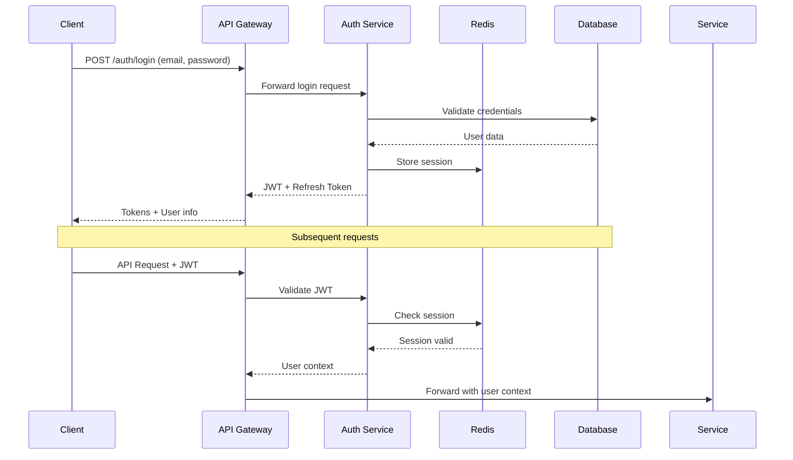

# Architecture de Sécurité et d'Authentification

## 1. Vue d'Ensemble de la Sécurité

### 1.1 Principes de Sécurité

#### Defense in Depth (Défense en Profondeur)
- **Périmètre** : Firewall, WAF, DDoS protection
- **Réseau** : Segmentation, VPN, TLS
- **Application** : Authentification, autorisation, validation
- **Données** : Chiffrement, masquage, audit
- **Endpoint** : Antivirus, EDR, monitoring

#### Zero Trust Architecture
- **Vérification Continue** : Chaque requête est authentifiée
- **Principe du Moindre Privilège** : Accès minimal nécessaire
- **Micro-segmentation** : Isolation des services
- **Monitoring Continu** : Détection d'anomalies

### 1.2 Modèle de Menaces

#### Menaces Identifiées
- **Accès non autorisé** aux dossiers clients
- **Injection de malware** via upload de documents
- **Vol de données** sensibles
- **Attaques par déni de service** (DDoS)
- **Élévation de privilèges** 
- **Man-in-the-middle** sur les communications
- **Fuite de données** par les logs ou caches

## 2. Architecture d'Authentification

### 2.1 Flux d'Authentification

#### Authentification JWT avec Refresh Token


### 2.2 Structure des Tokens JWT

#### Access Token
```json
{
  "header": {
    "alg": "RS256",
    "typ": "JWT",
    "kid": "dpj-key-2024-01"
  },
  "payload": {
    "iss": "dpj-auth-service",
    "sub": "USER123",
    "aud": ["dpj-api"],
    "exp": 1640995200,
    "iat": 1640908800,
    "jti": "token-uuid-123",
    "user": {
      "id": "USER123",
      "email": "jean.dupont@banque.fr",
      "role": "COLLABORATEUR",
      "permissions": [
        "dossier:read",
        "dossier:write",
        "document:read",
        "document:write",
        "document:validate",
        "ged:archive"
      ],
      "constraints": {
        "client_ids": ["CLIENT123", "CLIENT456"],
        "agence_id": "AG001",
        "max_file_size": 52428800
      }
    }
  }
}
```

#### Refresh Token
```json
{
  "header": {
    "alg": "RS256",
    "typ": "JWT"
  },
  "payload": {
    "iss": "dpj-auth-service",
    "sub": "USER123",
    "aud": ["dpj-auth"],
    "exp": 1643587200,
    "iat": 1640908800,
    "jti": "refresh-uuid-456",
    "token_type": "refresh"
  }
}
```

### 2.3 Gestion des Clés de Chiffrement

#### Rotation des Clés RSA
```java
@Component
public class JwtKeyManager {
    
    private final Map<String, RSAPrivateKey> privateKeys = new ConcurrentHashMap<>();
    private final Map<String, RSAPublicKey> publicKeys = new ConcurrentHashMap<>();
    
    @Scheduled(fixedRate = 86400000) // 24h
    public void rotateKeys() {
        String keyId = "dpj-key-" + LocalDate.now().format(DateTimeFormatter.ISO_LOCAL_DATE);
        KeyPair keyPair = generateRSAKeyPair();
        
        privateKeys.put(keyId, (RSAPrivateKey) keyPair.getPrivate());
        publicKeys.put(keyId, (RSAPublicKey) keyPair.getPublic());
        
        // Publier la clé publique pour les autres services
        publishPublicKey(keyId, keyPair.getPublic());
        
        // Nettoyer les anciennes clés (garder 7 jours)
        cleanupOldKeys();
    }
}
```

## 3. Architecture d'Autorisation

### 3.1 Contrôle d'Accès Basé sur les Rôles (RBAC)

#### Définition des Rôles
```sql
-- Table des rôles
CREATE TABLE roles (
    id UUID PRIMARY KEY,
    nom VARCHAR(50) UNIQUE NOT NULL,
    description TEXT,
    est_actif BOOLEAN DEFAULT TRUE
);

-- Table des permissions
CREATE TABLE permissions (
    id UUID PRIMARY KEY,
    ressource VARCHAR(50) NOT NULL,
    action VARCHAR(50) NOT NULL,
    description TEXT,
    UNIQUE(ressource, action)
);

-- Table de liaison rôles-permissions
CREATE TABLE role_permissions (
    role_id UUID REFERENCES roles(id),
    permission_id UUID REFERENCES permissions(id),
    PRIMARY KEY (role_id, permission_id)
);

-- Données de base
INSERT INTO roles (nom, description) VALUES
('CLIENT', 'Utilisateur client final'),
('COLLABORATEUR', 'Employé bancaire'),
('SUPERVISEUR', 'Responsable d''équipe'),
('ADMIN', 'Administrateur système');

INSERT INTO permissions (ressource, action) VALUES
('dossier', 'read'),
('dossier', 'write'),
('dossier', 'delete'),
('document', 'read'),
('document', 'write'),
('document', 'validate'),
('document', 'delete'),
('ged', 'archive'),
('audit', 'read'),
('admin', 'manage');
```

#### Matrice des Permissions
| Rôle | Dossier Read | Dossier Write | Document Read | Document Write | Document Validate | GED Archive | Audit Read |
|------|--------------|---------------|---------------|----------------|-------------------|-------------|------------|
| CLIENT | Ses dossiers | Ses dossiers | Ses documents | Ses documents | ❌ | ❌ | ❌ |
| COLLABORATEUR | Dossiers assignés | Dossiers assignés | Documents assignés | Documents assignés | ✅ | ✅ | Ses actions |
| SUPERVISEUR | Équipe | Équipe | Équipe | Équipe | ✅ | ✅ | Équipe |
| ADMIN | Tous | Tous | Tous | Tous | ✅ | ✅ | Tous |

### 3.2 Contrôle d'Accès Dynamique

#### Évaluation des Permissions
```java
@Component
public class PermissionEvaluator {
    
    public boolean hasPermission(UserContext user, String resource, String action, Object target) {
        // Vérification des permissions de base
        if (!user.hasPermission(resource + ":" + action)) {
            return false;
        }
        
        // Contrôles contextuels
        switch (resource) {
            case "dossier":
                return evaluateDossierAccess(user, (Dossier) target);
            case "document":
                return evaluateDocumentAccess(user, (Document) target);
            default:
                return true;
        }
    }
    
    private boolean evaluateDossierAccess(UserContext user, Dossier dossier) {
        switch (user.getRole()) {
            case CLIENT:
                return dossier.getClientId().equals(user.getId());
            case COLLABORATEUR:
                return dossier.getCollaborateurId().equals(user.getId()) ||
                       user.getClientIds().contains(dossier.getClientId());
            case SUPERVISEUR:
                return user.getAgenceId().equals(dossier.getAgenceId());
            case ADMIN:
                return true;
            default:
                return false;
        }
    }
}
```

## 4. Sécurité des Communications

### 4.1 Chiffrement en Transit

#### Configuration TLS 1.3
```yaml
# nginx.conf
server {
    listen 443 ssl http2;
    server_name api.dpj.banque.fr;
    
    # Certificats SSL
    ssl_certificate /etc/ssl/certs/dpj.crt;
    ssl_certificate_key /etc/ssl/private/dpj.key;
    
    # Configuration TLS
    ssl_protocols TLSv1.3;
    ssl_ciphers ECDHE-ECDSA-AES256-GCM-SHA384:ECDHE-RSA-AES256-GCM-SHA384;
    ssl_prefer_server_ciphers off;
    
    # HSTS
    add_header Strict-Transport-Security "max-age=31536000; includeSubDomains" always;
    
    # Security headers
    add_header X-Frame-Options DENY;
    add_header X-Content-Type-Options nosniff;
    add_header X-XSS-Protection "1; mode=block";
    add_header Content-Security-Policy "default-src 'self'";
}
```

#### Mutual TLS pour les Services Internes
```yaml
# Service-to-service communication
apiVersion: security.istio.io/v1beta1
kind: PeerAuthentication
metadata:
  name: dpj-mtls
spec:
  mtls:
    mode: STRICT
---
apiVersion: security.istio.io/v1beta1
kind: AuthorizationPolicy
metadata:
  name: dpj-service-authz
spec:
  rules:
  - from:
    - source:
        principals: ["cluster.local/ns/dpj/sa/document-service"]
    to:
    - operation:
        methods: ["GET", "POST"]
        paths: ["/api/v1/storage/*"]
```

### 4.2 Sécurité des APIs

#### Rate Limiting
```yaml
# Kong rate limiting plugin
plugins:
  - name: rate-limiting
    config:
      minute: 100
      hour: 1000
      policy: redis
      redis_host: redis-cluster
      fault_tolerant: true
      hide_client_headers: false
```

#### Input Validation et Sanitisation
```java
@RestController
@Validated
public class DocumentController {
    
    @PostMapping("/documents")
    public ResponseEntity<Document> uploadDocument(
            @Valid @RequestBody DocumentUploadRequest request,
            @RequestParam("file") MultipartFile file) {
        
        // Validation du fichier
        validateFile(file);
        
        // Sanitisation du nom de fichier
        String sanitizedFilename = sanitizeFilename(file.getOriginalFilename());
        
        // Scan antivirus
        if (!antivirusService.scanFile(file)) {
            throw new SecurityException("Virus détecté dans le fichier");
        }
        
        return documentService.uploadDocument(request, file);
    }
    
    private void validateFile(MultipartFile file) {
        // Validation de la taille
        if (file.getSize() > MAX_FILE_SIZE) {
            throw new ValidationException("Fichier trop volumineux");
        }
        
        // Validation du type MIME
        String contentType = file.getContentType();
        if (!ALLOWED_MIME_TYPES.contains(contentType)) {
            throw new ValidationException("Type de fichier non autorisé");
        }
        
        // Validation de l'extension
        String filename = file.getOriginalFilename();
        String extension = getFileExtension(filename);
        if (!ALLOWED_EXTENSIONS.contains(extension.toLowerCase())) {
            throw new ValidationException("Extension de fichier non autorisée");
        }
    }
}
```

## 5. Sécurité des Données

### 5.1 Chiffrement au Repos

#### Chiffrement des Documents
```java
@Service
public class DocumentEncryptionService {
    
    private final AESUtil aesUtil;
    private final KeyManagementService kms;
    
    public EncryptedDocument encryptDocument(byte[] documentData, String documentId) {
        // Génération d'une clé de chiffrement unique par document
        SecretKey dataKey = aesUtil.generateKey();
        
        // Chiffrement du document avec la clé de données
        byte[] encryptedData = aesUtil.encrypt(documentData, dataKey);
        
        // Chiffrement de la clé de données avec la clé maître (KMS)
        byte[] encryptedDataKey = kms.encrypt(dataKey.getEncoded(), "dpj-master-key");
        
        return EncryptedDocument.builder()
            .documentId(documentId)
            .encryptedData(encryptedData)
            .encryptedDataKey(encryptedDataKey)
            .algorithm("AES-256-GCM")
            .build();
    }
    
    public byte[] decryptDocument(EncryptedDocument encryptedDocument) {
        // Déchiffrement de la clé de données
        byte[] dataKeyBytes = kms.decrypt(encryptedDocument.getEncryptedDataKey(), "dpj-master-key");
        SecretKey dataKey = new SecretKeySpec(dataKeyBytes, "AES");
        
        // Déchiffrement du document
        return aesUtil.decrypt(encryptedDocument.getEncryptedData(), dataKey);
    }
}
```

#### Chiffrement de la Base de Données
```sql
-- PostgreSQL TDE (Transparent Data Encryption)
ALTER SYSTEM SET shared_preload_libraries = 'pg_tde';
ALTER SYSTEM SET pg_tde.keyring_configuration = '/etc/postgresql/keyring.conf';

-- Chiffrement au niveau colonne pour les données sensibles
CREATE TABLE documents (
    id UUID PRIMARY KEY,
    nom_fichier VARCHAR(255),
    contenu_chiffre BYTEA, -- Données chiffrées
    cle_chiffrement BYTEA, -- Clé chiffrée avec la clé maître
    checksum_chiffre VARCHAR(64) -- Checksum du contenu chiffré
);
```

### 5.2 Masquage et Anonymisation

#### Masquage des Données Sensibles dans les Logs
```java
@Component
public class DataMaskingService {
    
    private static final Pattern EMAIL_PATTERN = Pattern.compile("([a-zA-Z0-9._%+-]+)@([a-zA-Z0-9.-]+\\.[a-zA-Z]{2,})");
    private static final Pattern PHONE_PATTERN = Pattern.compile("(\\+33|0)[1-9]([0-9]{8})");
    
    public String maskSensitiveData(String data) {
        if (data == null) return null;
        
        // Masquage des emails
        data = EMAIL_PATTERN.matcher(data).replaceAll("***@$2");
        
        // Masquage des numéros de téléphone
        data = PHONE_PATTERN.matcher(data).replaceAll("$1*****$2");
        
        return data;
    }
}

// Configuration Logback
<configuration>
    <appender name="STDOUT" class="ch.qos.logback.core.ConsoleAppender">
        <encoder class="com.banque.dpj.logging.MaskingPatternLayoutEncoder">
            <pattern>%d{HH:mm:ss.SSS} [%thread] %-5level %logger{36} - %msg%n</pattern>
        </encoder>
    </appender>
</configuration>
```

## 6. Sécurité des Fichiers

### 6.1 Scan Antivirus

#### Intégration ClamAV
```java
@Service
public class AntivirusService {
    
    private final ClamAVClient clamAVClient;
    
    public ScanResult scanFile(MultipartFile file) {
        try {
            byte[] fileBytes = file.getBytes();
            ScanResult result = clamAVClient.scan(fileBytes);
            
            // Log du résultat
            auditService.logVirusScan(file.getOriginalFilename(), result);
            
            return result;
        } catch (Exception e) {
            log.error("Erreur lors du scan antivirus", e);
            // En cas d'erreur, rejeter le fichier par sécurité
            return ScanResult.INFECTED;
        }
    }
    
    @Async
    public void scanStoredFile(String filePath, String documentId) {
        try {
            ScanResult result = clamAVClient.scanFile(filePath);
            
            if (result == ScanResult.INFECTED) {
                // Quarantaine du fichier
                quarantineService.quarantineFile(filePath, documentId);
                
                // Notification d'alerte
                alertService.sendSecurityAlert("Virus détecté", documentId);
            }
            
            // Mise à jour du statut dans la base
            documentService.updateVirusScanStatus(documentId, result);
            
        } catch (Exception e) {
            log.error("Erreur lors du scan différé", e);
        }
    }
}
```

### 6.2 Validation des Types de Fichiers

#### Validation Avancée des Fichiers
```java
@Component
public class FileTypeValidator {
    
    private final Map<String, List<byte[]>> FILE_SIGNATURES = Map.of(
        "application/pdf", List.of(
            new byte[]{0x25, 0x50, 0x44, 0x46} // %PDF
        ),
        "image/jpeg", List.of(
            new byte[]{(byte)0xFF, (byte)0xD8, (byte)0xFF}
        ),
        "image/png", List.of(
            new byte[]{(byte)0x89, 0x50, 0x4E, 0x47, 0x0D, 0x0A, 0x1A, 0x0A}
        )
    );
    
    public boolean validateFileType(MultipartFile file) {
        try {
            byte[] fileHeader = new byte[8];
            file.getInputStream().read(fileHeader);
            
            String declaredMimeType = file.getContentType();
            List<byte[]> expectedSignatures = FILE_SIGNATURES.get(declaredMimeType);
            
            if (expectedSignatures == null) {
                return false;
            }
            
            return expectedSignatures.stream()
                .anyMatch(signature -> matchesSignature(fileHeader, signature));
                
        } catch (IOException e) {
            log.error("Erreur lors de la validation du type de fichier", e);
            return false;
        }
    }
    
    private boolean matchesSignature(byte[] fileHeader, byte[] signature) {
        if (fileHeader.length < signature.length) {
            return false;
        }
        
        for (int i = 0; i < signature.length; i++) {
            if (fileHeader[i] != signature[i]) {
                return false;
            }
        }
        
        return true;
    }
}
```

## 7. Audit et Traçabilité

### 7.1 Logging de Sécurité

#### Configuration des Logs d'Audit
```java
@Component
public class SecurityAuditLogger {
    
    private final Logger securityLogger = LoggerFactory.getLogger("SECURITY");
    
    @EventListener
    public void handleAuthenticationSuccess(AuthenticationSuccessEvent event) {
        UserDetails user = (UserDetails) event.getAuthentication().getPrincipal();
        
        SecurityEvent securityEvent = SecurityEvent.builder()
            .eventType("AUTHENTICATION_SUCCESS")
            .userId(user.getUsername())
            .timestamp(Instant.now())
            .ipAddress(getClientIpAddress())
            .userAgent(getUserAgent())
            .build();
            
        securityLogger.info("Security event: {}", securityEvent);
    }
    
    @EventListener
    public void handleAuthenticationFailure(AuthenticationFailureEvent event) {
        SecurityEvent securityEvent = SecurityEvent.builder()
            .eventType("AUTHENTICATION_FAILURE")
            .username(event.getAuthentication().getName())
            .timestamp(Instant.now())
            .ipAddress(getClientIpAddress())
            .failureReason(event.getException().getMessage())
            .build();
            
        securityLogger.warn("Security event: {}", securityEvent);
    }
    
    public void logDocumentAccess(String userId, String documentId, String action) {
        SecurityEvent event = SecurityEvent.builder()
            .eventType("DOCUMENT_ACCESS")
            .userId(userId)
            .resourceId(documentId)
            .action(action)
            .timestamp(Instant.now())
            .build();
            
        securityLogger.info("Document access: {}", event);
    }
}
```

### 7.2 Détection d'Anomalies

#### Détection de Comportements Suspects
```java
@Service
public class AnomalyDetectionService {
    
    private final RedisTemplate<String, Object> redisTemplate;
    
    public void trackUserActivity(String userId, String action, String resourceId) {
        String key = "user_activity:" + userId + ":" + LocalDate.now();
        
        // Compteur d'actions par jour
        redisTemplate.opsForHash().increment(key, action, 1);
        redisTemplate.expire(key, Duration.ofDays(7));
        
        // Vérification des seuils
        checkActivityThresholds(userId, action);
    }
    
    private void checkActivityThresholds(String userId, String action) {
        String key = "user_activity:" + userId + ":" + LocalDate.now();
        Long actionCount = (Long) redisTemplate.opsForHash().get(key, action);
        
        if (actionCount != null) {
            switch (action) {
                case "DOCUMENT_DOWNLOAD":
                    if (actionCount > 100) {
                        alertService.sendAnomalyAlert("Téléchargements excessifs", userId, actionCount);
                    }
                    break;
                case "LOGIN_ATTEMPT":
                    if (actionCount > 10) {
                        securityService.lockAccount(userId, Duration.ofMinutes(30));
                        alertService.sendSecurityAlert("Tentatives de connexion multiples", userId);
                    }
                    break;
            }
        }
    }
}
```

## 8. Gestion des Incidents de Sécurité

### 8.1 Plan de Réponse aux Incidents

#### Procédure d'Escalade
```java
@Service
public class SecurityIncidentService {
    
    public void handleSecurityIncident(SecurityIncident incident) {
        // Classification de l'incident
        IncidentSeverity severity = classifyIncident(incident);
        
        // Actions immédiates
        switch (severity) {
            case CRITICAL:
                // Isolation immédiate
                isolateAffectedSystems(incident);
                // Notification immédiate
                notifySecurityTeam(incident);
                // Activation du plan de continuité
                activateBusinessContinuityPlan();
                break;
                
            case HIGH:
                // Surveillance renforcée
                enhanceMonitoring(incident);
                // Notification équipe sécurité
                notifySecurityTeam(incident);
                break;
                
            case MEDIUM:
                // Log et surveillance
                logIncident(incident);
                scheduleInvestigation(incident);
                break;
        }
        
        // Traçabilité
        auditService.logSecurityIncident(incident);
    }
}
```

Cette architecture de sécurité robuste garantit la protection des données sensibles et la conformité aux exigences bancaires tout en maintenant les performances requises pour 500+ utilisateurs simultanés.