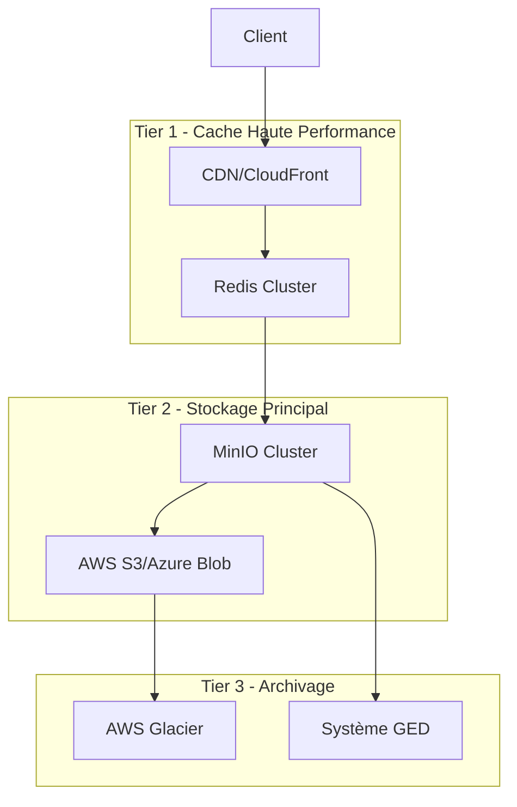

# Architecture de Stockage et Gestion des Documents

## 1. Vue d'Ensemble du Stockage

### 1.1 Exigences de Stockage

#### Exigences Fonctionnelles
- **Volume** : Support de documents jusqu'à 50MB
- **Types** : PDF, images (JPEG, PNG), documents Office
- **Performance** : Temps d'accès < 2 secondes
- **Concurrent** : 500+ utilisateurs simultanés
- **Durabilité** : 99.999999999% (11 9's)
- **Disponibilité** : 99.9% avec RTO < 15 minutes

#### Exigences Non Fonctionnelles
- **Sécurité** : Chiffrement au repos et en transit
- **Compliance** : Traçabilité complète des accès
- **Scalabilité** : Croissance horizontale
- **Backup** : Sauvegarde automatique avec rétention

### 1.2 Architecture de Stockage Multi-Tiers



## 2. Architecture MinIO/S3

### 2.1 Configuration MinIO Cluster

#### Déploiement Haute Disponibilité
```yaml
# docker-compose.yml pour MinIO cluster
version: '3.8'
services:
  minio1:
    image: minio/minio:latest
    hostname: minio1
    volumes:
      - /data/minio1:/data
    environment:
      MINIO_ROOT_USER: dpj_admin
      MINIO_ROOT_PASSWORD: ${MINIO_PASSWORD}
      MINIO_SERVER_URL: https://storage.dpj.banque.fr
    command: server --console-address ":9001" http://minio{1...4}/data
    healthcheck:
      test: ["CMD", "curl", "-f", "http://localhost:9000/minio/health/live"]
      interval: 30s
      timeout: 20s
      retries: 3

  minio2:
    image: minio/minio:latest
    hostname: minio2
    volumes:
      - /data/minio2:/data
    environment:
      MINIO_ROOT_USER: dpj_admin
      MINIO_ROOT_PASSWORD: ${MINIO_PASSWORD}
      MINIO_SERVER_URL: https://storage.dpj.banque.fr
    command: server --console-address ":9001" http://minio{1...4}/data

  # minio3 et minio4 similaires...

  nginx:
    image: nginx:alpine
    ports:
      - "9000:9000"
      - "9001:9001"
    volumes:
      - ./nginx.conf:/etc/nginx/nginx.conf
    depends_on:
      - minio1
      - minio2
      - minio3
      - minio4
```

#### Configuration Nginx Load Balancer
```nginx
upstream minio_servers {
    least_conn;
    server minio1:9000 max_fails=3 fail_timeout=30s;
    server minio2:9000 max_fails=3 fail_timeout=30s;
    server minio3:9000 max_fails=3 fail_timeout=30s;
    server minio4:9000 max_fails=3 fail_timeout=30s;
}

server {
    listen 9000;
    server_name storage.dpj.banque.fr;
    
    # Configuration SSL
    ssl_certificate /etc/ssl/certs/dpj.crt;
    ssl_certificate_key /etc/ssl/private/dpj.key;
    
    # Augmentation des limites pour gros fichiers
    client_max_body_size 100M;
    proxy_request_buffering off;
    
    location / {
        proxy_pass http://minio_servers;
        proxy_set_header Host $http_host;
        proxy_set_header X-Real-IP $remote_addr;
        proxy_set_header X-Forwarded-For $proxy_add_x_forwarded_for;
        proxy_set_header X-Forwarded-Proto $scheme;
        
        # Timeouts pour gros fichiers
        proxy_connect_timeout 300;
        proxy_send_timeout 300;
        proxy_read_timeout 300;
    }
}
```

### 2.2 Organisation des Buckets

#### Structure des Buckets
```
dpj-documents-prod/
├── active/                    # Documents actifs
│   ├── 2024/
│   │   ├── 01/               # Partitioning par mois
│   │   │   ├── dossier-{uuid}/
│   │   │   │   ├── {document-id}.pdf
│   │   │   │   ├── {document-id}.metadata.json
│   │   │   │   └── thumbnails/
│   │   │   │       └── {document-id}_thumb.jpg
│   │   └── 02/
│   └── 2025/

dpj-documents-archive/
├── 2023/                     # Documents archivés
└── 2022/

dpj-temp-uploads/
├── sessions/                 # Uploads temporaires
│   └── {session-id}/
└── processing/              # Files en cours de traitement
    └── {job-id}/

dpj-backups/
├── daily/                   # Sauvegardes quotidiennes
├── weekly/                  # Sauvegardes hebdomadaires
└── monthly/                 # Sauvegardes mensuelles
```

#### Politique de Cycle de Vie
```json
{
  "Rules": [
    {
      "ID": "DocumentLifecycle",
      "Status": "Enabled",
      "Filter": {
        "Prefix": "active/"
      },
      "Transitions": [
        {
          "Days": 90,
          "StorageClass": "STANDARD_IA"
        },
        {
          "Days": 365,
          "StorageClass": "GLACIER"
        },
        {
          "Days": 2555,
          "StorageClass": "DEEP_ARCHIVE"
        }
      ]
    },
    {
      "ID": "TempCleanup",
      "Status": "Enabled",
      "Filter": {
        "Prefix": "temp/"
      },
      "Expiration": {
        "Days": 7
      }
    }
  ]
}
```

## 3. Service de Gestion des Documents

### 3.1 Document Storage Service

#### Interface du Service
```java
@Service
public class DocumentStorageService {
    
    private final MinioClient minioClient;
    private final DocumentEncryptionService encryptionService;
    private final ThumbnailService thumbnailService;
    private final VirusScanner virusScanner;
    
    public StorageResult storeDocument(DocumentUploadRequest request) {
        try {
            // 1. Validation et scan antivirus
            validateAndScanFile(request.getFile());
            
            // 2. Génération des métadonnées
            DocumentMetadata metadata = generateMetadata(request);
            
            // 3. Chiffrement du document
            EncryptedDocument encryptedDoc = encryptionService.encrypt(
                request.getFile().getBytes(), 
                metadata.getDocumentId()
            );
            
            // 4. Génération du chemin de stockage
            String storagePath = generateStoragePath(metadata);
            
            // 5. Upload vers MinIO
            uploadToMinio(encryptedDoc, storagePath, metadata);
            
            // 6. Génération des thumbnails (asynchrone)
            generateThumbnailAsync(encryptedDoc, storagePath);
            
            // 7. Sauvegarde des métadonnées
            saveMetadata(metadata, storagePath);
            
            return StorageResult.success(metadata.getDocumentId(), storagePath);
            
        } catch (Exception e) {
            log.error("Erreur lors du stockage du document", e);
            return StorageResult.failure(e.getMessage());
        }
    }
    
    private void uploadToMinio(EncryptedDocument doc, String path, DocumentMetadata metadata) {
        try {
            // Préparation des métadonnées S3
            Map<String, String> userMetadata = Map.of(
                "document-id", metadata.getDocumentId(),
                "dossier-id", metadata.getDossierId(),
                "content-type", metadata.getMimeType(),
                "checksum", metadata.getChecksum(),
                "encrypted", "true",
                "virus-scan", "clean"
            );
            
            // Upload avec métadonnées
            minioClient.putObject(
                PutObjectArgs.builder()
                    .bucket("dpj-documents-prod")
                    .object(path)
                    .stream(new ByteArrayInputStream(doc.getEncryptedData()), 
                           doc.getEncryptedData().length, -1)
                    .contentType("application/octet-stream")
                    .userMetadata(userMetadata)
                    .serverSideEncryption(ServerSideEncryption.withCustomerKey(
                        encryptionService.getStorageKey()))
                    .build()
            );
            
        } catch (Exception e) {
            throw new StorageException("Erreur upload MinIO", e);
        }
    }
}
```

### 3.2 Gestion des Versions de Documents

#### Versioning Strategy
```java
@Service
public class DocumentVersionService {
    
    public DocumentVersion createNewVersion(String documentId, MultipartFile newFile) {
        // Récupération de la version actuelle
        Document currentDoc = documentRepository.findById(documentId)
            .orElseThrow(() -> new DocumentNotFoundException(documentId));
        
        // Archivage de la version actuelle
        archiveCurrentVersion(currentDoc);
        
        // Création de la nouvelle version
        DocumentVersion newVersion = DocumentVersion.builder()
            .documentId(documentId)
            .versionNumber(currentDoc.getVersionNumber() + 1)
            .parentVersionId(currentDoc.getId())
            .build();
        
        // Stockage de la nouvelle version
        StorageResult result = storeDocument(
            DocumentUploadRequest.fromMultipartFile(newFile, documentId)
        );
        
        // Mise à jour des métadonnées
        updateDocumentVersion(currentDoc, newVersion, result);
        
        return newVersion;
    }
    
    private void archiveCurrentVersion(Document document) {
        // Déplacement vers le bucket d'archive
        String currentPath = document.getCheminStockage();
        String archivePath = generateArchivePath(document);
        
        minioClient.copyObject(
            CopyObjectArgs.builder()
                .bucket("dpj-documents-archive")
                .object(archivePath)
                .source(CopySource.builder()
                    .bucket("dpj-documents-prod")
                    .object(currentPath)
                    .build())
                .build()
        );
        
        // Mise à jour du statut
        document.setStatut(StatutDocument.ARCHIVE);
        document.setCheminArchive(archivePath);
        documentRepository.save(document);
    }
}
```

## 4. Optimisation des Performances

### 4.1 Cache Multi-Niveaux

#### Configuration Redis pour Cache Documents
```java
@Configuration
@EnableCaching
public class DocumentCacheConfig {
    
    @Bean
    public CacheManager cacheManager(RedisConnectionFactory connectionFactory) {
        RedisCacheConfiguration config = RedisCacheConfiguration.defaultCacheConfig()
            .entryTtl(Duration.ofMinutes(15))
            .serializeKeysWith(RedisSerializationContext.SerializationPair
                .fromSerializer(new StringRedisSerializer()))
            .serializeValuesWith(RedisSerializationContext.SerializationPair
                .fromSerializer(new GenericJackson2JsonRedisSerializer()));
        
        return RedisCacheManager.builder(connectionFactory)
            .cacheDefaults(config)
            .withCacheConfiguration("documents", config.entryTtl(Duration.ofMinutes(30)))
            .withCacheConfiguration("thumbnails", config.entryTtl(Duration.ofHours(2)))
            .withCacheConfiguration("metadata", config.entryTtl(Duration.ofMinutes(10)))
            .build();
    }
}

@Service
public class CachedDocumentService {
    
    @Cacheable(value = "documents", key = "#documentId")
    public DocumentContent getDocument(String documentId) {
        return loadDocumentFromStorage(documentId);
    }
    
    @Cacheable(value = "thumbnails", key = "#documentId + '_' + #size")
    public byte[] getThumbnail(String documentId, ThumbnailSize size) {
        return generateThumbnail(documentId, size);
    }
    
    @CacheEvict(value = {"documents", "thumbnails"}, key = "#documentId")
    public void evictDocumentCache(String documentId) {
        // Cache invalidation lors de la mise à jour
    }
}
```

### 4.2 CDN et Distribution de Contenu

#### Configuration CloudFront/CDN
```yaml
# Terraform configuration pour CloudFront
resource "aws_cloudfront_distribution" "dpj_documents" {
  origin {
    domain_name = "storage.dpj.banque.fr"
    origin_id   = "DPJ-MinIO"
    
    custom_origin_config {
      http_port              = 80
      https_port             = 443
      origin_protocol_policy = "https-only"
      origin_ssl_protocols   = ["TLSv1.2"]
    }
  }
  
  enabled = true
  
  default_cache_behavior {
    allowed_methods        = ["DELETE", "GET", "HEAD", "OPTIONS", "PATCH", "POST", "PUT"]
    cached_methods         = ["GET", "HEAD"]
    target_origin_id       = "DPJ-MinIO"
    compress               = true
    viewer_protocol_policy = "redirect-to-https"
    
    forwarded_values {
      query_string = false
      headers      = ["Authorization", "Range"]
      cookies {
        forward = "none"
      }
    }
    
    min_ttl     = 0
    default_ttl = 3600
    max_ttl     = 86400
  }
  
  # Cache behavior pour les thumbnails
  ordered_cache_behavior {
    path_pattern           = "/thumbnails/*"
    allowed_methods        = ["GET", "HEAD"]
    cached_methods         = ["GET", "HEAD"]
    target_origin_id       = "DPJ-MinIO"
    compress               = true
    viewer_protocol_policy = "redirect-to-https"
    
    forwarded_values {
      query_string = false
      cookies {
        forward = "none"
      }
    }
    
    min_ttl     = 86400
    default_ttl = 604800
    max_ttl     = 31536000
  }
  
  restrictions {
    geo_restriction {
      restriction_type = "whitelist"
      locations        = ["FR", "EU"]
    }
  }
  
  viewer_certificate {
    acm_certificate_arn = aws_acm_certificate.dpj_cert.arn
    ssl_support_method  = "sni-only"
  }
}
```

## 5. Traitement Asynchrone des Documents

### 5.1 Pipeline de Traitement

#### Architecture de Traitement


#### Service de Traitement Asynchrone
```java
@Service
public class DocumentProcessingService {
    
    private final KafkaTemplate<String, DocumentProcessingEvent> kafkaTemplate;
    
    @EventListener
    public void handleDocumentUploaded(DocumentUploadedEvent event) {
        DocumentProcessingEvent processingEvent = DocumentProcessingEvent.builder()
            .documentId(event.getDocumentId())
            .dossierId(event.getDossierId())
            .storagePath(event.getStoragePath())
            .processingSteps(Arrays.asList(
                ProcessingStep.VIRUS_SCAN,
                ProcessingStep.THUMBNAIL_GENERATION,
                ProcessingStep.OCR_PROCESSING,
                ProcessingStep.METADATA_EXTRACTION
            ))
            .build();
            
        kafkaTemplate.send("document-processing", processingEvent);
    }
    
    @KafkaListener(topics = "document-processing")
    public void processDocument(DocumentProcessingEvent event) {
        try {
            for (ProcessingStep step : event.getProcessingSteps()) {
                executeProcessingStep(event.getDocumentId(), step);
                updateProcessingStatus(event.getDocumentId(), step, ProcessingStatus.COMPLETED);
            }
            
            // Notification de fin de traitement
            notificationService.sendProcessingComplete(event.getDocumentId());
            
        } catch (Exception e) {
            log.error("Erreur lors du traitement du document {}", event.getDocumentId(), e);
            updateProcessingStatus(event.getDocumentId(), null, ProcessingStatus.FAILED);
        }
    }
    
    private void executeProcessingStep(String documentId, ProcessingStep step) {
        switch (step) {
            case VIRUS_SCAN:
                virusScanService.scanDocument(documentId);
                break;
            case THUMBNAIL_GENERATION:
                thumbnailService.generateThumbnails(documentId);
                break;
            case OCR_PROCESSING:
                ocrService.extractText(documentId);
                break;
            case METADATA_EXTRACTION:
                metadataService.extractMetadata(documentId);
                break;
        }
    }
}
```

### 5.2 Génération de Thumbnails

#### Service de Thumbnails
```java
@Service
public class ThumbnailService {
    
    private final ImageProcessor imageProcessor;
    private final PdfProcessor pdfProcessor;
    
    @Async
    public CompletableFuture<List<ThumbnailResult>> generateThumbnails(String documentId) {
        try {
            Document document = documentRepository.findById(documentId)
                .orElseThrow(() -> new DocumentNotFoundException(documentId));
            
            byte[] documentData = storageService.getDocumentData(document.getCheminStockage());
            List<ThumbnailResult> results = new ArrayList<>();
            
            // Génération de différentes tailles
            for (ThumbnailSize size : ThumbnailSize.values()) {
                byte[] thumbnail = generateThumbnail(documentData, document.getMimeType(), size);
                String thumbnailPath = storeThumbnail(documentId, size, thumbnail);
                
                results.add(ThumbnailResult.builder()
                    .documentId(documentId)
                    .size(size)
                    .path(thumbnailPath)
                    .build());
            }
            
            return CompletableFuture.completedFuture(results);
            
        } catch (Exception e) {
            log.error("Erreur génération thumbnails pour {}", documentId, e);
            return CompletableFuture.failedFuture(e);
        }
    }
    
    private byte[] generateThumbnail(byte[] data, String mimeType, ThumbnailSize size) {
        switch (mimeType) {
            case "application/pdf":
                return pdfProcessor.generateThumbnail(data, size.getWidth(), size.getHeight());
            case "image/jpeg":
            case "image/png":
                return imageProcessor.resize(data, size.getWidth(), size.getHeight());
            default:
                return generateDefaultThumbnail(mimeType, size);
        }
    }
}
```

## 6. Monitoring et Métriques

### 6.1 Métriques de Stockage

#### Collecte de Métriques
```java
@Component
public class StorageMetricsCollector {
    
    private final MeterRegistry meterRegistry;
    private final Counter uploadCounter;
    private final Timer uploadTimer;
    private final Gauge storageUsage;
    
    public StorageMetricsCollector(MeterRegistry meterRegistry) {
        this.meterRegistry = meterRegistry;
        this.uploadCounter = Counter.builder("documents.upload.total")
            .description("Total number of document uploads")
            .register(meterRegistry);
        this.uploadTimer = Timer.builder("documents.upload.duration")
            .description("Document upload duration")
            .register(meterRegistry);
        this.storageUsage = Gauge.builder("storage.usage.bytes")
            .description("Total storage usage in bytes")
            .register(meterRegistry, this, StorageMetricsCollector::getStorageUsage);
    }
    
    public void recordUpload(String documentType, long fileSize, Duration duration) {
        uploadCounter.increment(
            Tags.of(
                "type", documentType,
                "size_category", categorizeSizeFile(fileSize)
            )
        );
        
        uploadTimer.record(duration,
            Tags.of("type", documentType)
        );
    }
    
    private double getStorageUsage() {
        // Calcul de l'usage total du stockage
        return minioClient.getBucketStats("dpj-documents-prod").getSize();
    }
}
```

### 6.2 Health Checks

#### Vérification de Santé du Stockage
```java
@Component
public class StorageHealthIndicator implements HealthIndicator {
    
    private final MinioClient minioClient;
    
    @Override
    public Health health() {
        try {
            // Test de connectivité MinIO
            boolean minioHealthy = minioClient.bucketExists(
                BucketExistsArgs.builder().bucket("dpj-documents-prod").build()
            );
            
            if (!minioHealthy) {
                return Health.down()
                    .withDetail("minio", "Bucket not accessible")
                    .build();
            }
            
            // Test de performance (upload/download test file)
            long responseTime = performanceTest();
            
            if (responseTime > 5000) { // 5 secondes
                return Health.down()
                    .withDetail("performance", "Response time too high: " + responseTime + "ms")
                    .build();
            }
            
            return Health.up()
                .withDetail("minio", "Connected")
                .withDetail("response_time_ms", responseTime)
                .build();
                
        } catch (Exception e) {
            return Health.down()
                .withDetail("error", e.getMessage())
                .build();
        }
    }
    
    private long performanceTest() {
        long startTime = System.currentTimeMillis();
        
        try {
            // Upload d'un fichier test
            byte[] testData = "health check test".getBytes();
            String testPath = "health-check/" + UUID.randomUUID() + ".txt";
            
            minioClient.putObject(
                PutObjectArgs.builder()
                    .bucket("dpj-documents-prod")
                    .object(testPath)
                    .stream(new ByteArrayInputStream(testData), testData.length, -1)
                    .build()
            );
            
            // Download du fichier test
            minioClient.getObject(
                GetObjectArgs.builder()
                    .bucket("dpj-documents-prod")
                    .object(testPath)
                    .build()
            );
            
            // Nettoyage
            minioClient.removeObject(
                RemoveObjectArgs.builder()
                    .bucket("dpj-documents-prod")
                    .object(testPath)
                    .build()
            );
            
            return System.currentTimeMillis() - startTime;
            
        } catch (Exception e) {
            throw new RuntimeException("Performance test failed", e);
        }
    }
}
```

## 7. Stratégie de Sauvegarde et Recovery

### 7.1 Sauvegarde Automatisée

#### Script de Sauvegarde
```bash
#!/bin/bash
# backup-documents.sh

BACKUP_DATE=$(date +%Y%m%d_%H%M%S)
BACKUP_BUCKET="dpj-backups"
SOURCE_BUCKET="dpj-documents-prod"

# Sauvegarde incrémentale quotidienne
mc mirror --overwrite --remove minio/$SOURCE_BUCKET minio/$BACKUP_BUCKET/daily/$BACKUP_DATE/

# Sauvegarde complète hebdomadaire (dimanche)
if [ $(date +%u) -eq 7 ]; then
    mc cp --recursive minio/$SOURCE_BUCKET minio/$BACKUP_BUCKET/weekly/$BACKUP_DATE/
fi

# Sauvegarde mensuelle (1er du mois)
if [ $(date +%d) -eq 01 ]; then
    mc cp --recursive minio/$SOURCE_BUCKET minio/$BACKUP_BUCKET/monthly/$BACKUP_DATE/
fi

# Nettoyage des anciennes sauvegardes
# Garder 30 jours de sauvegardes quotidiennes
find /backup/daily -type d -mtime +30 -exec rm -rf {} \;

# Garder 12 semaines de sauvegardes hebdomadaires
find /backup/weekly -type d -mtime +84 -exec rm -rf {} \;

# Garder 12 mois de sauvegardes mensuelles
find /backup/monthly -type d -mtime +365 -exec rm -rf {} \;
```

### 7.2 Plan de Recovery

#### Procédure de Restauration
```java
@Service
public class DisasterRecoveryService {
    
    public RecoveryResult restoreFromBackup(String backupDate, RecoveryScope scope) {
        try {
            log.info("Début de la restauration depuis la sauvegarde {}", backupDate);
            
            // 1. Validation de la sauvegarde
            validateBackup(backupDate);
            
            // 2. Arrêt des services (mode maintenance)
            enableMaintenanceMode();
            
            // 3. Restauration des données
            switch (scope) {
                case FULL:
                    restoreFullBackup(backupDate);
                    break;
                case PARTIAL:
                    restorePartialBackup(backupDate);
                    break;
                case POINT_IN_TIME:
                    restorePointInTime(backupDate);
                    break;
            }
            
            // 4. Vérification de l'intégrité
            verifyDataIntegrity();
            
            // 5. Redémarrage des services
            disableMaintenanceMode();
            
            log.info("Restauration terminée avec succès");
            return RecoveryResult.success();
            
        } catch (Exception e) {
            log.error("Erreur lors de la restauration", e);
            return RecoveryResult.failure(e.getMessage());
        }
    }
}
```

Cette architecture de stockage robuste garantit la haute disponibilité, la performance et la sécurité requises pour gérer efficacement les documents du système DPJ avec 500+ utilisateurs simultanés.