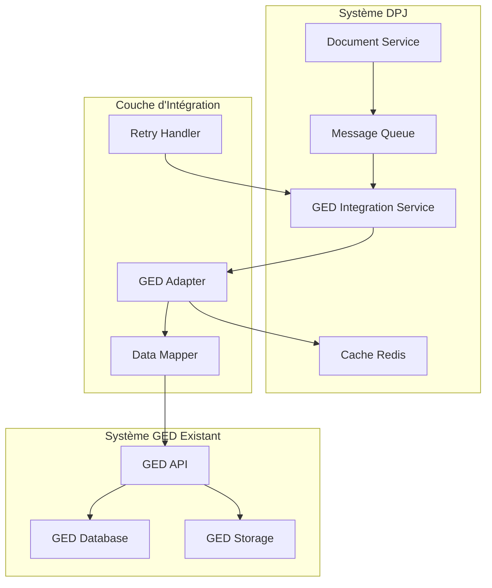

# Intégration avec la GED Existante

## 1. Vue d'Ensemble de l'Intégration GED

### 1.1 Objectifs de l'Intégration

#### Fonctionnalités Requises
- **Archivage automatique** des documents validés
- **Recherche et récupération** de documents archivés
- **Réutilisation** de documents déjà transmis
- **Synchronisation** des métadonnées
- **Traçabilité** complète des opérations

#### Contraintes d'Intégration
- **Intégration minimale** selon les exigences
- **Compatibilité** avec le système GED existant
- **Performance** : Archivage asynchrone pour éviter les blocages
- **Résilience** : Gestion des pannes et reprises sur erreur

### 1.2 Architecture d'Intégration



## 2. Service d'Intégration GED

### 2.1 GED Integration Service

#### Interface du Service
```java
@Service
@Transactional
public class GedIntegrationService {
    
    private final GedAdapter gedAdapter;
    private final DocumentRepository documentRepository;
    private final GedMappingService mappingService;
    private final KafkaTemplate<String, GedArchiveEvent> kafkaTemplate;
    
    /**
     * Archive un document en GED de manière asynchrone
     */
    public CompletableFuture<GedArchiveResult> archiveDocument(String documentId) {
        return CompletableFuture.supplyAsync(() -> {
            try {
                // 1. Récupération du document
                Document document = documentRepository.findById(documentId)
                    .orElseThrow(() -> new DocumentNotFoundException(documentId));
                
                // 2. Validation des prérequis
                validateDocumentForArchive(document);
                
                // 3. Préparation des données pour la GED
                GedDocumentRequest gedRequest = mappingService.mapToGedRequest(document);
                
                // 4. Archivage en GED
                GedArchiveResponse gedResponse = gedAdapter.archiveDocument(gedRequest);
                
                // 5. Mise à jour du document
                updateDocumentWithGedInfo(document, gedResponse);
                
                // 6. Notification de succès
                publishArchiveSuccessEvent(document, gedResponse);
                
                return GedArchiveResult.success(gedResponse.getGedId());
                
            } catch (Exception e) {
                log.error("Erreur lors de l'archivage du document {}", documentId, e);
                publishArchiveFailureEvent(documentId, e.getMessage());
                return GedArchiveResult.failure(e.getMessage());
            }
        });
    }
    
    /**
     * Archive plusieurs documents d'un dossier
     */
    public CompletableFuture<BatchGedArchiveResult> archiveDossierDocuments(String dossierId) {
        return CompletableFuture.supplyAsync(() -> {
            List<Document> documents = documentRepository.findValidatedDocumentsByDossierId(dossierId);
            List<CompletableFuture<GedArchiveResult>> archiveFutures = new ArrayList<>();
            
            for (Document document : documents) {
                archiveFutures.add(archiveDocument(document.getId()));
            }
            
            // Attendre tous les archivages
            CompletableFuture<Void> allArchives = CompletableFuture.allOf(
                archiveFutures.toArray(new CompletableFuture[0])
            );
            
            try {
                allArchives.get(30, TimeUnit.SECONDS); // Timeout de 30 secondes
                
                List<GedArchiveResult> results = archiveFutures.stream()
                    .map(CompletableFuture::join)
                    .collect(Collectors.toList());
                
                return BatchGedArchiveResult.fromResults(results);
                
            } catch (Exception e) {
                log.error("Erreur lors de l'archivage batch du dossier {}", dossierId, e);
                return BatchGedArchiveResult.failure(e.getMessage());
            }
        });
    }
    
    private void validateDocumentForArchive(Document document) {
        if (!StatutDocument.VALIDE.equals(document.getStatut())) {
            throw new IllegalStateException("Seuls les documents validés peuvent être archivés");
        }
        
        if (document.getGedId() != null) {
            throw new IllegalStateException("Document déjà archivé en GED");
        }
    }
    
    private void updateDocumentWithGedInfo(Document document, GedArchiveResponse response) {
        document.setGedId(response.getGedId());
        document.setDateArchivage(response.getArchiveDate());
        document.setStatut(StatutDocument.ARCHIVE);
        document.setCheminGed(response.getGedPath());
        
        documentRepository.save(document);
    }
}
```

### 2.2 GED Adapter Pattern

#### Adapter Générique
```java
public interface GedAdapter {
    GedArchiveResponse archiveDocument(GedDocumentRequest request);
    GedDocument retrieveDocument(String gedId);
    List<GedDocument> searchDocuments(GedSearchCriteria criteria);
    boolean deleteDocument(String gedId);
    GedMetadata getDocumentMetadata(String gedId);
}

@Component
public class DefaultGedAdapter implements GedAdapter {
    
    private final GedApiClient gedApiClient;
    private final GedRetryHandler retryHandler;
    private final GedMetricsCollector metricsCollector;
    
    @Override
    @Retryable(value = {GedException.class}, maxAttempts = 3, backoff = @Backoff(delay = 2000))
    public GedArchiveResponse archiveDocument(GedDocumentRequest request) {
        Timer.Sample sample = Timer.start(metricsCollector.getMeterRegistry());
        
        try {
            log.info("Archivage document en GED: {}", request.getDocumentId());
            
            // 1. Validation de la requête
            validateGedRequest(request);
            
            // 2. Appel API GED
            GedArchiveResponse response = gedApiClient.archiveDocument(request);
            
            // 3. Validation de la réponse
            validateGedResponse(response);
            
            metricsCollector.recordArchiveSuccess(request.getDocumentType());
            log.info("Document {} archivé avec succès en GED: {}", 
                    request.getDocumentId(), response.getGedId());
            
            return response;
            
        } catch (Exception e) {
            metricsCollector.recordArchiveFailure(request.getDocumentType(), e.getClass().getSimpleName());
            log.error("Erreur archivage GED pour document {}", request.getDocumentId(), e);
            throw new GedArchiveException("Erreur archivage GED", e);
            
        } finally {
            sample.stop(Timer.builder("ged.archive.duration")
                .tag("type", request.getDocumentType())
                .register(metricsCollector.getMeterRegistry()));
        }
    }
    
    @Override
    @Cacheable(value = "ged-documents", key = "#gedId")
    public GedDocument retrieveDocument(String gedId) {
        try {
            log.debug("Récupération document GED: {}", gedId);
            
            GedDocument document = gedApiClient.getDocument(gedId);
            
            if (document == null) {
                throw new GedDocumentNotFoundException("Document GED non trouvé: " + gedId);
            }
            
            return document;
            
        } catch (Exception e) {
            log.error("Erreur récupération document GED {}", gedId, e);
            throw new GedRetrievalException("Erreur récupération GED", e);
        }
    }
    
    @Override
    public List<GedDocument> searchDocuments(GedSearchCriteria criteria) {
        try {
            log.debug("Recherche documents GED: {}", criteria);
            
            // Construction de la requête de recherche
            GedSearchRequest searchRequest = buildSearchRequest(criteria);
            
            // Exécution de la recherche
            GedSearchResponse response = gedApiClient.searchDocuments(searchRequest);
            
            return response.getDocuments();
            
        } catch (Exception e) {
            log.error("Erreur recherche documents GED", e);
            throw new GedSearchException("Erreur recherche GED", e);
        }
    }
}
```

## 3. Mapping et Transformation des Données

### 3.1 Service de Mapping

#### Transformation DPJ vers GED
```java
@Service
public class GedMappingService {
    
    private final GedConfigurationProperties gedConfig;
    
    public GedDocumentRequest mapToGedRequest(Document document) {
        return GedDocumentRequest.builder()
            .documentId(document.getId())
            .originalFilename(document.getNomOriginal())
            .contentType(document.getMimeType())
            .fileSize(document.getTailleFichier())
            .checksum(document.getChecksumSha256())
            .documentType(mapDocumentType(document.getTypeDocument()))
            .classification(determineClassification(document))
            .metadata(buildGedMetadata(document))
            .retentionPeriod(calculateRetentionPeriod(document))
            .confidentialityLevel(determineConfidentiality(document))
            .build();
    }
    
    private GedDocumentType mapDocumentType(String dpjDocumentType) {
        Map<String, GedDocumentType> typeMapping = Map.of(
            "PIECE_IDENTITE", GedDocumentType.IDENTITY_DOCUMENT,
            "JUSTIFICATIF_DOMICILE", GedDocumentType.PROOF_OF_ADDRESS,
            "BULLETIN_SALAIRE", GedDocumentType.PAYSLIP,
            "RIB", GedDocumentType.BANK_DETAILS,
            "CONTRAT_TRAVAIL", GedDocumentType.EMPLOYMENT_CONTRACT
        );
        
        return typeMapping.getOrDefault(dpjDocumentType, GedDocumentType.OTHER);
    }
    
    private GedMetadata buildGedMetadata(Document document) {
        return GedMetadata.builder()
            .sourceSystem("DPJ")
            .sourceDocumentId(document.getId())
            .dossierId(document.getDossier().getId())
            .clientId(document.getDossier().getClientId())
            .depositDate(document.getDateDepot())
            .validationDate(document.getDateValidation())
            .validator(document.getValidateurId())
            .businessContext(buildBusinessContext(document))
            .technicalMetadata(buildTechnicalMetadata(document))
            .build();
    }
    
    private Map<String, Object> buildBusinessContext(Document document) {
        Map<String, Object> context = new HashMap<>();
        context.put("parcours_type", document.getDossier().getTypeParcours());
        context.put("etape", document.getEtape() != null ? document.getEtape().getNomEtape() : null);
        context.put("agence", document.getDossier().getMetadata().get("agence"));
        context.put("conseiller", document.getDossier().getCollaborateurId());
        return context;
    }
    
    private RetentionPeriod calculateRetentionPeriod(Document document) {
        // Règles métier pour la durée de rétention
        switch (document.getTypeDocument()) {
            case "PIECE_IDENTITE":
                return RetentionPeriod.TEN_YEARS;
            case "JUSTIFICATIF_DOMICILE":
                return RetentionPeriod.FIVE_YEARS;
            case "BULLETIN_SALAIRE":
                return RetentionPeriod.SEVEN_YEARS;
            default:
                return RetentionPeriod.FIVE_YEARS;
        }
    }
}
```

### 3.2 Configuration GED

#### Propriétés de Configuration
```yaml
# application.yml
ged:
  integration:
    enabled: true
    api:
      base-url: https://ged-api.banque.fr/v1
      timeout: 30s
      max-retries: 3
      retry-delay: 2s
    authentication:
      type: oauth2
      client-id: ${GED_CLIENT_ID}
      client-secret: ${GED_CLIENT_SECRET}
      token-url: https://auth.banque.fr/oauth/token
    mapping:
      default-classification: DOSSIER_CLIENT
      default-retention: 5_YEARS
      default-confidentiality: INTERNAL
    batch:
      max-concurrent-archives: 10
      batch-size: 50
      timeout: 300s
```

```java
@ConfigurationProperties(prefix = "ged.integration")
@Data
public class GedConfigurationProperties {
    
    private boolean enabled = true;
    private ApiConfig api = new ApiConfig();
    private AuthConfig authentication = new AuthConfig();
    private MappingConfig mapping = new MappingConfig();
    private BatchConfig batch = new BatchConfig();
    
    @Data
    public static class ApiConfig {
        private String baseUrl;
        private Duration timeout = Duration.ofSeconds(30);
        private int maxRetries = 3;
        private Duration retryDelay = Duration.ofSeconds(2);
    }
    
    @Data
    public static class AuthConfig {
        private AuthType type = AuthType.OAUTH2;
        private String clientId;
        private String clientSecret;
        private String tokenUrl;
    }
    
    @Data
    public static class MappingConfig {
        private String defaultClassification = "DOSSIER_CLIENT";
        private String defaultRetention = "5_YEARS";
        private String defaultConfidentiality = "INTERNAL";
    }
    
    @Data
    public static class BatchConfig {
        private int maxConcurrentArchives = 10;
        private int batchSize = 50;
        private Duration timeout = Duration.ofMinutes(5);
    }
}
```

## 4. Gestion des Erreurs et Résilience

### 4.1 Stratégie de Retry

#### Retry Handler
```java
@Component
public class GedRetryHandler {
    
    private final RetryTemplate retryTemplate;
    
    public GedRetryHandler() {
        this.retryTemplate = RetryTemplate.builder()
            .maxAttempts(3)
            .exponentialBackoff(2000, 2, 10000)
            .retryOn(GedTemporaryException.class, ConnectException.class, SocketTimeoutException.class)
            .build();
    }
    
    public <T> T executeWithRetry(String operation, Supplier<T> supplier) {
        return retryTemplate.execute(context -> {
            log.debug("Tentative {} pour l'opération GED: {}", 
                     context.getRetryCount() + 1, operation);
            
            try {
                return supplier.get();
            } catch (Exception e) {
                log.warn("Échec tentative {} pour {}: {}", 
                        context.getRetryCount() + 1, operation, e.getMessage());
                
                if (context.getRetryCount() == 2) { // Dernière tentative
                    log.error("Échec définitif pour l'opération GED: {}", operation, e);
                }
                
                throw e;
            }
        });
    }
}
```

### 4.2 Circuit Breaker

#### Protection contre les Pannes GED
```java
@Component
public class GedCircuitBreakerService {
    
    private final CircuitBreaker circuitBreaker;
    
    public GedCircuitBreakerService() {
        this.circuitBreaker = CircuitBreaker.ofDefaults("ged-service");
        
        // Configuration du circuit breaker
        circuitBreaker.getEventPublisher()
            .onStateTransition(event -> 
                log.info("Circuit breaker GED transition: {} -> {}", 
                        event.getStateTransition().getFromState(),
                        event.getStateTransition().getToState()));
    }
    
    public <T> T executeWithCircuitBreaker(Supplier<T> supplier) {
        return circuitBreaker.executeSupplier(supplier);
    }
    
    @EventListener
    public void handleCircuitBreakerOpen(CircuitBreakerOnStateTransitionEvent event) {
        if (event.getStateTransition().getToState() == CircuitBreaker.State.OPEN) {
            // Notification d'alerte
            alertService.sendAlert("Circuit breaker GED ouvert", 
                                 "Le système GED est temporairement indisponible");
            
            // Activation du mode dégradé
            activateDegradedMode();
        }
    }
    
    private void activateDegradedMode() {
        // En mode dégradé, les documents sont marqués pour archivage différé
        log.warn("Activation du mode dégradé GED - archivage différé activé");
    }
}
```

## 5. Traitement Asynchrone et Files d'Attente

### 5.1 Gestion des Files d'Attente

#### Configuration Kafka pour GED
```java
@Configuration
@EnableKafka
public class GedKafkaConfig {
    
    @Bean
    public ProducerFactory<String, GedArchiveEvent> gedProducerFactory() {
        Map<String, Object> configProps = new HashMap<>();
        configProps.put(ProducerConfig.BOOTSTRAP_SERVERS_CONFIG, "kafka:9092");
        configProps.put(ProducerConfig.KEY_SERIALIZER_CLASS_CONFIG, StringSerializer.class);
        configProps.put(ProducerConfig.VALUE_SERIALIZER_CLASS_CONFIG, JsonSerializer.class);
        configProps.put(ProducerConfig.ACKS_CONFIG, "all");
        configProps.put(ProducerConfig.RETRIES_CONFIG, 3);
        configProps.put(ProducerConfig.ENABLE_IDEMPOTENCE_CONFIG, true);
        
        return new DefaultKafkaProducerFactory<>(configProps);
    }
    
    @Bean
    public KafkaTemplate<String, GedArchiveEvent> gedKafkaTemplate() {
        return new KafkaTemplate<>(gedProducerFactory());
    }
    
    @Bean
    public ConsumerFactory<String, GedArchiveEvent> gedConsumerFactory() {
        Map<String, Object> props = new HashMap<>();
        props.put(ConsumerConfig.BOOTSTRAP_SERVERS_CONFIG, "kafka:9092");
        props.put(ConsumerConfig.GROUP_ID_CONFIG, "ged-archive-group");
        props.put(ConsumerConfig.KEY_DESERIALIZER_CLASS_CONFIG, StringDeserializer.class);
        props.put(ConsumerConfig.VALUE_DESERIALIZER_CLASS_CONFIG, JsonDeserializer.class);
        props.put(ConsumerConfig.AUTO_OFFSET_RESET_CONFIG, "earliest");
        props.put(ConsumerConfig.ENABLE_AUTO_COMMIT_CONFIG, false);
        
        return new DefaultKafkaConsumerFactory<>(props);
    }
}
```

#### Consumer pour Archivage GED
```java
@Component
public class GedArchiveConsumer {
    
    private final GedIntegrationService gedIntegrationService;
    private final GedMetricsCollector metricsCollector;
    
    @KafkaListener(topics = "ged-archive-requests", groupId = "ged-archive-group")
    public void handleArchiveRequest(GedArchiveEvent event, Acknowledgment ack) {
        try {
            log.info("Traitement demande d'archivage GED: {}", event.getDocumentId());
            
            // Traitement de l'archivage
            GedArchiveResult result = gedIntegrationService.archiveDocument(event.getDocumentId()).get();
            
            if (result.isSuccess()) {
                log.info("Archivage GED réussi pour document {}: {}", 
                        event.getDocumentId(), result.getGedId());
                metricsCollector.recordArchiveSuccess(event.getDocumentType());
            } else {
                log.error("Échec archivage GED pour document {}: {}", 
                         event.getDocumentId(), result.getErrorMessage());
                metricsCollector.recordArchiveFailure(event.getDocumentType(), "ARCHIVE_FAILED");
                
                // Republication pour retry si erreur temporaire
                if (isTemporaryError(result.getErrorMessage())) {
                    republishForRetry(event);
                }
            }
            
            // Acknowledgment du message
            ack.acknowledge();
            
        } catch (Exception e) {
            log.error("Erreur lors du traitement de l'archivage GED", e);
            metricsCollector.recordArchiveFailure(event.getDocumentType(), "PROCESSING_ERROR");
            
            // Ne pas acknowledger en cas d'erreur pour retry automatique
        }
    }
    
    @KafkaListener(topics = "ged-batch-archive-requests", groupId = "ged-batch-group")
    public void handleBatchArchiveRequest(GedBatchArchiveEvent event, Acknowledgment ack) {
        try {
            log.info("Traitement archivage batch GED pour dossier: {}", event.getDossierId());
            
            BatchGedArchiveResult result = gedIntegrationService
                .archiveDossierDocuments(event.getDossierId()).get();
            
            log.info("Archivage batch terminé - Succès: {}, Échecs: {}", 
                    result.getSuccessCount(), result.getFailureCount());
            
            // Notification du résultat
            notificationService.sendBatchArchiveResult(event.getDossierId(), result);
            
            ack.acknowledge();
            
        } catch (Exception e) {
            log.error("Erreur archivage batch GED pour dossier {}", event.getDossierId(), e);
        }
    }
}
```

## 6. Recherche et Réutilisation de Documents

### 6.1 Service de Recherche GED

#### Recherche de Documents Existants
```java
@Service
public class GedSearchService {
    
    private final GedAdapter gedAdapter;
    private final GedMappingService mappingService;
    
    /**
     * Recherche de documents similaires pour réutilisation
     */
    public List<ReusableDocument> findReusableDocuments(String clientId, String documentType) {
        try {
            GedSearchCriteria criteria = GedSearchCriteria.builder()
                .clientId(clientId)
                .documentType(mappingService.mapDocumentType(documentType))
                .status(GedDocumentStatus.ARCHIVED)
                .validityPeriod(Duration.ofYears(2)) // Documents valides depuis moins de 2 ans
                .build();
            
            List<GedDocument> gedDocuments = gedAdapter.searchDocuments(criteria);
            
            return gedDocuments.stream()
                .map(this::mapToReusableDocument)
                .filter(this::isDocumentReusable)
                .sorted(Comparator.comparing(ReusableDocument::getArchiveDate).reversed())
                .collect(Collectors.toList());
                
        } catch (Exception e) {
            log.error("Erreur recherche documents réutilisables pour client {} type {}", 
                     clientId, documentType, e);
            return Collections.emptyList();
        }
    }
    
    /**
     * Recherche avancée avec critères multiples
     */
    public GedSearchResult searchDocuments(GedAdvancedSearchRequest request) {
        try {
            GedSearchCriteria criteria = buildSearchCriteria(request);
            List<GedDocument> documents = gedAdapter.searchDocuments(criteria);
            
            return GedSearchResult.builder()
                .documents(documents)
                .totalCount(documents.size())
                .searchCriteria(criteria)
                .searchDate(Instant.now())
                .build();
                
        } catch (Exception e) {
            log.error("Erreur recherche avancée GED", e);
            throw new GedSearchException("Erreur recherche GED", e);
        }
    }
    
    private ReusableDocument mapToReusableDocument(GedDocument gedDoc) {
        return ReusableDocument.builder()
            .gedId(gedDoc.getId())
            .originalDocumentId(gedDoc.getMetadata().getSourceDocumentId())
            .filename(gedDoc.getFilename())
            .documentType(gedDoc.getType())
            .archiveDate(gedDoc.getArchiveDate())
            .validationDate(gedDoc.getMetadata().getValidationDate())
            .fileSize(gedDoc.getFileSize())
            .checksum(gedDoc.getChecksum())
            .canBeReused(isDocumentReusable(gedDoc))
            .build();
    }
    
    private boolean isDocumentReusable(GedDocument document) {
        // Règles métier pour la réutilisation
        Duration timeSinceArchive = Duration.between(document.getArchiveDate(), Instant.now());
        
        switch (document.getType()) {
            case IDENTITY_DOCUMENT:
                return timeSinceArchive.toDays() < 365; // 1 an
            case PROOF_OF_ADDRESS:
                return timeSinceArchive.toDays() < 90;  // 3 mois
            case PAYSLIP:
                return timeSinceArchive.toDays() < 180; // 6 mois
            default:
                return timeSinceArchive.toDays() < 365;
        }
    }
}
```

### 6.2 Service de Réutilisation

#### Réutilisation de Documents GED
```java
@Service
public class DocumentReuseService {
    
    private final GedSearchService gedSearchService;
    private final DocumentStorageService storageService;
    private final GedAdapter gedAdapter;
    
    /**
     * Propose des documents réutilisables pour un dossier
     */
    public List<DocumentSuggestion> suggestReusableDocuments(String dossierId) {
        try {
            Dossier dossier = dossierRepository.findById(dossierId)
                .orElseThrow(() -> new DossierNotFoundException(dossierId));
            
            List<DocumentSuggestion> suggestions = new ArrayList<>();
            
            // Recherche pour chaque type de document requis
            List<String> requiredDocTypes = getRequiredDocumentTypes(dossier);
            
            for (String docType : requiredDocTypes) {
                List<ReusableDocument> reusableDocs = gedSearchService
                    .findReusableDocuments(dossier.getClientId(), docType);
                
                if (!reusableDocs.isEmpty()) {
                    DocumentSuggestion suggestion = DocumentSuggestion.builder()
                        .documentType(docType)
                        .availableDocuments(reusableDocs)
                        .recommendedDocument(reusableDocs.get(0)) // Le plus récent
                        .build();
                    
                    suggestions.add(suggestion);
                }
            }
            
            return suggestions;
            
        } catch (Exception e) {
            log.error("Erreur suggestion documents réutilisables pour dossier {}", dossierId, e);
            return Collections.emptyList();
        }
    }
    
    /**
     * Réutilise un document depuis la GED
     */
    public Document reuseDocumentFromGed(String dossierId, String gedId) {
        try {
            // 1. Récupération du document depuis la GED
            GedDocument gedDocument = gedAdapter.retrieveDocument(gedId);
            
            // 2. Validation de la réutilisation
            validateDocumentReuse(gedDocument);
            
            // 3. Téléchargement du contenu
            byte[] documentContent = gedAdapter.downloadDocument(gedId);
            
            // 4. Création d'un nouveau document dans DPJ
            Document newDocument = createDocumentFromGed(dossierId, gedDocument, documentContent);
            
            // 5. Stockage dans le système DPJ
            StorageResult storageResult = storageService.storeReusedDocument(newDocument, documentContent);
            
            // 6. Mise à jour des métadonnées
            newDocument.setCheminStockage(storageResult.getStoragePath());
            newDocument.setStatut(StatutDocument.VALIDE); // Déjà validé en GED
            newDocument.setSourceGedId(gedId);
            
            Document savedDocument = documentRepository.save(newDocument);
            
            // 7. Audit de la réutilisation
            auditService.logDocumentReuse(savedDocument.getId(), gedId);
            
            log.info("Document réutilisé depuis GED {} vers document {}", gedId, savedDocument.getId());
            
            return savedDocument;
            
        } catch (Exception e) {
            log.error("Erreur réutilisation document GED {} pour dossier {}", gedId, dossierId, e);
            throw new DocumentReuseException("Erreur réutilisation document GED", e);
        }
    }
    
    private Document createDocumentFromGed(String dossierId, GedDocument gedDoc, byte[] content) {
        return Document.builder()
            .id(UUID.randomUUID().toString())
            .dossierId(dossierId)
            .nomFichier(gedDoc.getFilename())
            .nomOriginal(gedDoc.getOriginalFilename())
            .typeDocument(mappingService.mapFromGedDocumentType(gedDoc.getType()))
            .mimeType(gedDoc.getContentType())
            .tailleFichier((long) content.length)
            .checksumSha256(calculateChecksum(content))
            .estObligatoire(true)
            .dateDepot(Instant.now())
            .deposantId("SYSTEM_REUSE")
            .sourceGedId(gedDoc.getId())
            .build();
    }
}
```

## 7. Monitoring et Métriques GED

### 7.1 Collecte de Métriques

#### Métriques d'Intégration GED
```java
@Component
public class GedMetricsCollector {
private final MeterRegistry meterRegistry;
    private final Counter archiveSuccessCounter;
    private final Counter archiveFailureCounter;
    private final Timer archiveDurationTimer;
    private final Gauge gedConnectionStatus;
    
    public GedMetricsCollector(MeterRegistry meterRegistry) {
        this.meterRegistry = meterRegistry;
        
        this.archiveSuccessCounter = Counter.builder("ged.archive.success")
            .description("Nombre d'archivages GED réussis")
            .register(meterRegistry);
            
        this.archiveFailureCounter = Counter.builder("ged.archive.failure")
            .description("Nombre d'archivages GED échoués")
            .register(meterRegistry);
            
        this.archiveDurationTimer = Timer.builder("ged.archive.duration")
            .description("Durée des archivages GED")
            .register(meterRegistry);
            
        this.gedConnectionStatus = Gauge.builder("ged.connection.status")
            .description("Statut de connexion GED (1=OK, 0=KO)")
            .register(meterRegistry, this, GedMetricsCollector::checkGedConnection);
    }
    
    public void recordArchiveSuccess(String documentType) {
        archiveSuccessCounter.increment(Tags.of("type", documentType));
    }
    
    public void recordArchiveFailure(String documentType, String errorType) {
        archiveFailureCounter.increment(Tags.of("type", documentType, "error", errorType));
    }
    
    public Timer.Sample startArchiveTimer() {
        return Timer.start(meterRegistry);
    }
    
    private double checkGedConnection() {
        // Vérification de la connectivité GED
        try {
            // Test de ping vers l'API GED
            return gedAdapter.healthCheck() ? 1.0 : 0.0;
        } catch (Exception e) {
            return 0.0;
        }
    }
}
```

### 7.2 Health Checks GED

#### Vérification de Santé GED
```java
@Component
public class GedHealthIndicator implements HealthIndicator {
    
    private final GedAdapter gedAdapter;
    private final GedConfigurationProperties gedConfig;
    
    @Override
    public Health health() {
        try {
            if (!gedConfig.isEnabled()) {
                return Health.up()
                    .withDetail("status", "disabled")
                    .withDetail("message", "Intégration GED désactivée")
                    .build();
            }
            
            // Test de connectivité
            boolean isConnected = gedAdapter.healthCheck();
            
            if (!isConnected) {
                return Health.down()
                    .withDetail("ged", "Non accessible")
                    .withDetail("url", gedConfig.getApi().getBaseUrl())
                    .build();
            }
            
            // Test de performance
            long responseTime = measureResponseTime();
            
            if (responseTime > 10000) { // 10 secondes
                return Health.down()
                    .withDetail("ged", "Temps de réponse trop élevé")
                    .withDetail("response_time_ms", responseTime)
                    .build();
            }
            
            return Health.up()
                .withDetail("ged", "Connecté")
                .withDetail("response_time_ms", responseTime)
                .withDetail("url", gedConfig.getApi().getBaseUrl())
                .build();
                
        } catch (Exception e) {
            return Health.down()
                .withDetail("ged", "Erreur de connexion")
                .withDetail("error", e.getMessage())
                .build();
        }
    }
    
    private long measureResponseTime() {
        long startTime = System.currentTimeMillis();
        try {
            gedAdapter.healthCheck();
            return System.currentTimeMillis() - startTime;
        } catch (Exception e) {
            throw new RuntimeException("Test de performance GED échoué", e);
        }
    }
}
```

## 8. Tests d'Intégration GED

### 8.1 Tests Unitaires

#### Tests du Service d'Intégration
```java
@ExtendWith(MockitoExtension.class)
class GedIntegrationServiceTest {
    
    @Mock
    private GedAdapter gedAdapter;
    
    @Mock
    private DocumentRepository documentRepository;
    
    @Mock
    private GedMappingService mappingService;
    
    @InjectMocks
    private GedIntegrationService gedIntegrationService;
    
    @Test
    void shouldArchiveDocumentSuccessfully() {
        // Given
        String documentId = "doc-123";
        Document document = createValidDocument(documentId);
        GedDocumentRequest gedRequest = createGedRequest();
        GedArchiveResponse gedResponse = createGedResponse();
        
        when(documentRepository.findById(documentId)).thenReturn(Optional.of(document));
        when(mappingService.mapToGedRequest(document)).thenReturn(gedRequest);
        when(gedAdapter.archiveDocument(gedRequest)).thenReturn(gedResponse);
        
        // When
        CompletableFuture<GedArchiveResult> result = gedIntegrationService.archiveDocument(documentId);
        
        // Then
        assertThat(result.join().isSuccess()).isTrue();
        assertThat(result.join().getGedId()).isEqualTo(gedResponse.getGedId());
        
        verify(documentRepository).save(argThat(doc -> 
            doc.getGedId().equals(gedResponse.getGedId()) &&
            doc.getStatut() == StatutDocument.ARCHIVE
        ));
    }
    
    @Test
    void shouldHandleArchiveFailure() {
        // Given
        String documentId = "doc-123";
        Document document = createValidDocument(documentId);
        
        when(documentRepository.findById(documentId)).thenReturn(Optional.of(document));
        when(mappingService.mapToGedRequest(document)).thenReturn(createGedRequest());
        when(gedAdapter.archiveDocument(any())).thenThrow(new GedArchiveException("GED indisponible"));
        
        // When
        CompletableFuture<GedArchiveResult> result = gedIntegrationService.archiveDocument(documentId);
        
        // Then
        assertThat(result.join().isSuccess()).isFalse();
        assertThat(result.join().getErrorMessage()).contains("GED indisponible");
    }
}
```

### 8.2 Tests d'Intégration

#### Tests avec GED Mock
```java
@SpringBootTest
@TestPropertySource(properties = {
    "ged.integration.enabled=true",
    "ged.integration.api.base-url=http://localhost:8089"
})
class GedIntegrationTest {
    
    @Autowired
    private GedIntegrationService gedIntegrationService;
    
    @MockBean
    private GedAdapter gedAdapter;
    
    @Test
    @Transactional
    void shouldArchiveDocumentEndToEnd() {
        // Given
        Document document = createAndSaveDocument();
        GedArchiveResponse mockResponse = GedArchiveResponse.builder()
            .gedId("GED-2024-001")
            .archiveDate(Instant.now())
            .gedPath("/archives/2024/01/GED-2024-001.pdf")
            .build();
        
        when(gedAdapter.archiveDocument(any())).thenReturn(mockResponse);
        
        // When
        GedArchiveResult result = gedIntegrationService.archiveDocument(document.getId()).join();
        
        // Then
        assertThat(result.isSuccess()).isTrue();
        
        // Vérification en base
        Document updatedDoc = documentRepository.findById(document.getId()).orElseThrow();
        assertThat(updatedDoc.getGedId()).isEqualTo("GED-2024-001");
        assertThat(updatedDoc.getStatut()).isEqualTo(StatutDocument.ARCHIVE);
    }
}
```

## 9. Documentation et Procédures

### 9.1 Guide d'Intégration

#### Procédure de Configuration
```markdown
# Configuration de l'Intégration GED

## Prérequis
1. Accès à l'API GED avec credentials OAuth2
2. Configuration des certificats SSL
3. Paramétrage des mappings de types de documents

## Configuration
1. Modifier `application.yml`:
   ```yaml
   ged:
     integration:
       enabled: true
       api:
         base-url: https://ged-api.banque.fr/v1
       authentication:
         client-id: ${GED_CLIENT_ID}
         client-secret: ${GED_CLIENT_SECRET}
   ```

2. Configurer les variables d'environnement:
   ```bash
   export GED_CLIENT_ID=dpj-integration
   export GED_CLIENT_SECRET=secret-key
   ```

## Tests de Validation
1. Vérifier la connectivité: `curl -f http://localhost:8080/actuator/health/ged`
2. Tester l'archivage: Utiliser l'endpoint `/api/v1/ged/archive`
3. Vérifier les métriques: Consulter `/actuator/metrics/ged.archive.success`
```

### 9.2 Procédures de Maintenance

#### Maintenance Préventive
```markdown
# Maintenance GED

## Contrôles Quotidiens
- [ ] Vérifier les métriques d'archivage
- [ ] Contrôler les logs d'erreur
- [ ] Valider la connectivité GED

## Contrôles Hebdomadaires
- [ ] Analyser les performances d'archivage
- [ ] Vérifier l'espace de stockage GED
- [ ] Contrôler les sauvegardes

## Procédures d'Urgence
1. **GED Indisponible**: Activer le mode dégradé
2. **Erreurs d'Archivage**: Vérifier la configuration et relancer
3. **Performance Dégradée**: Analyser les métriques et ajuster
```

Cette architecture d'intégration GED robuste permet un archivage fiable et performant tout en maintenant la résilience nécessaire pour un système bancaire critique.