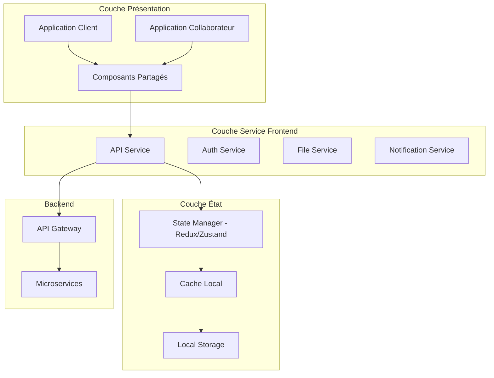

# Architecture des Interfaces Utilisateur

## 1. Vue d'Ensemble des Interfaces

### 1.1 Objectifs des Interfaces

#### Exigences Fonctionnelles
- **Interface Client** : Déposer, consulter et gérer ses pièces justificatives
- **Interface Collaborateur** : Valider, archiver et gérer les dossiers clients
- **Expérience Utilisateur** : Interface intuitive et responsive
- **Performance** : Temps de chargement < 2 secondes
- **Accessibilité** : Conformité RGAA (Référentiel Général d'Amélioration de l'Accessibilité)

#### Contraintes Techniques
- **Responsive Design** : Support mobile, tablette et desktop
- **Navigateurs** : Support des navigateurs modernes (Chrome, Firefox, Safari, Edge)
- **Sécurité** : Protection contre XSS, CSRF et autres vulnérabilités web
- **Offline** : Fonctionnalités de base disponibles hors ligne

### 1.2 Architecture Frontend



## 2. Architecture Technique Frontend

### 2.1 Stack Technologique

#### Technologies Principales
- **Framework** : React 18 avec TypeScript
- **Routing** : React Router v6
- **State Management** : Redux Toolkit + RTK Query
- **UI Library** : Material-UI (MUI) v5
- **Styling** : Styled Components + CSS Modules
- **Build Tool** : Vite
- **Testing** : Jest + React Testing Library + Cypress

#### Outils de Développement
- **Linting** : ESLint + Prettier
- **Type Checking** : TypeScript strict mode
- **Bundle Analysis** : Webpack Bundle Analyzer
- **Performance** : React DevTools Profiler

### 2.2 Structure du Projet

#### Organisation des Dossiers
```
src/
├── apps/
│   ├── client/                 # Application client
│   │   ├── pages/
│   │   ├── components/
│   │   └── hooks/
│   └── collaborateur/          # Application collaborateur
│       ├── pages/
│       ├── components/
│       └── hooks/
├── shared/                     # Composants partagés
│   ├── components/
│   │   ├── ui/                # Composants UI de base
│   │   ├── forms/             # Composants de formulaires
│   │   ├── layout/            # Composants de mise en page
│   │   └── business/          # Composants métier
│   ├── hooks/                 # Hooks personnalisés
│   ├── services/              # Services API
│   ├── store/                 # État global
│   ├── types/                 # Types TypeScript
│   ├── utils/                 # Utilitaires
│   └── constants/             # Constantes
├── assets/                    # Ressources statiques
│   ├── images/
│   ├── icons/
│   └── fonts/
└── styles/                    # Styles globaux
    ├── themes/
    ├── globals.css
    └── variables.css
```

## 3. Interface Client

### 3.1 Pages et Fonctionnalités

#### Page d'Accueil Dossier
```tsx
// src/apps/client/pages/DossierHomePage.tsx
import React from 'react';
import { useParams } from 'react-router-dom';
import { useDossierQuery } from '@/shared/services/dossierApi';
import { DossierHeader } from '../components/DossierHeader';
import { EtapesProgress } from '../components/EtapesProgress';
import { DocumentsList } from '../components/DocumentsList';
import { DocumentUpload } from '../components/DocumentUpload';

export const DossierHomePage: React.FC = () => {
  const { dossierId } = useParams<{ dossierId: string }>();
  const { data: dossier, isLoading, error } = useDossierQuery(dossierId!);

  if (isLoading) return <LoadingSpinner />;
  if (error) return <ErrorMessage error={error} />;
  if (!dossier) return <NotFound />;

  return (
    <PageContainer>
      <DossierHeader dossier={dossier} />
      
      <Grid container spacing={3}>
        <Grid item xs={12}>
          <EtapesProgress 
            etapes={dossier.etapes}
            etapeCourante={dossier.etapeCourante}
          />
        </Grid>
        
        <Grid item xs={12} md={8}>
          <DocumentsList 
            documents={dossier.documents}
            onDocumentAction={handleDocumentAction}
          />
        </Grid>
        
        <Grid item xs={12} md={4}>
          <DocumentUpload 
            dossierId={dossierId!}
            allowedTypes={getAllowedDocumentTypes(dossier)}
            onUploadSuccess={handleUploadSuccess}
          />
        </Grid>
      </Grid>
    </PageContainer>
  );
};
```

#### Composant Upload de Documents
```tsx
// src/apps/client/components/DocumentUpload.tsx
import React, { useCallback, useState } from 'react';
import { useDropzone } from 'react-dropzone';
import { useUploadDocumentMutation } from '@/shared/services/documentApi';
import { DocumentType } from '@/shared/types/document';

interface DocumentUploadProps {
  dossierId: string;
  allowedTypes: DocumentType[];
  onUploadSuccess: (document: Document) => void;
}

export const DocumentUpload: React.FC<DocumentUploadProps> = ({
  dossierId,
  allowedTypes,
  onUploadSuccess
}) => {
  const [selectedType, setSelectedType] = useState<DocumentType | null>(null);
  const [uploadDocument, { isLoading }] = useUploadDocumentMutation();

  const onDrop = useCallback(async (acceptedFiles: File[]) => {
    if (!selectedType || acceptedFiles.length === 0) return;

    const file = acceptedFiles[0];
    
    try {
      const formData = new FormData();
      formData.append('file', file);
      formData.append('dossier_id', dossierId);
      formData.append('type_document', selectedType);
      formData.append('est_obligatoire', 'true');

      const result = await uploadDocument(formData).unwrap();
      
      showNotification({
        type: 'success',
        message: `Document "${file.name}" uploadé avec succès`
      });
      
      onUploadSuccess(result);
      setSelectedType(null);
      
    } catch (error) {
      showNotification({
        type: 'error',
        message: `Erreur lors de l'upload: ${error.message}`
      });
    }
  }, [selectedType, dossierId, uploadDocument, onUploadSuccess]);

  const { getRootProps, getInputProps, isDragActive } = useDropzone({
    onDrop,
    accept: {
      'application/pdf': ['.pdf'],
      'image/jpeg': ['.jpg', '.jpeg'],
      'image/png': ['.png']
    },
    maxSize: 50 * 1024 * 1024, // 50MB
    multiple: false,
    disabled: !selectedType || isLoading
  });

  return (
    <Card>
      <CardHeader>
        <Typography variant="h6">Ajouter un document</Typography>
      </CardHeader>
      
      <CardContent>
        <FormControl fullWidth margin="normal">
          <InputLabel>Type de document</InputLabel>
          <Select
            value={selectedType || ''}
            onChange={(e) => setSelectedType(e.target.value as DocumentType)}
          >
            {allowedTypes.map(type => (
              <MenuItem key={type} value={type}>
                {getDocumentTypeLabel(type)}
              </MenuItem>
            ))}
          </Select>
        </FormControl>

        {selectedType && (
          <Box
            {...getRootProps()}
            sx={{
              border: '2px dashed',
              borderColor: isDragActive ? 'primary.main' : 'grey.300',
              borderRadius: 2,
              p: 3,
              textAlign: 'center',
              cursor: 'pointer',
              bgcolor: isDragActive ? 'action.hover' : 'background.paper',
              transition: 'all 0.2s ease'
            }}
          >
            <input {...getInputProps()} />
            
            {isLoading ? (
              <CircularProgress />
            ) : (
              <>
                <CloudUploadIcon sx={{ fontSize: 48, color: 'grey.400', mb: 2 }} />
                <Typography variant="body1" gutterBottom>
                  {isDragActive
                    ? 'Déposez le fichier ici...'
                    : 'Glissez-déposez un fichier ou cliquez pour sélectionner'
                  }
                </Typography>
                <Typography variant="body2" color="text.secondary">
                  Formats acceptés: PDF, JPG, PNG (max 50MB)
                </Typography>
              </>
            )}
          </Box>
        )}
      </CardContent>
    </Card>
  );
};
```

### 3.2 Composants Métier Client

#### Liste des Documents
```tsx
// src/apps/client/components/DocumentsList.tsx
import React from 'react';
import { Document, DocumentStatus } from '@/shared/types/document';
import { DocumentCard } from '@/shared/components/business/DocumentCard';

interface DocumentsListProps {
  documents: Document[];
  onDocumentAction: (action: string, document: Document) => void;
}

export const DocumentsList: React.FC<DocumentsListProps> = ({
  documents,
  onDocumentAction
}) => {
  const groupedDocuments = groupDocumentsByEtape(documents);

  return (
    <Box>
      {Object.entries(groupedDocuments).map(([etape, docs]) => (
        <Accordion key={etape} defaultExpanded>
          <AccordionSummary expandIcon={<ExpandMoreIcon />}>
            <Typography variant="h6">
              {etape}
              <Chip 
                label={`${docs.length} document(s)`}
                size="small"
                sx={{ ml: 2 }}
              />
            </Typography>
          </AccordionSummary>
          
          <AccordionDetails>
            <Grid container spacing={2}>
              {docs.map(document => (
                <Grid item xs={12} sm={6} md={4} key={document.id}>
                  <DocumentCard
                    document={document}
                    actions={getClientDocumentActions(document)}
                    onAction={(action) => onDocumentAction(action, document)}
                  />
                </Grid>
              ))}
            </Grid>
          </AccordionDetails>
        </Accordion>
      ))}
    </Box>
  );
};

const getClientDocumentActions = (document: Document) => {
  const actions = [
    { key: 'view', label: 'Visualiser', icon: <VisibilityIcon /> },
    { key: 'download', label: 'Télécharger', icon: <DownloadIcon /> }
  ];

  if (document.statut === DocumentStatus.REJETE) {
    actions.push({
      key: 'replace',
      label: 'Remplacer',
      icon: <ReplaceIcon />
    });
  }

  return actions;
};
```

## 4. Interface Collaborateur

### 4.1 Pages et Fonctionnalités

#### Dashboard Collaborateur
```tsx
// src/apps/collaborateur/pages/DashboardPage.tsx
import React from 'react';
import { useDossiersQuery } from '@/shared/services/dossierApi';
import { DossierFilters } from '../components/DossierFilters';
import { DossiersTable } from '../components/DossiersTable';
import { DashboardStats } from '../components/DashboardStats';

export const DashboardPage: React.FC = () => {
  const [filters, setFilters] = useState<DossierFilters>({
    statut: null,
    typeParcours: null,
    dateFrom: null,
    dateTo: null
  });

  const { data: dossiers, isLoading } = useDossiersQuery(filters);
  const { data: stats } = useDashboardStatsQuery();

  return (
    <PageContainer>
      <PageHeader>
        <Typography variant="h4">Tableau de bord</Typography>
        <Button
          variant="contained"
          startIcon={<AddIcon />}
          onClick={() => navigate('/dossiers/nouveau')}
        >
          Nouveau dossier
        </Button>
      </PageHeader>

      <Grid container spacing={3}>
        <Grid item xs={12}>
          <DashboardStats stats={stats} />
        </Grid>
        
        <Grid item xs={12} md={3}>
          <DossierFilters
            filters={filters}
            onFiltersChange={setFilters}
          />
        </Grid>
        
        <Grid item xs={12} md={9}>
          <DossiersTable
            dossiers={dossiers}
            loading={isLoading}
            onDossierSelect={handleDossierSelect}
          />
        </Grid>
      </Grid>
    </PageContainer>
  );
};
```

#### Page de Validation de Documents
```tsx
// src/apps/collaborateur/pages/DocumentValidationPage.tsx
import React, { useState } from 'react';
import { useParams } from 'react-router-dom';
import { useDocumentQuery, useValidateDocumentMutation } from '@/shared/services/documentApi';
import { DocumentViewer } from '@/shared/components/business/DocumentViewer';
import { ValidationForm } from '../components/ValidationForm';

export const DocumentValidationPage: React.FC = () => {
  const { documentId } = useParams<{ documentId: string }>();
  const { data: document, isLoading } = useDocumentQuery(documentId!);
  const [validateDocument] = useValidateDocumentMutation();
  
  const [validationData, setValidationData] = useState({
    statut: null,
    commentaire: '',
    dateExpiration: null
  });

  const handleValidation = async (isValid: boolean) => {
    try {
      await validateDocument({
        documentId: documentId!,
        statut: isValid ? 'VALIDE' : 'REJETE',
        commentaire: validationData.commentaire,
        dateExpiration: validationData.dateExpiration
      }).unwrap();

      showNotification({
        type: 'success',
        message: `Document ${isValid ? 'validé' : 'rejeté'} avec succès`
      });

      navigate(-1);
    } catch (error) {
      showNotification({
        type: 'error',
        message: `Erreur lors de la validation: ${error.message}`
      });
    }
  };

  if (isLoading) return <LoadingSpinner />;
  if (!document) return <NotFound />;

  return (
    <PageContainer>
      <Grid container spacing={3}>
        <Grid item xs={12} md={8}>
          <DocumentViewer
            document={document}
            showMetadata={true}
            showHistory={true}
          />
        </Grid>
        
        <Grid item xs={12} md={4}>
          <ValidationForm
            document={document}
            validationData={validationData}
            onValidationDataChange={setValidationData}
            onValidate={handleValidation}
          />
        </Grid>
      </Grid>
    </PageContainer>
  );
};
```

### 4.2 Composants Métier Collaborateur

#### Formulaire de Validation
```tsx
// src/apps/collaborateur/components/ValidationForm.tsx
import React from 'react';
import { Document } from '@/shared/types/document';

interface ValidationFormProps {
  document: Document;
  validationData: ValidationData;
  onValidationDataChange: (data: ValidationData) => void;
  onValidate: (isValid: boolean) => void;
}

export const ValidationForm: React.FC<ValidationFormProps> = ({
  document,
  validationData,
  onValidationDataChange,
  onValidate
}) => {
  return (
    <Card>
      <CardHeader>
        <Typography variant="h6">Validation du document</Typography>
      </CardHeader>
      
      <CardContent>
        <DocumentInfo document={document} />
        
        <Divider sx={{ my: 2 }} />
        
        <TextField
          fullWidth
          multiline
          rows={4}
          label="Commentaire"
          value={validationData.commentaire}
          onChange={(e) => onValidationDataChange({
            ...validationData,
            commentaire: e.target.value
          })}
          margin="normal"
        />
        
        <DatePicker
          label="Date d'expiration"
          value={validationData.dateExpiration}
          onChange={(date) => onValidationDataChange({
            ...validationData,
            dateExpiration: date
          })}
          renderInput={(params) => <TextField {...params} fullWidth margin="normal" />}
        />
        
        <Box sx={{ mt: 3, display: 'flex', gap: 2 }}>
          <Button
            variant="contained"
            color="success"
            startIcon={<CheckIcon />}
            onClick={() => onValidate(true)}
            fullWidth
          >
            Valider
          </Button>
          
          <Button
            variant="contained"
            color="error"
            startIcon={<CloseIcon />}
            onClick={() => onValidate(false)}
            fullWidth
          >
            Rejeter
          </Button>
        </Box>
      </CardContent>
    </Card>
  );
};
```

## 5. Composants Partagés

### 5.1 Composants UI de Base

#### Visualiseur de Documents
```tsx
// src/shared/components/business/DocumentViewer.tsx
import React, { useState } from 'react';
import { Document } from '@/shared/types/document';
import { useDocumentPreviewQuery } from '@/shared/services/documentApi';

interface DocumentViewerProps {
  document: Document;
  showMetadata?: boolean;
  showHistory?: boolean;
}

export const DocumentViewer: React.FC<DocumentViewerProps> = ({
  document,
  showMetadata = false,
  showHistory = false
}) => {
  const [currentPage, setCurrentPage] = useState(1);
  const { data: previewUrl } = useDocumentPreviewQuery({
    documentId: document.id,
    page: currentPage
  });

  const renderDocumentContent = () => {
    switch (document.mimeType) {
      case 'application/pdf':
        return (
          <PDFViewer
            url={previewUrl}
            currentPage={currentPage}
            onPageChange={setCurrentPage}
          />
        );
      case 'image/jpeg':
      case 'image/png':
        return (
          <ImageViewer
            src={previewUrl}
            alt={document.nomFichier}
          />
        );
      default:
        return (
          <Box sx={{ p: 3, textAlign: 'center' }}>
            <FileIcon sx={{ fontSize: 64, color: 'grey.400' }} />
            <Typography variant="body1" sx={{ mt: 2 }}>
              Aperçu non disponible pour ce type de fichier
            </Typography>
            <Button
              variant="outlined"
              startIcon={<DownloadIcon />}
              onClick={() => downloadDocument(document.id)}
              sx={{ mt: 2 }}
            >
              Télécharger
            </Button>
          </Box>
        );
    }
  };

  return (
    <Card>
      <CardHeader>
        <Typography variant="h6">{document.nomOriginal}</Typography>
        <DocumentStatusChip status={document.statut} />
      </CardHeader>
      
      <CardContent>
        <Box sx={{ minHeight: 600, border: '1px solid', borderColor: 'grey.300' }}>
          {renderDocumentContent()}
        </Box>
        
        {showMetadata && (
          <DocumentMetadata document={document} />
        )}
        
        {showHistory && (
          <DocumentHistory documentId={document.id} />
        )}
      </CardContent>
    </Card>
  );
};
```

### 5.2 Hooks Personnalisés

#### Hook de Gestion des Notifications
```tsx
// src/shared/hooks/useNotifications.ts
import { useContext } from 'react';
import { NotificationContext } from '@/shared/contexts/NotificationContext';

export interface Notification {
  id: string;
  type: 'success' | 'error' | 'warning' | 'info';
  message: string;
  duration?: number;
}

export const useNotifications = () => {
  const context = useContext(NotificationContext);
  
  if (!context) {
    throw new Error('useNotifications must be used within NotificationProvider');
  }
  
  const showNotification = (notification: Omit<Notification, 'id'>) => {
    const id = generateId();
    context.addNotification({ ...notification, id });
  };
  
  const hideNotification = (id: string) => {
    context.removeNotification(id);
  };
  
  return {
    notifications: context.notifications,
    showNotification,
    hideNotification
  };
};
```

#### Hook de Gestion des Uploads
```tsx
// src/shared/hooks/useFileUpload.ts
import { useState, useCallback } from 'react';
import { useUploadDocumentMutation } from '@/shared/services/documentApi';

export interface UploadProgress {
  loaded: number;
  total: number;
  percentage: number;
}

export const useFileUpload = () => {
  const [uploadProgress, setUploadProgress] = useState<UploadProgress | null>(null);
  const [uploadDocument] = useUploadDocumentMutation();
  
  const uploadFile = useCallback(async (
    file: File,
    metadata: UploadMetadata
  ) => {
    const formData = new FormData();
    formData.append('file', file);
    Object.entries(metadata).forEach(([key, value]) => {
      formData.append(key, value);
    });
    
    try {
      setUploadProgress({ loaded: 0, total: file.size, percentage: 0 });
      
      const result = await uploadDocument(formData, {
        onUploadProgress: (progressEvent) => {
          const { loaded, total } = progressEvent;
          const percentage = Math.round((loaded * 100) / total);
          setUploadProgress({ loaded, total, percentage });
        }
      }).unwrap();
      
      setUploadProgress(null);
      return result;
      
    } catch (error) {
      setUploadProgress(null);
      throw error;
    }
  }, [uploadDocument]);
  
  return {
    uploadFile,
    uploadProgress,
    isUploading: uploadProgress !== null
  };
};
```

## 6. Gestion de l'État

### 6.1 Configuration Redux

#### Store Configuration
```tsx
// src/shared/store/index.ts
import { configureStore } from '@reduxjs/toolkit';
import { setupListeners } from '@reduxjs/toolkit/query';
import { dossierApi } from '@/shared/services/dossierApi';
import { documentApi } from '@/shared/services/documentApi';
import { authSlice } from './slices/authSlice';
import { uiSlice } from './slices/uiSlice';

export const store = configureStore({
  reducer: {
    auth: authSlice.reducer,
    ui: uiSlice.reducer,
    [dossierApi.reducerPath]: dossierApi.reducer,
    [documentApi.reducerPath]: documentApi.reducer,
  },
  middleware: (getDefaultMiddleware) =>
    getDefaultMiddleware({
      serializableCheck: {
        ignoredActions: ['persist/PERSIST', 'persist/REHYDRATE'],
      },
    })
      .concat(dossierApi.middleware)
      .concat(documentApi.middleware),
});

setupListeners(store.dispatch);

export type RootState = ReturnType<typeof store.getState>;
export type AppDispatch = typeof store.dispatch;
```

#### Slice d'Authentification
```tsx
// src/shared/store/slices/authSlice.ts
import { createSlice, PayloadAction } from '@reduxjs/toolkit';
import { User } from '@/shared/types/user';

interface AuthState {
  user: User | null;
  token: string | null;
  isAuthenticated: boolean;
  isLoading: boolean;
}

const initialState: AuthState = {
  user: null,
  token: null,
  isAuthenticated: false,
  isLoading: false,
};

export const authSlice = createSlice({
  name: 'auth',
  initialState,
  reducers: {
    loginStart: (state) => {
      state.isLoading = true;
    },
    loginSuccess: (state, action: PayloadAction<{ user: User; token: string }>) => {
      state.user = action.payload.user;
      state.token = action.payload.token;
      state.isAuthenticated = true;
      state.isLoading = false;
    },
    loginFailure: (state) => {
      state.user = null;
      state.token = null;
      state.isAuthenticated = false;
      state.isLoading = false;
    },
    logout: (state) => {
      state.user = null;
      state.token = null;
      state.isAuthenticated = false;
      state.isLoading = false;
    },
  },
});

export const { loginStart, loginSuccess, loginFailure, logout } = authSlice.actions;
```

## 7. Services API

### 7.1 Configuration RTK Query

#### API de Base
```tsx
// src/shared/services/baseApi.ts
import { createApi, fetchBaseQuery } from '@reduxjs/toolkit/query/react';
import { RootState } from '@/shared/store';

export const baseApi = createApi({
  reducerPath: 'api',
  baseQuery: fetchBaseQuery({
    baseUrl: '/api/v1',
    prepareHeaders: (headers, { getState }) => {
      const token = (getState() as RootState).auth.token;
      if (token) {
        headers.set('authorization', `Bearer ${token}`);
      }
      return headers;
    },
  }),
  tagTypes: ['Dossier', 'Document', 'User'],
  endpoints: () => ({}),
});
```

#### API Documents
```tsx
// src/shared/services/documentApi.ts
import { baseApi } from './baseApi';
import { Document, DocumentUploadRequest } from '@/shared/types/document';

export const documentApi = baseApi.injectEndpoints({
  endpoints: (builder) => ({
    getDocument: builder.query<Document, string>({
      query: (id) => `documents/${id}`,
      providesTags: (result, error, id) => [{ type: 'Document', id }],
    }),
    
    uploadDocument: builder.mutation<Document, FormData>({
      query: (formData) => ({
        url: 'documents',
        method: 'POST',
        body: formData,
      }),
      invalidatesTags: ['Document', 'Dossier'],
    }),
    
    validateDocument: builder.mutation<Document, {
      documentId: string;
      statut: string;
      commentaire: string;
      dateExpiration?: string;
    }>({
      query: ({ documentId, ...body }) => ({
        url: `documents/${documentId}/valider`,
        method: 'POST',
        body,
      }),
      invalidatesTags: (result, error, { documentId }) => [
        { type: 'Document', id: documentId },
        'Dossier'
      ],
    }),
    
    getDocumentPreview: builder.query<string, {
      documentId: string;
      page?: number;
      width?: number;
      height?: number;
    }>({
      query: ({ documentId, ...params }) => ({
        url: `documents/${documentId}/preview`,
        params,
      }),
    }),
    
    downloadDocument: builder.mutation<Blob, string>({
      query: (documentId) => ({
        url: `documents/${documentId}/download`,
        responseHandler: (response) => response.blob(),
      }),
    }),
  }),
});

export const {
  useGetDocumentQuery,
  useUploadDocumentMutation,
  useValidateDocumentMutation,
  useGetDocumentPreviewQuery,
  useDownloadDocumentMutation,
} = documentApi;
```

## 8. Thème et Styling

### 8.1 Configuration du Thème

#### Thème Material-UI
```tsx
// src/shared/styles/theme.ts
import { createTheme } from '@mui/material/styles';

export const theme = createTheme({
  palette: {
    primary: {
      main: '#1976d2',
      light: '#42a5f5',
      dark: '#1565c0',
    },
    secondary: {
      main: '#dc004e',
      light: '#ff5983',
      dark: '#9a0036',
    },
    success: {
      main: '#2e7d32',
    },
    warning: {
      main: '#ed6c02',
    },
    error: {
      main: '#d32f2f',
    },
    background: {
      default: '#f5f5f5',
      paper: '#ffffff',
    },
  },
  typography: {
    fontFamily: '"Roboto", "Helvetica", "Arial", sans-serif',
    h1: {
      fontSize: '2.5rem',
      fontWeight: 500,
    },
    h2: {
      fontSize: '2rem',
      fontWeight: 500,
    },
    h3: {
      fontSize: '1.75rem',
      fontWeight: 500,
    },
    h4: {
      fontSize: '1.5rem',
      fontWeight: 500,
    },
    h5: {
      fontSize: '1.25rem',
      fontWeight: 500,
    },
    h6: {
      fontSize: '1rem',
fontWeight: 500,
    },
    body1: {
      fontSize: '1rem',
      lineHeight: 1.5,
    },
    body2: {
      fontSize: '0.875rem',
      lineHeight: 1.43,
    },
  },
  components: {
    MuiButton: {
      styleOverrides: {
        root: {
          textTransform: 'none',
          borderRadius: 8,
        },
      },
    },
    MuiCard: {
      styleOverrides: {
        root: {
          borderRadius: 12,
          boxShadow: '0 2px 8px rgba(0,0,0,0.1)',
        },
      },
    },
    MuiTextField: {
      styleOverrides: {
        root: {
          '& .MuiOutlinedInput-root': {
            borderRadius: 8,
          },
        },
      },
    },
  },
});
```

### 8.2 Composants Styled

#### Composants de Layout
```tsx
// src/shared/components/layout/PageContainer.tsx
import { styled } from '@mui/material/styles';
import { Container } from '@mui/material';

export const PageContainer = styled(Container)(({ theme }) => ({
  paddingTop: theme.spacing(3),
  paddingBottom: theme.spacing(3),
  minHeight: 'calc(100vh - 64px)', // Hauteur moins header
}));

export const PageHeader = styled('div')(({ theme }) => ({
  display: 'flex',
  justifyContent: 'space-between',
  alignItems: 'center',
  marginBottom: theme.spacing(3),
  [theme.breakpoints.down('sm')]: {
    flexDirection: 'column',
    alignItems: 'flex-start',
    gap: theme.spacing(2),
  },
}));
```

## 9. Responsive Design et Accessibilité

### 9.1 Breakpoints et Layout Responsive

#### Configuration des Breakpoints
```tsx
// src/shared/styles/breakpoints.ts
export const breakpoints = {
  xs: 0,
  sm: 600,
  md: 900,
  lg: 1200,
  xl: 1536,
};

// Hook pour la détection de breakpoints
export const useBreakpoint = () => {
  const theme = useTheme();
  const isMobile = useMediaQuery(theme.breakpoints.down('sm'));
  const isTablet = useMediaQuery(theme.breakpoints.between('sm', 'lg'));
  const isDesktop = useMediaQuery(theme.breakpoints.up('lg'));
  
  return { isMobile, isTablet, isDesktop };
};
```

#### Layout Adaptatif
```tsx
// src/shared/components/layout/ResponsiveLayout.tsx
import React from 'react';
import { useBreakpoint } from '@/shared/styles/breakpoints';

export const ResponsiveLayout: React.FC<{ children: React.ReactNode }> = ({ children }) => {
  const { isMobile, isTablet } = useBreakpoint();
  
  return (
    <Box sx={{ display: 'flex', flexDirection: 'column', minHeight: '100vh' }}>
      <AppBar position="sticky">
        <Toolbar>
          {isMobile ? <MobileHeader /> : <DesktopHeader />}
        </Toolbar>
      </AppBar>
      
      <Box sx={{ display: 'flex', flex: 1 }}>
        {!isMobile && <Sidebar />}
        
        <Box component="main" sx={{ flex: 1, overflow: 'auto' }}>
          {children}
        </Box>
      </Box>
      
      {isMobile && <BottomNavigation />}
    </Box>
  );
};
```

### 9.2 Accessibilité (RGAA)

#### Composants Accessibles
```tsx
// src/shared/components/ui/AccessibleButton.tsx
import React from 'react';
import { Button, ButtonProps } from '@mui/material';

interface AccessibleButtonProps extends ButtonProps {
  ariaLabel?: string;
  ariaDescribedBy?: string;
}

export const AccessibleButton: React.FC<AccessibleButtonProps> = ({
  ariaLabel,
  ariaDescribedBy,
  children,
  ...props
}) => {
  return (
    <Button
      {...props}
      aria-label={ariaLabel}
      aria-describedby={ariaDescribedBy}
      role="button"
      tabIndex={0}
    >
      {children}
    </Button>
  );
};
```

#### Navigation au Clavier
```tsx
// src/shared/hooks/useKeyboardNavigation.ts
import { useEffect } from 'react';

export const useKeyboardNavigation = (
  containerRef: React.RefObject<HTMLElement>,
  options: {
    focusableSelector?: string;
    onEscape?: () => void;
    onEnter?: () => void;
  } = {}
) => {
  const {
    focusableSelector = 'button, [href], input, select, textarea, [tabindex]:not([tabindex="-1"])',
    onEscape,
    onEnter
  } = options;

  useEffect(() => {
    const container = containerRef.current;
    if (!container) return;

    const handleKeyDown = (event: KeyboardEvent) => {
      const focusableElements = container.querySelectorAll(focusableSelector);
      const focusableArray = Array.from(focusableElements) as HTMLElement[];
      const currentIndex = focusableArray.indexOf(document.activeElement as HTMLElement);

      switch (event.key) {
        case 'ArrowDown':
        case 'ArrowRight':
          event.preventDefault();
          const nextIndex = (currentIndex + 1) % focusableArray.length;
          focusableArray[nextIndex]?.focus();
          break;

        case 'ArrowUp':
        case 'ArrowLeft':
          event.preventDefault();
          const prevIndex = currentIndex === 0 ? focusableArray.length - 1 : currentIndex - 1;
          focusableArray[prevIndex]?.focus();
          break;

        case 'Escape':
          onEscape?.();
          break;

        case 'Enter':
          onEnter?.();
          break;
      }
    };

    container.addEventListener('keydown', handleKeyDown);
    return () => container.removeEventListener('keydown', handleKeyDown);
  }, [containerRef, focusableSelector, onEscape, onEnter]);
};
```

## 10. Performance et Optimisation

### 10.1 Lazy Loading et Code Splitting

#### Lazy Loading des Pages
```tsx
// src/shared/utils/lazyImport.ts
import { lazy } from 'react';

export const lazyImport = <T extends Record<string, any>>(
  factory: () => Promise<T>,
  name: keyof T
) => {
  return lazy(() =>
    factory().then((module) => ({ default: module[name] }))
  );
};

// Usage
const DossierHomePage = lazyImport(
  () => import('@/apps/client/pages/DossierHomePage'),
  'DossierHomePage'
);
```

#### Optimisation des Bundles
```tsx
// src/shared/components/ui/LazyComponent.tsx
import React, { Suspense } from 'react';
import { CircularProgress, Box } from '@mui/material';

interface LazyComponentProps {
  children: React.ReactNode;
  fallback?: React.ReactNode;
}

export const LazyComponent: React.FC<LazyComponentProps> = ({
  children,
  fallback = (
    <Box display="flex" justifyContent="center" alignItems="center" minHeight="200px">
      <CircularProgress />
    </Box>
  )
}) => {
  return <Suspense fallback={fallback}>{children}</Suspense>;
};
```

### 10.2 Optimisation des Rendus

#### Mémorisation des Composants
```tsx
// src/shared/components/business/DocumentCard.tsx
import React, { memo } from 'react';
import { Document } from '@/shared/types/document';

interface DocumentCardProps {
  document: Document;
  actions: DocumentAction[];
  onAction: (action: string) => void;
}

export const DocumentCard = memo<DocumentCardProps>(({
  document,
  actions,
  onAction
}) => {
  return (
    <Card>
      <CardContent>
        <Typography variant="h6" noWrap>
          {document.nomOriginal}
        </Typography>
        
        <DocumentStatusChip status={document.statut} />
        
        <Typography variant="body2" color="text.secondary">
          {formatFileSize(document.tailleFichier)}
        </Typography>
        
        <Typography variant="body2" color="text.secondary">
          {formatDate(document.dateDepot)}
        </Typography>
      </CardContent>
      
      <CardActions>
        {actions.map(action => (
          <IconButton
            key={action.key}
            onClick={() => onAction(action.key)}
            aria-label={action.label}
          >
            {action.icon}
          </IconButton>
        ))}
      </CardActions>
    </Card>
  );
}, (prevProps, nextProps) => {
  // Comparaison personnalisée pour éviter les re-renders inutiles
  return (
    prevProps.document.id === nextProps.document.id &&
    prevProps.document.statut === nextProps.document.statut &&
    prevProps.actions.length === nextProps.actions.length
  );
});
```

#### Virtualisation des Listes
```tsx
// src/shared/components/ui/VirtualizedList.tsx
import React from 'react';
import { FixedSizeList as List } from 'react-window';
import { Box } from '@mui/material';

interface VirtualizedListProps<T> {
  items: T[];
  itemHeight: number;
  renderItem: (props: { index: number; style: React.CSSProperties; data: T[] }) => React.ReactNode;
  height?: number;
}

export const VirtualizedList = <T,>({
  items,
  itemHeight,
  renderItem,
  height = 400
}: VirtualizedListProps<T>) => {
  return (
    <Box sx={{ height, width: '100%' }}>
      <List
        height={height}
        itemCount={items.length}
        itemSize={itemHeight}
        itemData={items}
      >
        {renderItem}
      </List>
    </Box>
  );
};
```

## 11. Tests Frontend

### 11.1 Tests Unitaires

#### Test d'un Composant
```tsx
// src/apps/client/components/__tests__/DocumentUpload.test.tsx
import React from 'react';
import { render, screen, fireEvent, waitFor } from '@testing-library/react';
import { Provider } from 'react-redux';
import { configureStore } from '@reduxjs/toolkit';
import { DocumentUpload } from '../DocumentUpload';
import { documentApi } from '@/shared/services/documentApi';

const mockStore = configureStore({
  reducer: {
    [documentApi.reducerPath]: documentApi.reducer,
  },
  middleware: (getDefaultMiddleware) =>
    getDefaultMiddleware().concat(documentApi.middleware),
});

const renderWithProvider = (component: React.ReactElement) => {
  return render(
    <Provider store={mockStore}>
      {component}
    </Provider>
  );
};

describe('DocumentUpload', () => {
  const mockProps = {
    dossierId: 'dossier-123',
    allowedTypes: ['PIECE_IDENTITE', 'JUSTIFICATIF_DOMICILE'],
    onUploadSuccess: jest.fn(),
  };

  beforeEach(() => {
    jest.clearAllMocks();
  });

  it('should render document type selector', () => {
    renderWithProvider(<DocumentUpload {...mockProps} />);
    
    expect(screen.getByLabelText('Type de document')).toBeInTheDocument();
  });

  it('should show upload zone when document type is selected', async () => {
    renderWithProvider(<DocumentUpload {...mockProps} />);
    
    const typeSelector = screen.getByLabelText('Type de document');
    fireEvent.mouseDown(typeSelector);
    
    const option = screen.getByText('Pièce d\'identité');
    fireEvent.click(option);
    
    await waitFor(() => {
      expect(screen.getByText(/Glissez-déposez un fichier/)).toBeInTheDocument();
    });
  });

  it('should handle file upload', async () => {
    const file = new File(['test content'], 'test.pdf', { type: 'application/pdf' });
    
    renderWithProvider(<DocumentUpload {...mockProps} />);
    
    // Sélectionner le type de document
    const typeSelector = screen.getByLabelText('Type de document');
    fireEvent.mouseDown(typeSelector);
    fireEvent.click(screen.getByText('Pièce d\'identité'));
    
    // Simuler le drop de fichier
    const dropZone = screen.getByText(/Glissez-déposez un fichier/);
    fireEvent.drop(dropZone, {
      dataTransfer: {
        files: [file],
      },
    });
    
    await waitFor(() => {
      expect(mockProps.onUploadSuccess).toHaveBeenCalled();
    });
  });
});
```

### 11.2 Tests d'Intégration

#### Test E2E avec Cypress
```typescript
// cypress/e2e/document-upload.cy.ts
describe('Document Upload Flow', () => {
  beforeEach(() => {
    cy.login('client@test.com', 'password');
    cy.visit('/dossiers/test-dossier-id');
  });

  it('should upload a document successfully', () => {
    // Sélectionner le type de document
    cy.get('[data-testid="document-type-select"]').click();
    cy.get('[data-value="PIECE_IDENTITE"]').click();
    
    // Upload du fichier
    cy.get('[data-testid="file-upload-zone"]').selectFile('cypress/fixtures/test-document.pdf', {
      action: 'drag-drop'
    });
    
    // Vérifier le succès
    cy.get('[data-testid="success-notification"]').should('be.visible');
    cy.get('[data-testid="documents-list"]').should('contain', 'test-document.pdf');
  });

  it('should show validation errors for invalid files', () => {
    cy.get('[data-testid="document-type-select"]').click();
    cy.get('[data-value="PIECE_IDENTITE"]').click();
    
    // Upload d'un fichier invalide
    cy.get('[data-testid="file-upload-zone"]').selectFile('cypress/fixtures/invalid-file.txt', {
      action: 'drag-drop'
    });
    
    // Vérifier l'erreur
    cy.get('[data-testid="error-notification"]').should('be.visible');
    cy.get('[data-testid="error-notification"]').should('contain', 'Type de fichier non autorisé');
  });
});
```

## 12. Déploiement et Build

### 12.1 Configuration Vite

#### Configuration de Build
```typescript
// vite.config.ts
import { defineConfig } from 'vite';
import react from '@vitejs/plugin-react';
import { resolve } from 'path';

export default defineConfig({
  plugins: [react()],
  resolve: {
    alias: {
      '@': resolve(__dirname, 'src'),
    },
  },
  build: {
    rollupOptions: {
      output: {
        manualChunks: {
          vendor: ['react', 'react-dom'],
          mui: ['@mui/material', '@mui/icons-material'],
          redux: ['@reduxjs/toolkit', 'react-redux'],
        },
      },
    },
    chunkSizeWarningLimit: 1000,
  },
  server: {
    proxy: {
      '/api': {
        target: 'http://localhost:8080',
        changeOrigin: true,
      },
    },
  },
});
```

### 12.2 Variables d'Environnement

#### Configuration des Environnements
```typescript
// src/shared/config/env.ts
interface Config {
  apiBaseUrl: string;
  environment: 'development' | 'staging' | 'production';
  enableDevTools: boolean;
  maxFileSize: number;
  supportedFileTypes: string[];
}

export const config: Config = {
  apiBaseUrl: import.meta.env.VITE_API_BASE_URL || '/api/v1',
  environment: (import.meta.env.VITE_ENVIRONMENT as Config['environment']) || 'development',
  enableDevTools: import.meta.env.VITE_ENABLE_DEV_TOOLS === 'true',
  maxFileSize: parseInt(import.meta.env.VITE_MAX_FILE_SIZE || '52428800'), // 50MB
  supportedFileTypes: (import.meta.env.VITE_SUPPORTED_FILE_TYPES || 'pdf,jpg,jpeg,png').split(','),
};
```

## 13. Monitoring et Analytics

### 13.1 Monitoring des Performances

#### Web Vitals
```typescript
// src/shared/utils/webVitals.ts
import { getCLS, getFID, getFCP, getLCP, getTTFB } from 'web-vitals';

export const reportWebVitals = (onPerfEntry?: (metric: any) => void) => {
  if (onPerfEntry && onPerfEntry instanceof Function) {
    getCLS(onPerfEntry);
    getFID(onPerfEntry);
    getFCP(onPerfEntry);
    getLCP(onPerfEntry);
    getTTFB(onPerfEntry);
  }
};

// Usage dans main.tsx
reportWebVitals((metric) => {
  // Envoyer les métriques vers un service d'analytics
  analytics.track('Web Vital', {
    name: metric.name,
    value: metric.value,
    id: metric.id,
  });
});
```

### 13.2 Error Boundary et Logging

#### Error Boundary Global
```tsx
// src/shared/components/ErrorBoundary.tsx
import React, { Component, ErrorInfo, ReactNode } from 'react';
import { Box, Typography, Button } from '@mui/material';

interface Props {
  children: ReactNode;
}

interface State {
  hasError: boolean;
  error?: Error;
}

export class ErrorBoundary extends Component<Props, State> {
  constructor(props: Props) {
    super(props);
    this.state = { hasError: false };
  }

  static getDerivedStateFromError(error: Error): State {
    return { hasError: true, error };
  }

  componentDidCatch(error: Error, errorInfo: ErrorInfo) {
    console.error('Error caught by boundary:', error, errorInfo);
    
    // Envoyer l'erreur vers un service de logging
    this.logError(error, errorInfo);
  }

  private logError = (error: Error, errorInfo: ErrorInfo) => {
    // Intégration avec un service comme Sentry
    if (window.Sentry) {
      window.Sentry.captureException(error, {
        contexts: {
          react: {
            componentStack: errorInfo.componentStack,
          },
        },
      });
    }
  };

  render() {
    if (this.state.hasError) {
      return (
        <Box
          display="flex"
          flexDirection="column"
          alignItems="center"
          justifyContent="center"
          minHeight="400px"
          textAlign="center"
          p={3}
        >
          <Typography variant="h5" gutterBottom>
            Une erreur inattendue s'est produite
          </Typography>
          
          <Typography variant="body1" color="text.secondary" paragraph>
            Nous nous excusons pour la gêne occasionnée. L'équipe technique a été notifiée.
          </Typography>
          
          <Button
            variant="contained"
            onClick={() => window.location.reload()}
          >
            Recharger la page
          </Button>
        </Box>
      );
    }

    return this.props.children;
  }
}
```

Cette architecture d'interfaces utilisateur moderne et robuste offre une expérience utilisateur optimale pour les clients et collaborateurs, tout en maintenant les performances et l'accessibilité requises pour un système bancaire critique.