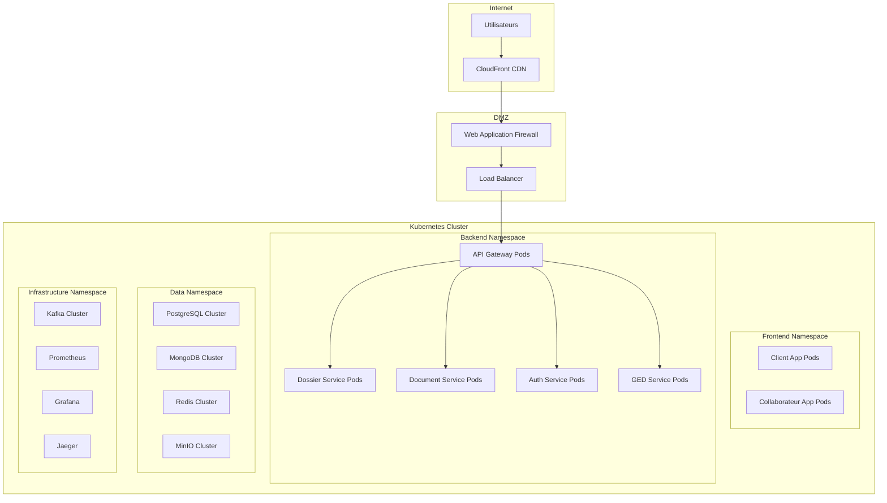

# Stratégie de Déploiement et d'Infrastructure

## 1. Vue d'Ensemble de l'Infrastructure

### 1.1 Objectifs de Déploiement

#### Exigences de Performance
- **Haute Disponibilité** : 99.9% de disponibilité
- **Scalabilité** : Support de 500+ utilisateurs simultanés
- **Performance** : Temps de réponse < 2 secondes
- **Résilience** : RTO < 15 minutes, RPO < 1 heure

#### Contraintes Opérationnelles
- **Sécurité** : Conformité aux standards bancaires
- **Monitoring** : Observabilité complète du système
- **Maintenance** : Déploiements sans interruption
- **Coûts** : Optimisation des ressources cloud

### 1.2 Architecture d'Infrastructure



## 2. Architecture Kubernetes

### 2.1 Configuration du Cluster

#### Cluster Multi-Zone
```yaml
# cluster-config.yaml
apiVersion: v1
kind: ConfigMap
metadata:
  name: cluster-config
  namespace: kube-system
data:
  cluster.yaml: |
    apiVersion: cluster.x-k8s.io/v1beta1
    kind: Cluster
    metadata:
      name: dpj-cluster
      namespace: default
    spec:
      clusterNetwork:
        pods:
          cidrBlocks:
          - 10.244.0.0/16
        services:
          cidrBlocks:
          - 10.96.0.0/12
      infrastructureRef:
        apiVersion: infrastructure.cluster.x-k8s.io/v1beta1
        kind: AWSCluster
        name: dpj-cluster
      controlPlaneRef:
        kind: KubeadmControlPlane
        apiVersion: controlplane.cluster.x-k8s.io/v1beta1
        name: dpj-cluster-control-plane
---
apiVersion: infrastructure.cluster.x-k8s.io/v1beta1
kind: AWSCluster
metadata:
  name: dpj-cluster
spec:
  region: eu-west-1
  sshKeyName: dpj-cluster-key
  networkSpec:
    vpc:
      availabilityZoneUsageLimit: 3
      availabilityZoneSelection: Ordered
    subnets:
    - availabilityZone: eu-west-1a
      cidrBlock: 10.0.1.0/24
      isPublic: true
    - availabilityZone: eu-west-1b
      cidrBlock: 10.0.2.0/24
      isPublic: true
    - availabilityZone: eu-west-1c
      cidrBlock: 10.0.3.0/24
      isPublic: true
    - availabilityZone: eu-west-1a
      cidrBlock: 10.0.11.0/24
      isPublic: false
    - availabilityZone: eu-west-1b
      cidrBlock: 10.0.12.0/24
      isPublic: false
    - availabilityZone: eu-west-1c
      cidrBlock: 10.0.13.0/24
      isPublic: false
```

#### Node Groups Configuration
```yaml
# node-groups.yaml
apiVersion: infrastructure.cluster.x-k8s.io/v1beta1
kind: AWSMachineTemplate
metadata:
  name: dpj-worker-nodes
spec:
  template:
    spec:
      instanceType: m5.xlarge
      ami:
        id: ami-0abcdef1234567890  # EKS optimized AMI
      iamInstanceProfile: nodes.cluster-api-provider-aws.sigs.k8s.io
      sshKeyName: dpj-cluster-key
      securityGroups:
      - id: sg-worker-nodes
      subnet:
        filters:
        - name: tag:Name
          values:
          - dpj-cluster-subnet-private-*
      rootVolume:
        size: 100
        type: gp3
        encrypted: true
      additionalSecurityGroups:
      - id: sg-database-access
---
apiVersion: cluster.x-k8s.io/v1beta1
kind: MachineDeployment
metadata:
  name: dpj-worker-nodes
spec:
  clusterName: dpj-cluster
  replicas: 6
  selector:
    matchLabels:
      cluster.x-k8s.io/cluster-name: dpj-cluster
      cluster.x-k8s.io/deployment-name: dpj-worker-nodes
  template:
    spec:
      clusterName: dpj-cluster
      bootstrap:
        configRef:
          apiVersion: bootstrap.cluster.x-k8s.io/v1beta1
          kind: KubeadmConfigTemplate
          name: dpj-worker-nodes
      infrastructureRef:
        apiVersion: infrastructure.cluster.x-k8s.io/v1beta1
        kind: AWSMachineTemplate
        name: dpj-worker-nodes
```

### 2.2 Namespaces et Isolation

#### Configuration des Namespaces
```yaml
# namespaces.yaml
apiVersion: v1
kind: Namespace
metadata:
  name: dpj-frontend
  labels:
    name: dpj-frontend
    tier: presentation
---
apiVersion: v1
kind: Namespace
metadata:
  name: dpj-backend
  labels:
    name: dpj-backend
    tier: application
---
apiVersion: v1
kind: Namespace
metadata:
  name: dpj-data
  labels:
    name: dpj-data
    tier: data
---
apiVersion: v1
kind: Namespace
metadata:
  name: dpj-infrastructure
  labels:
    name: dpj-infrastructure
    tier: infrastructure
---
apiVersion: v1
kind: Namespace
metadata:
  name: dpj-monitoring
  labels:
    name: dpj-monitoring
    tier: monitoring
```

#### Network Policies
```yaml
# network-policies.yaml
apiVersion: networking.k8s.io/v1
kind: NetworkPolicy
metadata:
  name: backend-network-policy
  namespace: dpj-backend
spec:
  podSelector: {}
  policyTypes:
  - Ingress
  - Egress
  ingress:
  - from:
    - namespaceSelector:
        matchLabels:
          name: dpj-frontend
    - namespaceSelector:
        matchLabels:
          name: dpj-backend
    ports:
    - protocol: TCP
      port: 8080
  egress:
  - to:
    - namespaceSelector:
        matchLabels:
          name: dpj-data
    ports:
    - protocol: TCP
      port: 5432  # PostgreSQL
    - protocol: TCP
      port: 27017 # MongoDB
    - protocol: TCP
      port: 6379  # Redis
  - to:
    - namespaceSelector:
        matchLabels:
          name: dpj-infrastructure
    ports:
    - protocol: TCP
      port: 9092  # Kafka
---
apiVersion: networking.k8s.io/v1
kind: NetworkPolicy
metadata:
  name: data-network-policy
  namespace: dpj-data
spec:
  podSelector: {}
  policyTypes:
  - Ingress
  ingress:
  - from:
    - namespaceSelector:
        matchLabels:
          name: dpj-backend
```

## 3. Déploiement des Services

### 3.1 Déploiement des Microservices

#### Document Service Deployment
```yaml
# document-service-deployment.yaml
apiVersion: apps/v1
kind: Deployment
metadata:
  name: document-service
  namespace: dpj-backend
  labels:
    app: document-service
    version: v1
spec:
  replicas: 3
  selector:
    matchLabels:
      app: document-service
      version: v1
  template:
    metadata:
      labels:
        app: document-service
        version: v1
    spec:
      serviceAccountName: document-service
      containers:
      - name: document-service
        image: dpj/document-service:1.0.0
        ports:
        - containerPort: 8080
          name: http
        env:
        - name: SPRING_PROFILES_ACTIVE
          value: "kubernetes"
        - name: DATABASE_URL
          valueFrom:
            secretKeyRef:
              name: database-credentials
              key: url
        - name: DATABASE_USERNAME
          valueFrom:
            secretKeyRef:
              name: database-credentials
              key: username
        - name: DATABASE_PASSWORD
          valueFrom:
            secretKeyRef:
              name: database-credentials
              key: password
        - name: MINIO_ENDPOINT
          value: "minio-service.dpj-data.svc.cluster.local:9000"
        - name: MINIO_ACCESS_KEY
          valueFrom:
            secretKeyRef:
              name: minio-credentials
              key: access-key
        - name: MINIO_SECRET_KEY
          valueFrom:
            secretKeyRef:
              name: minio-credentials
              key: secret-key
        resources:
          requests:
            memory: "512Mi"
            cpu: "250m"
          limits:
            memory: "1Gi"
            cpu: "500m"
        livenessProbe:
          httpGet:
            path: /actuator/health/liveness
            port: 8080
          initialDelaySeconds: 60
          periodSeconds: 30
        readinessProbe:
          httpGet:
            path: /actuator/health/readiness
            port: 8080
          initialDelaySeconds: 30
          periodSeconds: 10
        volumeMounts:
        - name: config-volume
          mountPath: /app/config
        - name: logs-volume
          mountPath: /app/logs
      volumes:
      - name: config-volume
        configMap:
          name: document-service-config
      - name: logs-volume
        emptyDir: {}
      affinity:
        podAntiAffinity:
          preferredDuringSchedulingIgnoredDuringExecution:
          - weight: 100
            podAffinityTerm:
              labelSelector:
                matchExpressions:
                - key: app
                  operator: In
                  values:
                  - document-service
              topologyKey: kubernetes.io/hostname
---
apiVersion: v1
kind: Service
metadata:
  name: document-service
  namespace: dpj-backend
  labels:
    app: document-service
spec:
  selector:
    app: document-service
  ports:
  - name: http
    port: 8080
    targetPort: 8080
  type: ClusterIP
```

#### Horizontal Pod Autoscaler
```yaml
# hpa.yaml
apiVersion: autoscaling/v2
kind: HorizontalPodAutoscaler
metadata:
  name: document-service-hpa
  namespace: dpj-backend
spec:
  scaleTargetRef:
    apiVersion: apps/v1
    kind: Deployment
    name: document-service
  minReplicas: 3
  maxReplicas: 10
  metrics:
  - type: Resource
    resource:
      name: cpu
      target:
        type: Utilization
        averageUtilization: 70
  - type: Resource
    resource:
      name: memory
      target:
        type: Utilization
        averageUtilization: 80
  behavior:
    scaleDown:
      stabilizationWindowSeconds: 300
      policies:
      - type: Percent
        value: 10
        periodSeconds: 60
    scaleUp:
      stabilizationWindowSeconds: 60
      policies:
      - type: Percent
        value: 50
        periodSeconds: 60
```

### 3.2 Déploiement des Bases de Données

#### PostgreSQL Cluster
```yaml
# postgresql-cluster.yaml
apiVersion: postgresql.cnpg.io/v1
kind: Cluster
metadata:
  name: postgresql-cluster
  namespace: dpj-data
spec:
  instances: 3
  primaryUpdateStrategy: unsupervised
  
  postgresql:
    parameters:
      max_connections: "200"
      shared_buffers: "256MB"
      effective_cache_size: "1GB"
      maintenance_work_mem: "64MB"
      checkpoint_completion_target: "0.9"
      wal_buffers: "16MB"
      default_statistics_target: "100"
      random_page_cost: "1.1"
      effective_io_concurrency: "200"
      work_mem: "4MB"
      min_wal_size: "1GB"
      max_wal_size: "4GB"
      
  bootstrap:
    initdb:
      database: dpj_db
      owner: dpj_user
      secret:
        name: postgresql-credentials
        
  storage:
    size: 100Gi
    storageClass: fast-ssd
    
  monitoring:
    enabled: true
    
  backup:
    retentionPolicy: "30d"
    barmanObjectStore:
      destinationPath: "s3://dpj-backups/postgresql"
      s3Credentials:
        accessKeyId:
          name: backup-credentials
          key: ACCESS_KEY_ID
        secretAccessKey:
          name: backup-credentials
          key: SECRET_ACCESS_KEY
      wal:
        retention: "7d"
      data:
        retention: "30d"
        
  resources:
    requests:
      memory: "1Gi"
      cpu: "500m"
    limits:
      memory: "2Gi"
      cpu: "1000m"
      
  affinity:
    podAntiAffinity:
      requiredDuringSchedulingIgnoredDuringExecution:
      - labelSelector:
          matchLabels:
            cnpg.io/cluster: postgresql-cluster
        topologyKey: kubernetes.io/hostname
```

#### MongoDB Cluster
```yaml
# mongodb-cluster.yaml
apiVersion: mongodbcommunity.mongodb.com/v1
kind: MongoDBCommunity
metadata:
  name: mongodb-cluster
  namespace: dpj-data
spec:
  members: 3
  type: ReplicaSet
  version: "6.0.5"
  
  security:
    authentication:
      modes: ["SCRAM"]
    tls:
      enabled: true
      certificateKeySecretRef:
        name: mongodb-tls
      caConfigMapRef:
        name: mongodb-ca
        
  users:
  - name: dpj_user
    db: dpj_metadata
    passwordSecretRef:
      name: mongodb-credentials
      key: password
    roles:
    - name: readWrite
      db: dpj_metadata
    - name: clusterMonitor
      db: admin
      
  additionalMongodConfig:
    storage.wiredTiger.engineConfig.journalCompressor: zlib
    storage.wiredTiger.collectionConfig.blockCompressor: zlib
    net.compression.compressors: "zlib"
    
  statefulSet:
    spec:
      template:
        spec:
          containers:
          - name: mongod
            resources:
              requests:
                memory: "1Gi"
                cpu: "500m"
              limits:
                memory: "2Gi"
                cpu: "1000m"
          affinity:
            podAntiAffinity:
              requiredDuringSchedulingIgnoredDuringExecution:
              - labelSelector:
                  matchLabels:
                    app: mongodb-cluster-svc
                topologyKey: kubernetes.io/hostname
      volumeClaimTemplates:
      - metadata:
          name: data-volume
        spec:
          accessModes: ["ReadWriteOnce"]
          resources:
            requests:
              storage: 50Gi
          storageClassName: fast-ssd
```

### 3.3 Déploiement du Stockage

#### MinIO Cluster
```yaml
# minio-cluster.yaml
apiVersion: v1
kind: Service
metadata:
  name: minio-service
  namespace: dpj-data
spec:
  clusterIP: None
  ports:
  - port: 9000
    name: minio
  - port: 9001
    name: console
  selector:
    app: minio
---
apiVersion: apps/v1
kind: StatefulSet
metadata:
  name: minio
  namespace: dpj-data
spec:
  serviceName: minio-service
  replicas: 4
  selector:
    matchLabels:
      app: minio
  template:
    metadata:
      labels:
        app: minio
    spec:
      containers:
      - name: minio
        image: minio/minio:RELEASE.2024-01-16T16-07-38Z
        args:
        - server
        - --console-address
        - ":9001"
        - http://minio-{0...3}.minio-service.dpj-data.svc.cluster.local/data
        env:
        - name: MINIO_ROOT_USER
          valueFrom:
            secretKeyRef:
              name: minio-credentials
              key: root-user
        - name: MINIO_ROOT_PASSWORD
          valueFrom:
            secretKeyRef:
              name: minio-credentials
              key: root-password
        - name: MINIO_SERVER_URL
          value: "https://storage.dpj.banque.fr"
        - name: MINIO_BROWSER_REDIRECT_URL
          value: "https://console.storage.dpj.banque.fr"
        ports:
        - containerPort: 9000
          name: minio
        - containerPort: 9001
          name: console
        volumeMounts:
        - name: data
          mountPath: /data
        resources:
          requests:
            memory: "1Gi"
            cpu: "500m"
          limits:
            memory: "2Gi"
            cpu: "1000m"
        livenessProbe:
          httpGet:
            path: /minio/health/live
            port: 9000
          initialDelaySeconds: 120
          periodSeconds: 30
        readinessProbe:
          httpGet:
            path: /minio/health/ready
            port: 9000
          initialDelaySeconds: 30
          periodSeconds: 10
      affinity:
        podAntiAffinity:
          requiredDuringSchedulingIgnoredDuringExecution:
          - labelSelector:
              matchLabels:
                app: minio
            topologyKey: kubernetes.io/hostname
  volumeClaimTemplates:
  - metadata:
      name: data
    spec:
      accessModes: ["ReadWriteOnce"]
      resources:
        requests:
          storage: 500Gi
      storageClassName: fast-ssd
```

## 4. Ingress et Load Balancing

### 4.1 Configuration Ingress

#### NGINX Ingress Controller
```yaml
# ingress.yaml
apiVersion: networking.k8s.io/v1
kind: Ingress
metadata:
  name: dpj-ingress
  namespace: dpj-frontend
  annotations:
    kubernetes.io/ingress.class: nginx
    nginx.ingress.kubernetes.io/ssl-redirect: "true"
    nginx.ingress.kubernetes.io/force-ssl-redirect: "true"
    nginx.ingress.kubernetes.io/proxy-body-size: "50m"
    nginx.ingress.kubernetes.io/proxy-read-timeout: "300"
    nginx.ingress.kubernetes.io/proxy-send-timeout: "300"
    nginx.ingress.kubernetes.io/rate-limit: "100"
    nginx.ingress.kubernetes.io/rate-limit-window: "1m"
    cert-manager.io/cluster-issuer: "letsencrypt-prod"
spec:
  tls:
  - hosts:
    - app.dpj.banque.fr
    - api.dpj.banque.fr
    secretName: dpj-tls-secret
  rules:
  - host: app.dpj.banque.fr
    http:
      paths:
      - path: /client
        pathType: Prefix
        backend:
          service:
            name: client-app-service
            port:
              number: 80
      - path: /collaborateur
        pathType: Prefix
        backend:
          service:
            name: collaborateur-app-service
            port:
              number: 80
  - host: api.dpj.banque.fr
    http:
      paths:
      - path: /
        pathType: Prefix
        backend:
          service:
            name: api-gateway-service
            port:
              number: 8080
```

### 4.2 Service Mesh (Istio)

#### Istio Configuration
```yaml
# istio-gateway.yaml
apiVersion: networking.istio.io/v1beta1
kind: Gateway
metadata:
  name: dpj-gateway
  namespace: dpj-backend
spec:
  selector:
    istio: ingressgateway
  servers:
  - port:
      number: 443
      name: https
      protocol: HTTPS
    tls:
      mode: SIMPLE
      credentialName: dpj-tls-secret
    hosts:
    - api.dpj.banque.fr
---
apiVersion: networking.istio.io/v1beta1
kind: VirtualService
metadata:
  name: dpj-api-vs
  namespace: dpj-backend
spec:
  hosts:
  - api.dpj.banque.fr
  gateways:
  - dpj-gateway
  http:
  - match:
    - uri:
        prefix: /api/v1/documents
    route:
    - destination:
        host: document-service.dpj-backend.svc.cluster.local
        port:
          number: 8080
    timeout: 30s
    retries:
      attempts: 3
      perTryTimeout: 10s
  - match:
    - uri:
        prefix: /api/v1/dossiers
    route:
    - destination:
        host: dossier-service.dpj-backend.svc.cluster.local
        port:
          number: 8080
    timeout: 30s
---
apiVersion: networking.istio.io/v1beta1
kind: DestinationRule
metadata:
  name: document-service-dr
  namespace: dpj-backend
spec:
  host: document-service.dpj-backend.svc.cluster.local
  trafficPolicy:
    connectionPool:
      tcp:
        maxConnections: 100
      http:
        http1MaxPendingRequests: 50
        maxRequestsPerConnection: 10
    loadBalancer:
      simple: LEAST_CONN
    outlierDetection:
      consecutiveErrors: 3
      interval: 30s
      baseEjectionTime: 30s
      maxEjectionPercent: 50
```

## 5. CI/CD Pipeline

### 5.1 GitLab CI/CD

#### Pipeline Configuration
```yaml
# .gitlab-ci.yml
stages:
  - build
  - test
  - security
  - package
  - deploy-staging
  - deploy-production

variables:
  DOCKER_REGISTRY: registry.dpj.banque.fr
  KUBERNETES_NAMESPACE_STAGING: dpj-staging
  KUBERNETES_NAMESPACE_PRODUCTION: dpj-backend

# Build Stage
build-backend:
  stage: build
  image: maven:3.8.6-openjdk-17
  script:
    - cd backend
    - mvn clean compile
  artifacts:
    paths:
      - backend/target/
    expire_in: 1 hour
  only:
    changes:
      - backend/**/*

build-frontend:
  stage: build
  image: node:18-alpine
  script:
    - cd frontend
    - npm ci
    - npm run build
  artifacts:
    paths:
      - frontend/dist/
    expire_in: 1 hour
  only:
    changes:
      - frontend/**/*

# Test Stage
test-backend:
  stage: test
  image: maven:3.8.6-openjdk-17
  services:
    - postgres:13
    - redis:7-alpine
  variables:
    POSTGRES_DB: test_db
    POSTGRES_USER: test_user
    POSTGRES_PASSWORD: test_password
  script:
    - cd backend
    - mvn test
  coverage: '/Total.*?([0-9]{1,3})%/'
  artifacts:
    reports:
      junit:
        - backend/target/surefire-reports/TEST-*.xml
      coverage_report:
        coverage_format: jacoco
        path: backend/target/site/jacoco/jacoco.xml
  only:
    changes:
      - backend/**/*

test-frontend:
  stage: test
  image: node:18-alpine
  script:
    - cd frontend
    - npm ci
    - npm run test:coverage
  coverage: '/All files[^|]*\|[^|]*\s+([\d\.]+)/'
  artifacts:
    reports:
      junit:
        - frontend/coverage/junit.xml
      coverage_report:
        coverage_format: cobertura
        path: frontend/coverage/cobertura-coverage.xml
  only:
    changes:
      - frontend/**/*

# Security Stage
security-scan:
  stage: security
  image: owasp/zap2docker-stable
  script:
    - mkdir -p /zap/wrk/
    - zap-baseline.py -t http://staging.dpj.banque.fr -J zap-report.json
  artifacts:
    reports:
      sast: zap-report.json
  allow_failure: true

# Package Stage
package-backend:
  stage: package
  image: docker:20.10.16
  services:
    - docker:20.10.16-dind
  before_script:
    - docker login -u $CI_REGISTRY_USER -p $CI_REGISTRY_PASSWORD $CI_REGISTRY
  script:
    - cd backend
    - docker build -t $DOCKER_REGISTRY/dpj/document-service:$CI_COMMIT_SHA .
    - docker push $DOCKER_REGISTRY/dpj/document-service:$CI_COMMIT_SHA
    - docker tag $DOCKER_REGISTRY/dpj/document-service:$CI_COMMIT_SHA $DOCKER_REGISTRY/dpj/document-service:latest
    - docker push $DOCKER_REGISTRY/dpj/document-service:latest
  only:
    changes:
      - backend/**/*

# Deploy Staging
deploy-staging:
  stage: deploy-staging
  image: bitnami/kubectl:latest
  script:
    - kubectl config use-context $KUBE_CONTEXT_STAGING
    - kubectl set image deployment/document-service document-service=$DOCKER_REGISTRY/dpj/document-service:$CI_COMMIT_SHA -n $KUBERNETES_NAMESPACE_STAGING
    - kubectl rollout status deployment/document-service -n $KUBERNETES_NAMESPACE_STAGING --timeout=300s
  environment:
    name: staging
    url: https://staging.dpj.banque.fr
  only:
    - develop

# Deploy Production
deploy-production:
  stage: deploy-production
  image: bitnami/kubectl:latest
  script:
    - kubectl config use-context $KUBE_CONTEXT_PRODUCTION
    - kubectl set image deployment/document-service document-service=$DOCKER_REGISTRY/dpj/document-service:$CI_COMMIT_SHA -n $KUBERNETES_NAMESPACE_PRODUCTION
    - kubectl rollout status deployment/document-service -n $KUBERNETES_NAMESPACE_PRODUCTION --timeout=300s
  environment:
    name: production
    url: https://app.dpj.banque.fr
  when: manual
  only:
    - main
```

### 5.2 Helm Charts

#### Document Service Helm Chart
```yaml
# charts/document-service/Chart.yaml
apiVersion: v2
name: document-service
description: A Helm chart for Document Service
type: application
version: 1.0.0
appVersion: "1.0.0"

dependencies:
- name: postgresql
  version: 12.1.9
  repository: https://charts.bitnami.com/bitnami
  condition: postgresql.enabled
```

```yaml
# charts/document-service/values.yaml
replicaCount: 3

image:
  repository: dpj/document-service
  pullPolicy: IfNotPresent
  tag: "1.0.0"

service:
  type: ClusterIP
  port: 8080

ingress:
  enabled: true
  className: "nginx"
  annotations:
    nginx.ingress.kubernetes.io/rewrite-target: /
  hosts:
    - host: api.dpj.banque.fr
      paths:
        - path: /api/v1/documents
          pathType: Prefix
  tls:
    - secretName: dpj-tls-secret
      hosts:
        - api.dpj.banque.fr

resources:
  limits:
    cpu: 500m
    memory: 1Gi
  requests:
    cpu: 250m
    memory: 512Mi

autoscaling:
  enabled: true
  minReplicas: 3
  maxReplicas: 10
  targetCPUUtilizationPercentage: 70
  targetMemoryUtilizationPercentage: 80

postgresql:
  enabled: true
  auth:
    postgresPassword: "secure-password"
    username: "dpj_user"
    password: "user-password"
    database: "dpj_db"
  primary:
    persistence:
      enabled: true
      size: 100Gi
      storageClass: "fast-ssd"

config:
  database:
    url: "jdbc:postgresql://document-service-postgresql:5432/dpj_db"
  minio:
    endpoint: "minio-service.dpj-data.svc.cluster.local:9000"
  kafka:
    bootstrapServers: "kafka-service.dpj-infrastructure.svc.cluster.local:9092"
```

## 6. Monitoring et Observabilité

### 6.1 Prometheus et Grafana

#### Prometheus Configuration
```yaml
# prometheus-config.yaml
apiVersion: v1
kin
d: ConfigMap
metadata:
  name: prometheus-config
  namespace: dpj-monitoring
data:
  prometheus.yml: |
    global:
      scrape_interval: 15s
      evaluation_interval: 15s
    
    rule_files:
      - "alert_rules.yml"
    
    alerting:
      alertmanagers:
        - static_configs:
            - targets:
              - alertmanager:9093
    
    scrape_configs:
      - job_name: 'kubernetes-apiservers'
        kubernetes_sd_configs:
        - role: endpoints
        scheme: https
        tls_config:
          ca_file: /var/run/secrets/kubernetes.io/serviceaccount/ca.crt
        bearer_token_file: /var/run/secrets/kubernetes.io/serviceaccount/token
        relabel_configs:
        - source_labels: [__meta_kubernetes_namespace, __meta_kubernetes_service_name, __meta_kubernetes_endpoint_port_name]
          action: keep
          regex: default;kubernetes;https
      
      - job_name: 'kubernetes-nodes'
        kubernetes_sd_configs:
        - role: node
        scheme: https
        tls_config:
          ca_file: /var/run/secrets/kubernetes.io/serviceaccount/ca.crt
        bearer_token_file: /var/run/secrets/kubernetes.io/serviceaccount/token
        relabel_configs:
        - action: labelmap
          regex: __meta_kubernetes_node_label_(.+)
      
      - job_name: 'kubernetes-pods'
        kubernetes_sd_configs:
        - role: pod
        relabel_configs:
        - source_labels: [__meta_kubernetes_pod_annotation_prometheus_io_scrape]
          action: keep
          regex: true
        - source_labels: [__meta_kubernetes_pod_annotation_prometheus_io_path]
          action: replace
          target_label: __metrics_path__
          regex: (.+)
        - source_labels: [__address__, __meta_kubernetes_pod_annotation_prometheus_io_port]
          action: replace
          regex: ([^:]+)(?::\d+)?;(\d+)
          replacement: $1:$2
          target_label: __address__
        - action: labelmap
          regex: __meta_kubernetes_pod_label_(.+)
        - source_labels: [__meta_kubernetes_namespace]
          action: replace
          target_label: kubernetes_namespace
        - source_labels: [__meta_kubernetes_pod_name]
          action: replace
          target_label: kubernetes_pod_name
      
      - job_name: 'dpj-services'
        kubernetes_sd_configs:
        - role: endpoints
          namespaces:
            names:
            - dpj-backend
        relabel_configs:
        - source_labels: [__meta_kubernetes_service_annotation_prometheus_io_scrape]
          action: keep
          regex: true
        - source_labels: [__meta_kubernetes_service_annotation_prometheus_io_path]
          action: replace
          target_label: __metrics_path__
          regex: (.+)
        - source_labels: [__address__, __meta_kubernetes_service_annotation_prometheus_io_port]
          action: replace
          regex: ([^:]+)(?::\d+)?;(\d+)
          replacement: $1:$2
          target_label: __address__
        - action: labelmap
          regex: __meta_kubernetes_service_label_(.+)
        - source_labels: [__meta_kubernetes_namespace]
          action: replace
          target_label: kubernetes_namespace
        - source_labels: [__meta_kubernetes_service_name]
          action: replace
          target_label: kubernetes_name

  alert_rules.yml: |
    groups:
    - name: dpj-alerts
      rules:
      - alert: HighCPUUsage
        expr: (100 - (avg by (instance) (irate(node_cpu_seconds_total{mode="idle"}[5m])) * 100)) > 80
        for: 5m
        labels:
          severity: warning
        annotations:
          summary: "High CPU usage detected"
          description: "CPU usage is above 80% for more than 5 minutes"
      
      - alert: HighMemoryUsage
        expr: (1 - (node_memory_MemAvailable_bytes / node_memory_MemTotal_bytes)) * 100 > 85
        for: 5m
        labels:
          severity: warning
        annotations:
          summary: "High memory usage detected"
          description: "Memory usage is above 85% for more than 5 minutes"
      
      - alert: PodCrashLooping
        expr: rate(kube_pod_container_status_restarts_total[15m]) > 0
        for: 5m
        labels:
          severity: critical
        annotations:
          summary: "Pod is crash looping"
          description: "Pod {{ $labels.pod }} in namespace {{ $labels.namespace }} is crash looping"
      
      - alert: ServiceDown
        expr: up == 0
        for: 1m
        labels:
          severity: critical
        annotations:
          summary: "Service is down"
          description: "Service {{ $labels.job }} is down"
      
      - alert: HighErrorRate
        expr: rate(http_requests_total{status=~"5.."}[5m]) / rate(http_requests_total[5m]) > 0.1
        for: 5m
        labels:
          severity: warning
        annotations:
          summary: "High error rate detected"
          description: "Error rate is above 10% for service {{ $labels.service }}"
```

#### Grafana Dashboards
```yaml
# grafana-dashboard-configmap.yaml
apiVersion: v1
kind: ConfigMap
metadata:
  name: dpj-dashboard
  namespace: dpj-monitoring
  labels:
    grafana_dashboard: "1"
data:
  dpj-overview.json: |
    {
      "dashboard": {
        "id": null,
        "title": "DPJ System Overview",
        "tags": ["dpj", "overview"],
        "timezone": "browser",
        "panels": [
          {
            "id": 1,
            "title": "Request Rate",
            "type": "graph",
            "targets": [
              {
                "expr": "sum(rate(http_requests_total[5m])) by (service)",
                "legendFormat": "{{ service }}"
              }
            ],
            "yAxes": [
              {
                "label": "Requests/sec"
              }
            ]
          },
          {
            "id": 2,
            "title": "Response Time",
            "type": "graph",
            "targets": [
              {
                "expr": "histogram_quantile(0.95, sum(rate(http_request_duration_seconds_bucket[5m])) by (le, service))",
                "legendFormat": "95th percentile - {{ service }}"
              }
            ]
          },
          {
            "id": 3,
            "title": "Error Rate",
            "type": "graph",
            "targets": [
              {
                "expr": "sum(rate(http_requests_total{status=~\"5..\"}[5m])) by (service) / sum(rate(http_requests_total[5m])) by (service)",
                "legendFormat": "{{ service }}"
              }
            ]
          },
          {
            "id": 4,
            "title": "Active Users",
            "type": "stat",
            "targets": [
              {
                "expr": "sum(active_sessions_total)",
                "legendFormat": "Active Sessions"
              }
            ]
          }
        ],
        "time": {
          "from": "now-1h",
          "to": "now"
        },
        "refresh": "30s"
      }
    }
```

### 6.2 Distributed Tracing (Jaeger)

#### Jaeger Configuration
```yaml
# jaeger-deployment.yaml
apiVersion: apps/v1
kind: Deployment
metadata:
  name: jaeger
  namespace: dpj-monitoring
spec:
  replicas: 1
  selector:
    matchLabels:
      app: jaeger
  template:
    metadata:
      labels:
        app: jaeger
    spec:
      containers:
      - name: jaeger
        image: jaegertracing/all-in-one:1.42
        ports:
        - containerPort: 16686
          name: ui
        - containerPort: 14268
          name: collector
        - containerPort: 6831
          name: agent-compact
        - containerPort: 6832
          name: agent-binary
        env:
        - name: COLLECTOR_ZIPKIN_HOST_PORT
          value: ":9411"
        - name: SPAN_STORAGE_TYPE
          value: "elasticsearch"
        - name: ES_SERVER_URLS
          value: "http://elasticsearch:9200"
        resources:
          requests:
            memory: "512Mi"
            cpu: "250m"
          limits:
            memory: "1Gi"
            cpu: "500m"
---
apiVersion: v1
kind: Service
metadata:
  name: jaeger-service
  namespace: dpj-monitoring
spec:
  selector:
    app: jaeger
  ports:
  - name: ui
    port: 16686
    targetPort: 16686
  - name: collector
    port: 14268
    targetPort: 14268
  - name: agent-compact
    port: 6831
    targetPort: 6831
    protocol: UDP
  - name: agent-binary
    port: 6832
    targetPort: 6832
    protocol: UDP
```

## 7. Sécurité Infrastructure

### 7.1 Pod Security Standards

#### Pod Security Policy
```yaml
# pod-security-policy.yaml
apiVersion: policy/v1beta1
kind: PodSecurityPolicy
metadata:
  name: dpj-restricted
spec:
  privileged: false
  allowPrivilegeEscalation: false
  requiredDropCapabilities:
    - ALL
  volumes:
    - 'configMap'
    - 'emptyDir'
    - 'projected'
    - 'secret'
    - 'downwardAPI'
    - 'persistentVolumeClaim'
  runAsUser:
    rule: 'MustRunAsNonRoot'
  seLinux:
    rule: 'RunAsAny'
  fsGroup:
    rule: 'RunAsAny'
  readOnlyRootFilesystem: true
  seccompProfile:
    type: RuntimeDefault
---
apiVersion: rbac.authorization.k8s.io/v1
kind: ClusterRole
metadata:
  name: dpj-psp-user
rules:
- apiGroups: ['policy']
  resources: ['podsecuritypolicies']
  verbs: ['use']
  resourceNames:
  - dpj-restricted
---
apiVersion: rbac.authorization.k8s.io/v1
kind: ClusterRoleBinding
metadata:
  name: dpj-psp-binding
roleRef:
  kind: ClusterRole
  name: dpj-psp-user
  apiGroup: rbac.authorization.k8s.io
subjects:
- kind: ServiceAccount
  name: default
  namespace: dpj-backend
- kind: ServiceAccount
  name: default
  namespace: dpj-frontend
```

### 7.2 Network Security

#### Calico Network Policies
```yaml
# network-security-policies.yaml
apiVersion: projectcalico.org/v3
kind: NetworkPolicy
metadata:
  name: deny-all-ingress
  namespace: dpj-backend
spec:
  selector: all()
  types:
  - Ingress
---
apiVersion: projectcalico.org/v3
kind: NetworkPolicy
metadata:
  name: allow-frontend-to-backend
  namespace: dpj-backend
spec:
  selector: app == "document-service" || app == "dossier-service"
  types:
  - Ingress
  ingress:
  - action: Allow
    source:
      namespaceSelector: name == "dpj-frontend"
    destination:
      ports:
      - 8080
---
apiVersion: projectcalico.org/v3
kind: NetworkPolicy
metadata:
  name: allow-backend-to-data
  namespace: dpj-data
spec:
  selector: app == "postgresql" || app == "mongodb" || app == "redis"
  types:
  - Ingress
  ingress:
  - action: Allow
    source:
      namespaceSelector: name == "dpj-backend"
    destination:
      ports:
      - 5432  # PostgreSQL
      - 27017 # MongoDB
      - 6379  # Redis
```

## 8. Backup et Disaster Recovery

### 8.1 Stratégie de Sauvegarde

#### Velero Backup Configuration
```yaml
# velero-backup-schedule.yaml
apiVersion: velero.io/v1
kind: Schedule
metadata:
  name: dpj-daily-backup
  namespace: velero
spec:
  schedule: "0 2 * * *"  # Daily at 2 AM
  template:
    includedNamespaces:
    - dpj-backend
    - dpj-data
    - dpj-frontend
    excludedResources:
    - events
    - events.events.k8s.io
    storageLocation: default
    volumeSnapshotLocations:
    - default
    ttl: 720h0m0s  # 30 days
---
apiVersion: velero.io/v1
kind: Schedule
metadata:
  name: dpj-weekly-backup
  namespace: velero
spec:
  schedule: "0 1 * * 0"  # Weekly on Sunday at 1 AM
  template:
    includedNamespaces:
    - dpj-backend
    - dpj-data
    - dpj-frontend
    - dpj-monitoring
    storageLocation: default
    volumeSnapshotLocations:
    - default
    ttl: 2160h0m0s  # 90 days
```

#### Database Backup Jobs
```yaml
# database-backup-cronjob.yaml
apiVersion: batch/v1
kind: CronJob
metadata:
  name: postgresql-backup
  namespace: dpj-data
spec:
  schedule: "0 3 * * *"  # Daily at 3 AM
  jobTemplate:
    spec:
      template:
        spec:
          containers:
          - name: postgres-backup
            image: postgres:13
            command:
            - /bin/bash
            - -c
            - |
              BACKUP_FILE="/backup/dpj_db_$(date +%Y%m%d_%H%M%S).sql"
              pg_dump -h postgresql-cluster-rw -U dpj_user -d dpj_db > $BACKUP_FILE
              gzip $BACKUP_FILE
              aws s3 cp $BACKUP_FILE.gz s3://dpj-backups/postgresql/
              find /backup -name "*.sql.gz" -mtime +7 -delete
            env:
            - name: PGPASSWORD
              valueFrom:
                secretKeyRef:
                  name: postgresql-credentials
                  key: password
            - name: AWS_ACCESS_KEY_ID
              valueFrom:
                secretKeyRef:
                  name: backup-credentials
                  key: access-key-id
            - name: AWS_SECRET_ACCESS_KEY
              valueFrom:
                secretKeyRef:
                  name: backup-credentials
                  key: secret-access-key
            volumeMounts:
            - name: backup-storage
              mountPath: /backup
          volumes:
          - name: backup-storage
            persistentVolumeClaim:
              claimName: backup-pvc
          restartPolicy: OnFailure
```

### 8.2 Disaster Recovery Plan

#### Recovery Procedures
```bash
#!/bin/bash
# disaster-recovery.sh

set -e

BACKUP_DATE=${1:-$(date +%Y%m%d)}
NAMESPACE=${2:-dpj-backend}

echo "Starting disaster recovery for date: $BACKUP_DATE"

# 1. Restore Velero backup
echo "Restoring Velero backup..."
velero restore create --from-backup dpj-daily-backup-$BACKUP_DATE

# 2. Wait for restore completion
echo "Waiting for restore completion..."
velero restore get dpj-daily-backup-$BACKUP_DATE-restore --wait

# 3. Restore database
echo "Restoring PostgreSQL database..."
kubectl exec -n dpj-data postgresql-cluster-1 -- psql -U dpj_user -d dpj_db -c "DROP SCHEMA public CASCADE; CREATE SCHEMA public;"
aws s3 cp s3://dpj-backups/postgresql/dpj_db_${BACKUP_DATE}_030000.sql.gz - | gunzip | kubectl exec -i -n dpj-data postgresql-cluster-1 -- psql -U dpj_user -d dpj_db

# 4. Verify services
echo "Verifying services..."
kubectl get pods -n $NAMESPACE
kubectl get services -n $NAMESPACE

# 5. Run health checks
echo "Running health checks..."
for service in document-service dossier-service auth-service; do
    kubectl exec -n $NAMESPACE deployment/$service -- curl -f http://localhost:8080/actuator/health
done

echo "Disaster recovery completed successfully!"
```

## 9. Scaling et Performance

### 9.1 Vertical Pod Autoscaler

#### VPA Configuration
```yaml
# vpa-config.yaml
apiVersion: autoscaling.k8s.io/v1
kind: VerticalPodAutoscaler
metadata:
  name: document-service-vpa
  namespace: dpj-backend
spec:
  targetRef:
    apiVersion: apps/v1
    kind: Deployment
    name: document-service
  updatePolicy:
    updateMode: "Auto"
  resourcePolicy:
    containerPolicies:
    - containerName: document-service
      minAllowed:
        cpu: 100m
        memory: 256Mi
      maxAllowed:
        cpu: 2000m
        memory: 4Gi
      controlledResources: ["cpu", "memory"]
```

### 9.2 Cluster Autoscaler

#### Node Auto-scaling
```yaml
# cluster-autoscaler.yaml
apiVersion: apps/v1
kind: Deployment
metadata:
  name: cluster-autoscaler
  namespace: kube-system
spec:
  replicas: 1
  selector:
    matchLabels:
      app: cluster-autoscaler
  template:
    metadata:
      labels:
        app: cluster-autoscaler
    spec:
      serviceAccountName: cluster-autoscaler
      containers:
      - image: k8s.gcr.io/autoscaling/cluster-autoscaler:v1.21.0
        name: cluster-autoscaler
        resources:
          limits:
            cpu: 100m
            memory: 300Mi
          requests:
            cpu: 100m
            memory: 300Mi
        command:
        - ./cluster-autoscaler
        - --v=4
        - --stderrthreshold=info
        - --cloud-provider=aws
        - --skip-nodes-with-local-storage=false
        - --expander=least-waste
        - --node-group-auto-discovery=asg:tag=k8s.io/cluster-autoscaler/enabled,k8s.io/cluster-autoscaler/dpj-cluster
        - --balance-similar-node-groups
        - --skip-nodes-with-system-pods=false
        env:
        - name: AWS_REGION
          value: eu-west-1
```

## 10. Cost Optimization

### 10.1 Resource Quotas

#### Namespace Resource Limits
```yaml
# resource-quotas.yaml
apiVersion: v1
kind: ResourceQuota
metadata:
  name: dpj-backend-quota
  namespace: dpj-backend
spec:
  hard:
    requests.cpu: "10"
    requests.memory: 20Gi
    limits.cpu: "20"
    limits.memory: 40Gi
    persistentvolumeclaims: "10"
    pods: "50"
    services: "10"
---
apiVersion: v1
kind: LimitRange
metadata:
  name: dpj-backend-limits
  namespace: dpj-backend
spec:
  limits:
  - default:
      cpu: 500m
      memory: 1Gi
    defaultRequest:
      cpu: 250m
      memory: 512Mi
    type: Container
  - max:
      cpu: 2000m
      memory: 4Gi
    min:
      cpu: 100m
      memory: 128Mi
    type: Container
```

### 10.2 Spot Instances

#### Mixed Instance Types
```yaml
# spot-node-group.yaml
apiVersion: infrastructure.cluster.x-k8s.io/v1beta1
kind: AWSMachineTemplate
metadata:
  name: dpj-spot-nodes
spec:
  template:
    spec:
      instanceType: m5.large
      spotMarketOptions:
        maxPrice: "0.10"
      mixedInstancesPolicy:
        instancesDistribution:
          onDemandBaseCapacity: 2
          onDemandPercentageAboveBaseCapacity: 20
          spotAllocationStrategy: diversified
        overrides:
        - instanceType: m5.large
        - instanceType: m5.xlarge
        - instanceType: m4.large
        - instanceType: m4.xlarge
      userData: |
        #!/bin/bash
        /etc/eks/bootstrap.sh dpj-cluster
        kubectl taint nodes $(hostname) node.kubernetes.io/spot=true:NoSchedule
```

## 11. Maintenance et Updates

### 11.1 Rolling Updates

#### Update Strategy
```yaml
# rolling-update-strategy.yaml
apiVersion: apps/v1
kind: Deployment
metadata:
  name: document-service
  namespace: dpj-backend
spec:
  strategy:
    type: RollingUpdate
    rollingUpdate:
      maxUnavailable: 1
      maxSurge: 1
  template:
    spec:
      containers:
      - name: document-service
        image: dpj/document-service:1.1.0
        readinessProbe:
          httpGet:
            path: /actuator/health/readiness
            port: 8080
          initialDelaySeconds: 30
          periodSeconds: 10
          timeoutSeconds: 5
          failureThreshold: 3
        livenessProbe:
          httpGet:
            path: /actuator/health/liveness
            port: 8080
          initialDelaySeconds: 60
          periodSeconds: 30
          timeoutSeconds: 10
          failureThreshold: 3
```

### 11.2 Blue-Green Deployment

#### Blue-Green Strategy with Argo Rollouts
```yaml
# blue-green-rollout.yaml
apiVersion: argoproj.io/v1alpha1
kind: Rollout
metadata:
  name: document-service-rollout
  namespace: dpj-backend
spec:
  replicas: 3
  strategy:
    blueGreen:
      activeService: document-service-active
      previewService: document-service-preview
      autoPromotionEnabled: false
      scaleDownDelaySeconds: 30
      prePromotionAnalysis:
        templates:
        - templateName: success-rate
        args:
        - name: service-name
          value: document-service-preview
      postPromotionAnalysis:
        templates:
        - templateName: success-rate
        args:
        - name: service-name
          value: document-service-active
  selector:
    matchLabels:
      app: document-service
  template:
    metadata:
      labels:
        app: document-service
    spec:
      containers:
      - name: document-service
        image: dpj/document-service:1.1.0
        ports:
        - containerPort: 8080
---
apiVersion: v1
kind: Service
metadata:
  name: document-service-active
  namespace: dpj-backend
spec:
  selector:
    app: document-service
  ports:
  - port: 8080
    targetPort: 8080
---
apiVersion: v1
kind: Service
metadata:
  name: document-service-preview
  namespace: dpj-backend
spec:
  selector:
    app: document-service
  ports:
  - port: 8080
    targetPort: 8080
```

Cette stratégie de déploiement et d'infrastructure robuste garantit la haute disponibilité, la scalabilité et la résilience nécessaires pour supporter 500+ utilisateurs simultanés tout en maintenant les standards de sécurité bancaire.