# Diagrammes d'Architecture

## 1. Vue d'Ensemble du Système

### 1.1 Architecture Fonctionnelle Globale

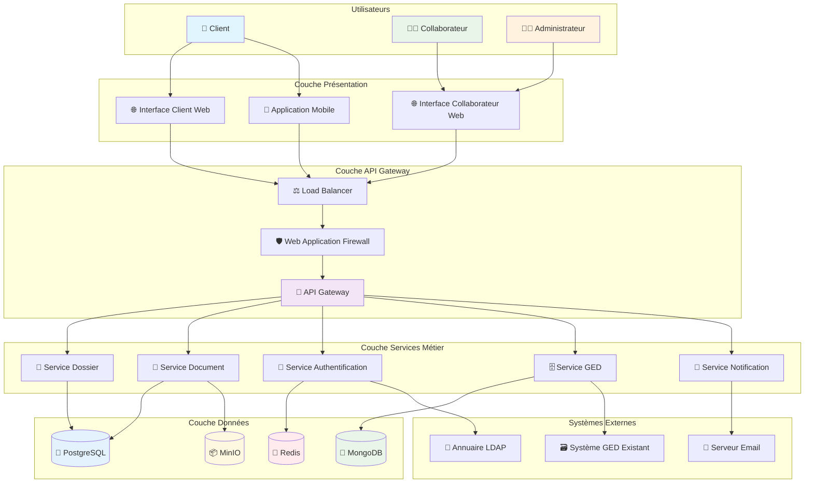

### 1.2 Architecture Technique Détaillée

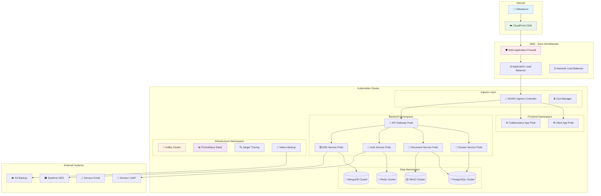

## 2. Architecture des Microservices

### 2.1 Diagramme de Services

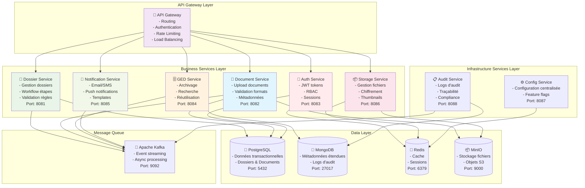

### 2.2 Communication entre Services

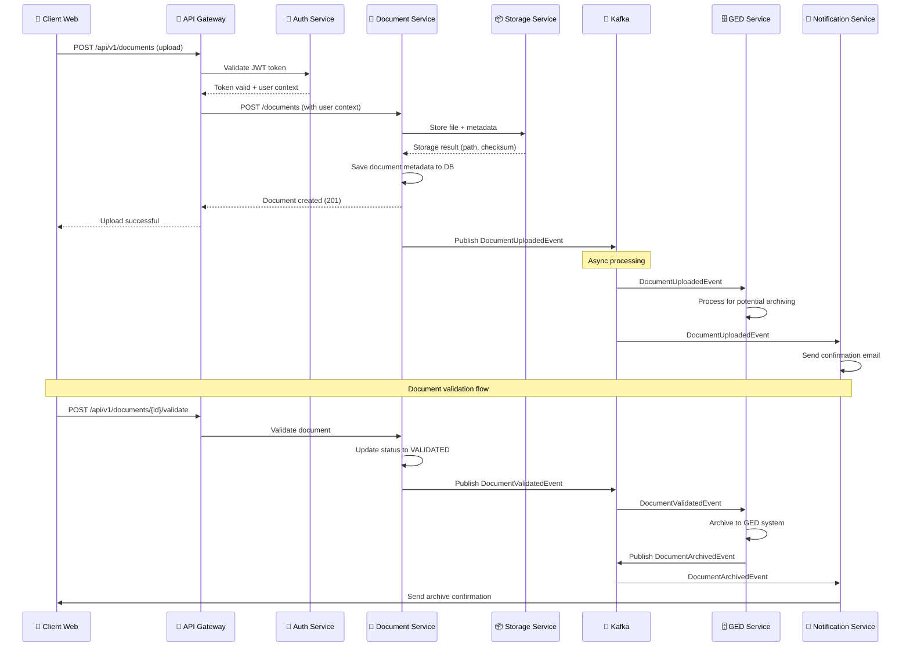

## 3. Architecture des Données

### 3.1 Modèle de Données Relationnel

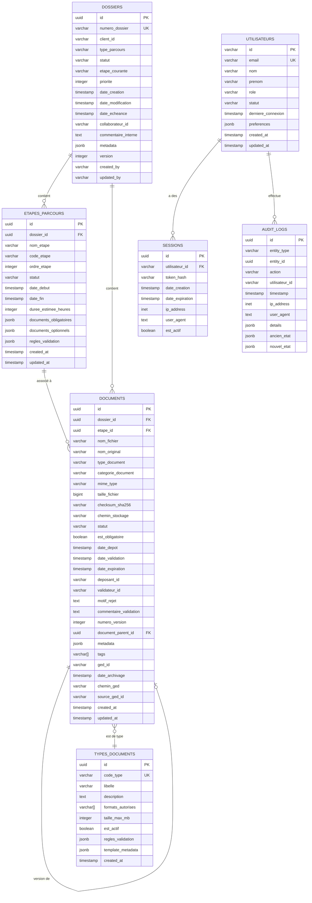

### 3.2 Architecture de Stockage Multi-Tiers

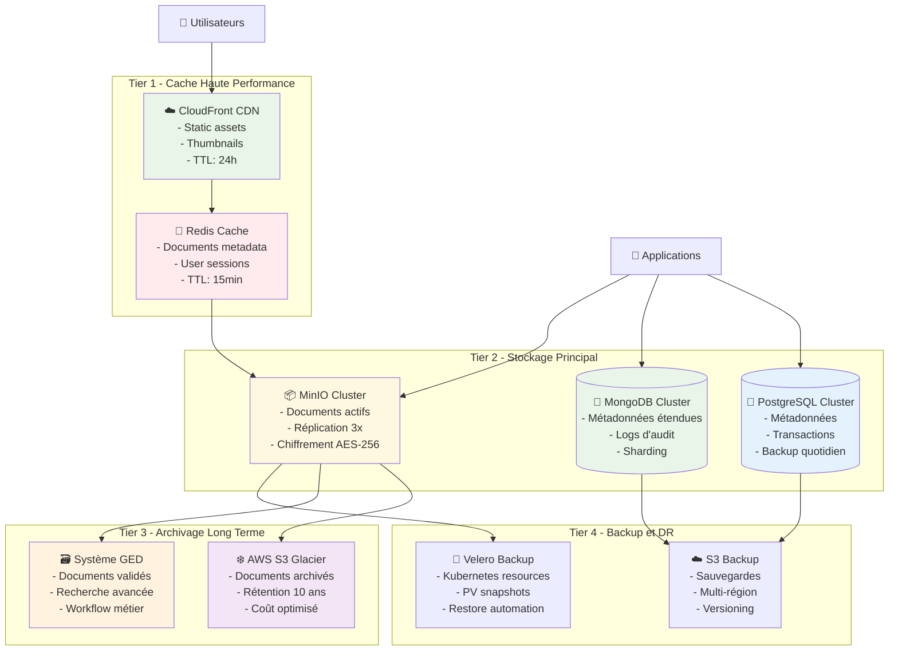

## 4. Architecture de Déploiement

### 4.1 Infrastructure Kubernetes

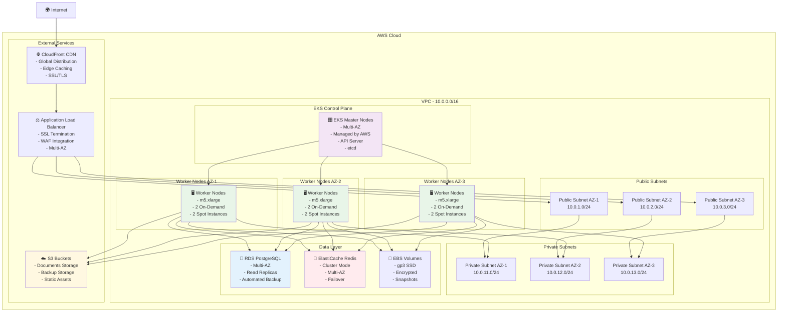

### 4.2 Namespaces et Isolation

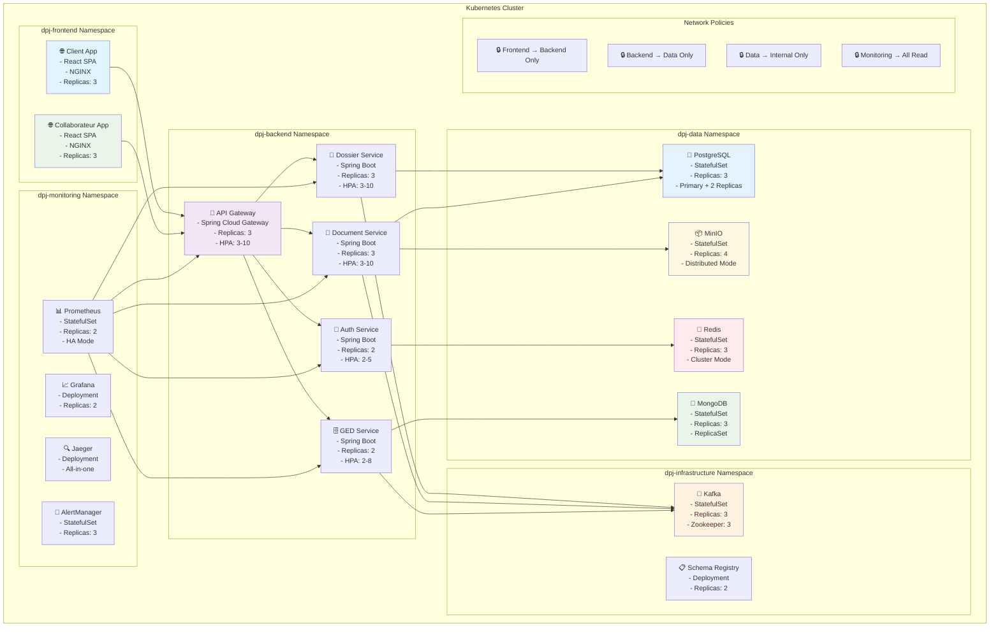

## 5. Architecture de Sécurité

### 5.1 Flux d'Authentification et Autorisation

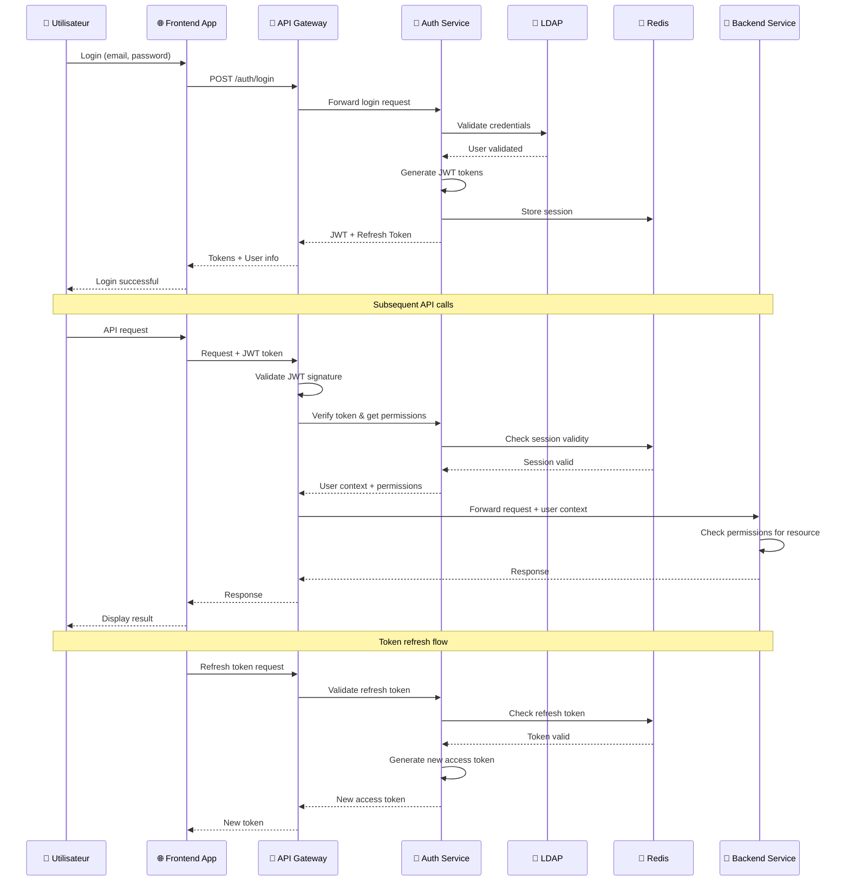

### 5.2 Architecture de Chiffrement

```mermaid
graph TB
    subgraph "Data Encryption at Rest"
        subgraph "Database Encryption"
            PostgreSQLTDE[🐘 PostgreSQL<br/>- TDE (Transparent Data Encryption)<br/>- Column-level encryption<br/>- Key rotation]
            
            MongoDBEnc[🍃 MongoDB<br/>- Encryption at rest<br/>- Field-level encryption<br/>- KMIP integration]
        end
        
        subgraph "File Storage Encryption"
            MinIOEnc[📦 MinIO<br/>- Server-side encryption<br/>- AES-256-GCM<br/>- Per-object keys]
            
            EBSEnc[💾 EBS Volumes<br/>- AWS KMS encryption<br/>- AES-256<br/>- Automatic key rotation]
        end
    end
    
    subgraph "Data Encryption in Transit"
        TLSTermination[🔒 TLS Termination<br/>- TLS 1.3<br/>- Perfect Forward Secrecy<br/>- HSTS headers]
        
        ServiceMesh[🕸️ Service Mesh (Istio)<br/>- mTLS between services<br/>- Certificate rotation<br/>- Traffic encryption]
    end
    
    subgraph "Key Management"
        AWSKMS[🔑 AWS KMS<br/>- Master keys<br/>- Key rotation<br/>- Audit logging]
        
        VaultKMS[🔐 HashiCorp Vault<br/>- Dynamic secrets<br/>- PKI certificates<br/>- Secret rotation]
    end
    
    subgraph "Application Layer Encryption"
        DocumentEnc[📄 Document Encryption<br/>- Unique key per document<br/>- Envelope encryption<br/>- Secure key derivation]
        
        PIIEnc[🔒 PII Encryption<br/>- Format-preserving encryption<br/>- Tokenization<br/>- Data masking]
    end
    
    Internet[🌍 Internet] --> TLSTermination
    TLSTermination --> ServiceMesh
    ServiceMesh --> PostgreSQLTDE
    ServiceMesh --> MongoDBEnc
    ServiceMesh --> MinIOEnc
    
    AWSKMS --> EBSEnc
    AWSKMS --> MinIOEnc
    VaultKMS --> DocumentEnc
    VaultKMS --> PIIEnc
    
    DocumentEnc --> MinIOEnc
    PIIEnc --> PostgreSQLTDE
    
style TLSTermination fill:#ffebee
    style ServiceMesh fill:#f3e5f5
    style AWSKMS fill:#fff3e0
    style VaultKMS fill:#e8f5e8
    style DocumentEnc fill:#e1f5fe
```

## 6. Architecture de Monitoring et Observabilité

### 6.1 Stack de Monitoring

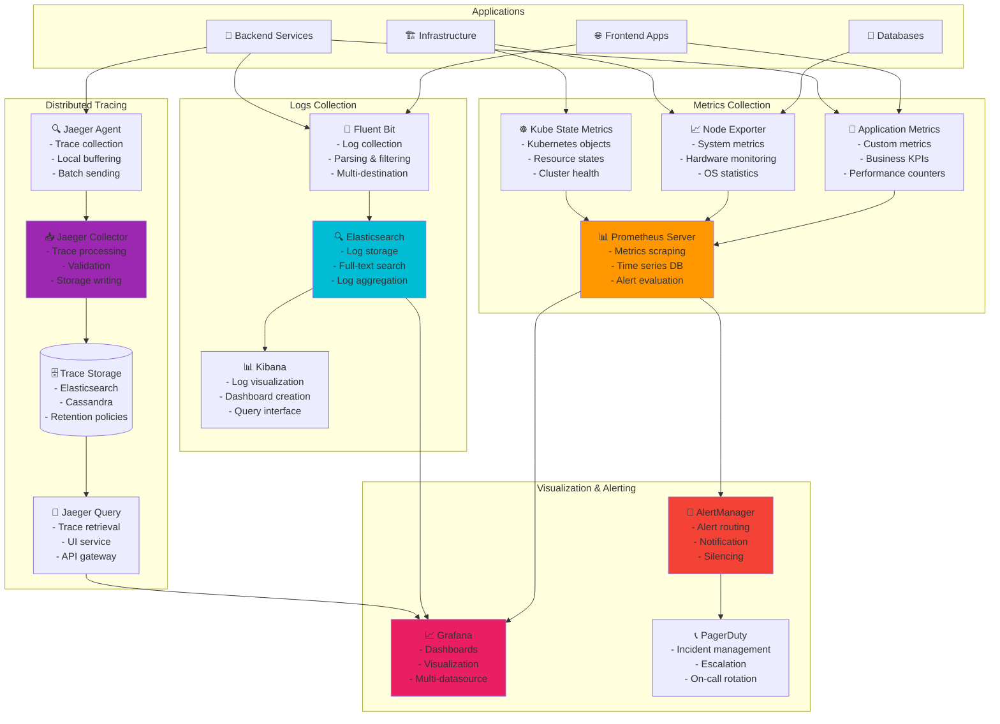

### 6.2 Flux de Monitoring en Temps Réel

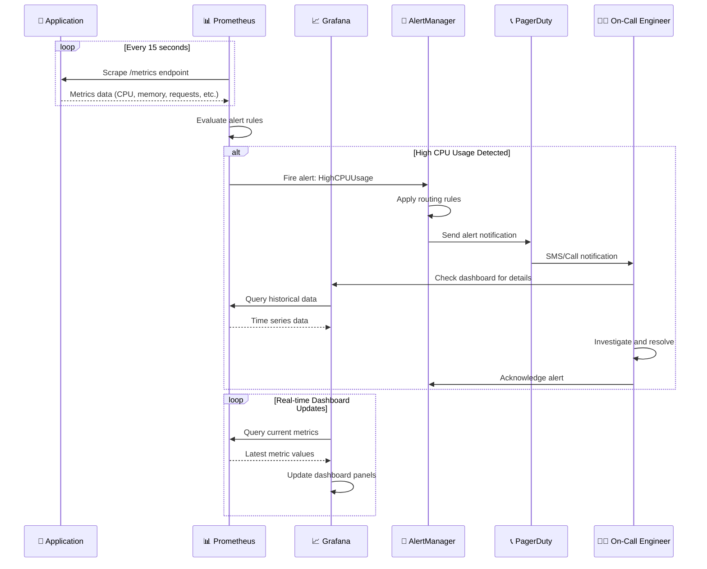

## 7. Architecture CI/CD

### 7.1 Pipeline de Déploiement

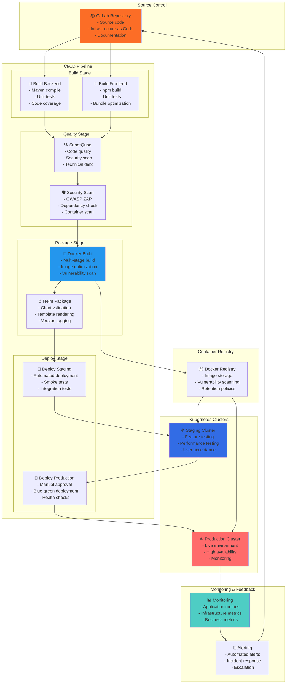

### 7.2 Stratégies de Déploiement

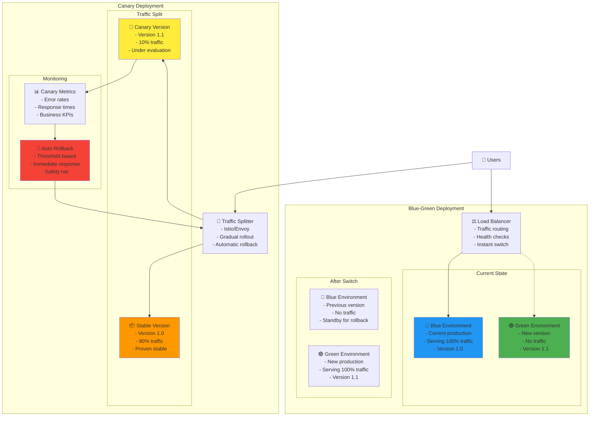

## 8. Architecture de Disaster Recovery

### 8.1 Plan de Continuité d'Activité

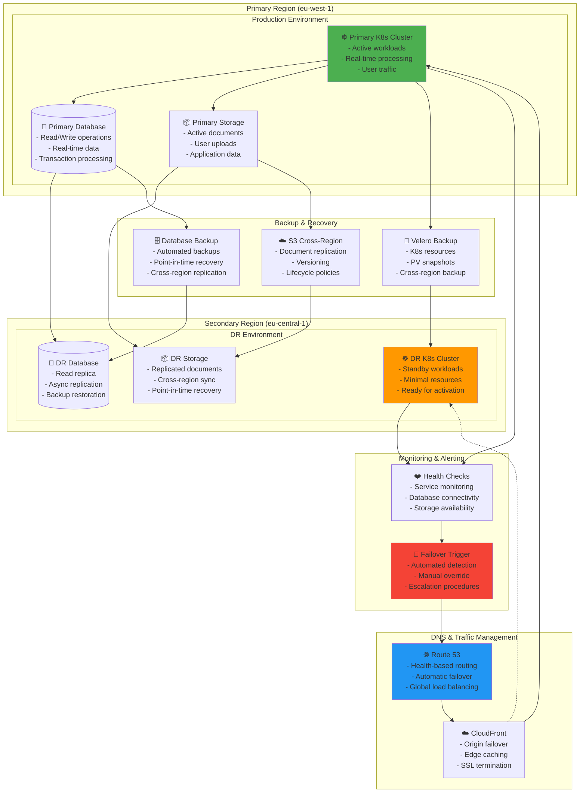

### 8.2 Procédure de Failover

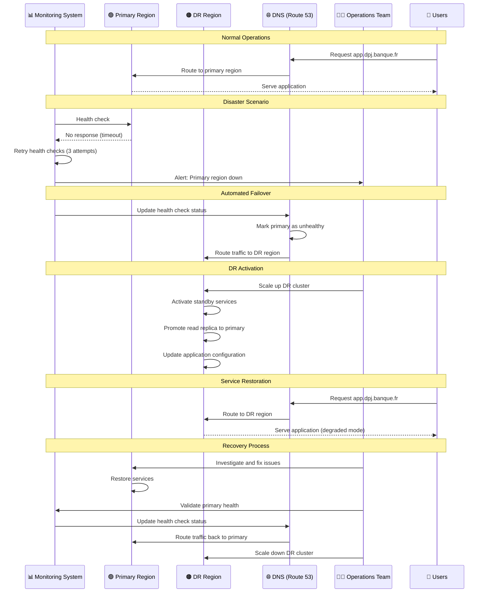

## 9. Architecture de Performance

### 9.1 Optimisations de Performance

```mermaid
graph TB
    subgraph "Client-Side Optimizations"
        CDN[☁️ CDN (CloudFront)<br/>- Static asset caching<br/>- Edge locations<br/>- Gzip compression]
        
        BrowserCache[🌐 Browser Cache<br/>- Cache headers<br/>- Service workers<br/>- Local storage]
        
        CodeSplitting[📦 Code Splitting<br/>- Lazy loading<br/>- Dynamic imports<br/>- Bundle optimization]
    end
    
    subgraph "Network Optimizations"
        HTTP2[🔗 HTTP/2<br/>- Multiplexing<br/>- Server push<br/>- Header compression]
        
        LoadBalancer[⚖️ Load Balancer<br/>- Connection pooling<br/>- Keep-alive<br/>- SSL termination]
        
        ServiceMesh[🕸️ Service Mesh<br/>- Circuit breakers<br/>- Retry policies<br/>- Load balancing]
    end
    
    subgraph "Application Optimizations"
        APIGateway[🚪 API Gateway<br/>- Request caching<br/>- Rate limiting<br/>- Response compression]
        
        Microservices[🔧 Microservices<br/>- Async processing<br/>- Connection pooling<br/>- JVM tuning]
        
        Caching[🔴 Redis Cache<br/>- Application cache<br/>- Session cache<br/>- Query cache]
    end
    
    subgraph "Database Optimizations"
        ReadReplicas[(📖 Read Replicas<br/>- Read scaling<br/>- Query distribution<br/>- Geo-distribution)]
        
        ConnectionPool[🏊 Connection Pool<br/>- HikariCP<br/>- Connection reuse<br/>- Pool sizing]
        
        QueryOptimization[🔍 Query Optimization<br/>- Index tuning<br/>- Query plans<br/>- Partitioning]
    end
    
    subgraph "Storage Optimizations"
        MinIOOptimization[📦 MinIO Optimization<br/>- Distributed storage<br/>- Erasure coding<br/>- Parallel uploads]
        
        S3Transfer[☁️ S3 Transfer<br/>- Multipart uploads<br/>- Transfer acceleration<br/>- Intelligent tiering]
    end
    
    Users[👥 Users] --> CDN
    CDN --> BrowserCache
    BrowserCache --> CodeSplitting
    
    CodeSplitting --> HTTP2
    HTTP2 --> LoadBalancer
    LoadBalancer --> ServiceMesh
    
    ServiceMesh --> APIGateway
    APIGateway --> Microservices
    Microservices --> Caching
    
    Microservices --> ReadReplicas
    ReadReplicas --> ConnectionPool
    ConnectionPool --> QueryOptimization
    
    Microservices --> MinIOOptimization
    MinIOOptimization --> S3Transfer
    
    style CDN fill:#4caf50
    style Caching fill:#ff5722
    style ReadReplicas fill:#2196f3
    style MinIOOptimization fill:#ff9800
```

### 9.2 Métriques de Performance

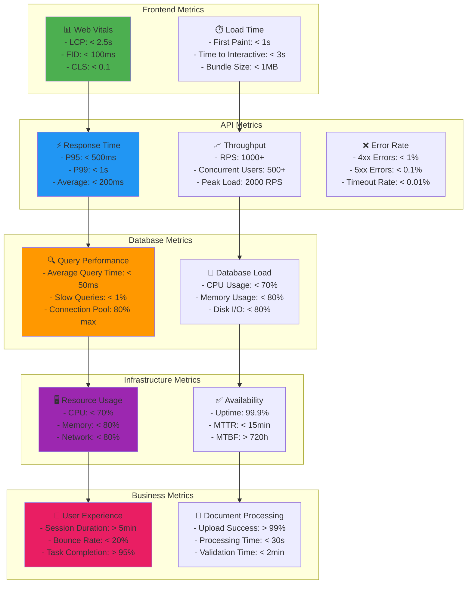

Cette architecture complète de diagrammes fournit une vision claire et détaillée du système DPJ, facilitant la compréhension et la communication entre les équipes techniques et métier.