# Stratégie de Tests et de Monitoring

## 1. Stratégie de Tests

### 1.1 Pyramide de Tests

```mermaid
graph TB
    subgraph "Pyramide de Tests"
        E2E[Tests End-to-End<br/>- Tests utilisateur complets<br/>- Scénarios métier<br/>- Interface utilisateur<br/>~5% des tests]
        
        Integration[Tests d'Intégration<br/>- APIs REST<br/>- Base de données<br/>- Services externes<br/>~25% des tests]
        
        Unit[Tests Unitaires<br/>- Logique métier<br/>- Composants isolés<br/>- Mocks/Stubs<br/>~70% des tests]
    end
    
    E2E --> Integration
    Integration --> Unit
    
    style E2E fill:#ff6b6b
    style Integration fill:#4ecdc4
    style Unit fill:#45b7d1
```



### 1.2 Tests Unitaires

#### Configuration JUnit 5 avec Mockito
```java
// Classe de test unitaire pour le service Document
@ExtendWith(MockitoExtension.class)
class DocumentServiceTest {
    
    @Mock
    private DocumentRepository documentRepository;
    
    @Mock
    private StorageService storageService;
    
    @Mock
    private ValidationService validationService;
    
    @InjectMocks
    private DocumentService documentService;
    
    @Test
    @DisplayName("Devrait uploader un document avec succès")
    void shouldUploadDocumentSuccessfully() {
        // Given
        String dossierId = "dossier-123";
        MockMultipartFile file = new MockMultipartFile(
            "file", "test.pdf", "application/pdf", "test content".getBytes()
        );
        
        DocumentUploadRequest request = DocumentUploadRequest.builder()
            .dossierId(dossierId)
            .typeDocument("PIECE_IDENTITE")
            .estObligatoire(true)
            .build();
        
        Document expectedDocument = Document.builder()
            .id("doc-123")
            .dossierId(dossierId)
            .nomFichier("test.pdf")
            .statut(StatutDocument.EN_ATTENTE)
            .build();
        
        when(validationService.validateUpload(any(), any())).thenReturn(ValidationResult.success());
        when(storageService.storeFile(any(), any())).thenReturn("storage/path/test.pdf");
        when(documentRepository.save(any(Document.class))).thenReturn(expectedDocument);
        
        // When
        Document result = documentService.uploadDocument(request, file);
        
        // Then
        assertThat(result).isNotNull();
        assertThat(result.getId()).isEqualTo("doc-123");
        assertThat(result.getNomFichier()).isEqualTo("test.pdf");
        assertThat(result.getStatut()).isEqualTo(StatutDocument.EN_ATTENTE);
        
        verify(validationService).validateUpload(request, file);
        verify(storageService).storeFile(eq(file), any());
        verify(documentRepository).save(any(Document.class));
    }
    
    @Test
    @DisplayName("Devrait échouer si la validation échoue")
    void shouldFailWhenValidationFails() {
        // Given
        MockMultipartFile file = new MockMultipartFile(
            "file", "test.pdf", "application/pdf", "test content".getBytes()
        );
        
        DocumentUploadRequest request = DocumentUploadRequest.builder()
            .dossierId("dossier-123")
            .typeDocument("PIECE_IDENTITE")
            .build();
        
        ValidationResult validationResult = ValidationResult.failure("Fichier trop volumineux");
        when(validationService.validateUpload(any(), any())).thenReturn(validationResult);
        
        // When & Then
        assertThatThrownBy(() -> documentService.uploadDocument(request, file))
            .isInstanceOf(ValidationException.class)
            .hasMessage("Fichier trop volumineux");
        
        verify(validationService).validateUpload(request, file);
        verifyNoInteractions(storageService, documentRepository);
    }
    
    @ParameterizedTest
    @ValueSource(strings = {"PIECE_IDENTITE", "JUSTIFICATIF_DOMICILE", "BULLETIN_SALAIRE"})
    @DisplayName("Devrait supporter différents types de documents")
    void shouldSupportDifferentDocumentTypes(String documentType) {
        // Given
        MockMultipartFile file = new MockMultipartFile(
            "file", "test.pdf", "application/pdf", "test content".getBytes()
        );
        
        DocumentUploadRequest request = DocumentUploadRequest.builder()
            .dossierId("dossier-123")
            .typeDocument(documentType)
            .build();
        
        when(validationService.validateUpload(any(), any())).thenReturn(ValidationResult.success());
        when(storageService.storeFile(any(), any())).thenReturn("storage/path/test.pdf");
        when(documentRepository.save(any(Document.class))).thenReturn(
            Document.builder().typeDocument(documentType).build()
        );
        
        // When
        Document result = documentService.uploadDocument(request, file);
        
        // Then
        assertThat(result.getTypeDocument()).isEqualTo(documentType);
    }
}
```

#### Tests avec TestContainers
```java
// Tests d'intégration avec base de données réelle
@SpringBootTest
@Testcontainers
@Transactional
class DocumentRepositoryIntegrationTest {
    
    @Container
    static PostgreSQLContainer<?> postgres = new PostgreSQLContainer<>("postgres:13")
            .withDatabaseName("test_db")
            .withUsername("test_user")
            .withPassword("test_password");
    
    @DynamicPropertySource
    static void configureProperties(DynamicPropertyRegistry registry) {
        registry.add("spring.datasource.url", postgres::getJdbcUrl);
        registry.add("spring.datasource.username", postgres::getUsername);
        registry.add("spring.datasource.password", postgres::getPassword);
    }
    
    @Autowired
    private DocumentRepository documentRepository;
    
    @Autowired
    private TestEntityManager entityManager;
    
    @Test
    void shouldFindDocumentsByDossierId() {
        // Given
        String dossierId = "dossier-123";
        
        Document doc1 = Document.builder()
            .dossierId(dossierId)
            .nomFichier("doc1.pdf")
            .typeDocument("PIECE_IDENTITE")
            .statut(StatutDocument.EN_ATTENTE)
            .build();
        
        Document doc2 = Document.builder()
            .dossierId(dossierId)
            .nomFichier("doc2.pdf")
            .typeDocument("JUSTIFICATIF_DOMICILE")
            .statut(StatutDocument.VALIDE)
            .build();
        
        entityManager.persistAndFlush(doc1);
        entityManager.persistAndFlush(doc2);
        
        // When
        List<Document> documents = documentRepository.findByDossierId(dossierId);
        
        // Then
        assertThat(documents).hasSize(2);
        assertThat(documents).extracting(Document::getNomFichier)
            .containsExactlyInAnyOrder("doc1.pdf", "doc2.pdf");
    }
    
    @Test
    void shouldFindDocumentsByStatut() {
        // Given
        Document validDoc = Document.builder()
            .dossierId("dossier-1")
            .nomFichier("valid.pdf")
            .statut(StatutDocument.VALIDE)
            .build();
        
        Document pendingDoc = Document.builder()
            .dossierId("dossier-2")
            .nomFichier("pending.pdf")
            .statut(StatutDocument.EN_ATTENTE)
            .build();
        
        entityManager.persistAndFlush(validDoc);
        entityManager.persistAndFlush(pendingDoc);
        
        // When
        List<Document> validDocuments = documentRepository.findByStatut(StatutDocument.VALIDE);
        
        // Then
        assertThat(validDocuments).hasSize(1);
        assertThat(validDocuments.get(0).getNomFichier()).isEqualTo("valid.pdf");
    }
}
```

### 1.3 Tests d'Intégration

#### Tests d'API REST avec MockMvc
```java
@SpringBootTest
@AutoConfigureTestDatabase(replace = AutoConfigureTestDatabase.Replace.NONE)
@Testcontainers
class DocumentControllerIntegrationTest {
    
    @Container
    static PostgreSQLContainer<?> postgres = new PostgreSQLContainer<>("postgres:13");
    
    @Autowired
    private MockMvc mockMvc;
    
    @Autowired
    private ObjectMapper objectMapper;
    
    @MockBean
    private StorageService storageService;
    
    @Test
    @WithMockUser(roles = "COLLABORATEUR")
    void shouldUploadDocumentSuccessfully() throws Exception {
        // Given
        MockMultipartFile file = new MockMultipartFile(
            "file", "test.pdf", "application/pdf", "test content".getBytes()
        );
        
        when(storageService.storeFile(any(), any())).thenReturn("storage/path/test.pdf");
        
        // When & Then
        mockMvc.perform(multipart("/api/v1/documents")
                .file(file)
                .param("dossierId", "dossier-123")
                .param("typeDocument", "PIECE_IDENTITE")
                .param("estObligatoire", "true"))
                .andExpect(status().isCreated())
                .andExpect(jsonPath("$.nomFichier").value("test.pdf"))
                .andExpect(jsonPath("$.typeDocument").value("PIECE_IDENTITE"))
                .andExpect(jsonPath("$.statut").value("EN_ATTENTE"));
    }
    
    @Test
    @WithMockUser(roles = "CLIENT")
    void shouldGetDocumentById() throws Exception {
        // Given
        Document document = createAndSaveDocument();
        
        // When & Then
        mockMvc.perform(get("/api/v1/documents/{id}", document.getId()))
                .andExpect(status().isOk())
                .andExpect(jsonPath("$.id").value(document.getId()))
                .andExpect(jsonPath("$.nomFichier").value(document.getNomFichier()));
    }
    
    @Test
    @WithMockUser(roles = "COLLABORATEUR")
    void shouldValidateDocument() throws Exception {
        // Given
        Document document = createAndSaveDocument();
        
        ValidationRequest request = ValidationRequest.builder()
            .statut("VALIDE")
            .commentaire("Document conforme")
            .build();
        
        // When & Then
        mockMvc.perform(post("/api/v1/documents/{id}/validate", document.getId())
                .contentType(MediaType.APPLICATION_JSON)
                .content(objectMapper.writeValueAsString(request)))
                .andExpect(status().isOk())
                .andExpect(jsonPath("$.statut").value("VALIDE"))
                .andExpect(jsonPath("$.commentaireValidation").value("Document conforme"));
    }
    
    private Document createAndSaveDocument() {
        // Logique pour créer et sauvegarder un document de test
        return documentRepository.save(Document.builder()
            .dossierId("dossier-123")
            .nomFichier("test.pdf")
            .typeDocument("PIECE_IDENTITE")
            .statut(StatutDocument.EN_ATTENTE)
            .build());
    }
}
```

#### Tests de Performance avec JMeter
```xml
<!-- plan-test-performance.jmx -->
<?xml version="1.0" encoding="UTF-8"?>
<jmeterTestPlan version="1.2">
  <hashTree>
    <TestPlan guiclass="TestPlanGui" testclass="TestPlan" testname="DPJ Performance Test">
      <elementProp name="TestPlan.arguments" elementType="Arguments" guiclass="ArgumentsPanel">
        <collectionProp name="Arguments.arguments"/>
      </elementProp>
      <stringProp name="TestPlan.user_define_classpath"></stringProp>
      <boolProp name="TestPlan.serialize_threadgroups">false</boolProp>
      <boolProp name="TestPlan.functional_mode">false</boolProp>
    </TestPlan>
    
    <hashTree>
      <!-- Thread Group pour simulation de charge -->
      <ThreadGroup guiclass="ThreadGroupGui" testclass="ThreadGroup" testname="Document Upload Load Test">
        <stringProp name="ThreadGroup.on_sample_error">continue</stringProp>
        <elementProp name="ThreadGroup.main_controller" elementType="LoopController">
          <boolProp name="LoopController.continue_forever">false</boolProp>
          <stringProp name="LoopController.loops">10</stringProp>
        </elementProp>
        <stringProp name="ThreadGroup.num_threads">50</stringProp>
        <stringProp name="ThreadGroup.ramp_time">30</stringProp>
        <longProp name="ThreadGroup.start_time">1640995200000</longProp>
        <longProp name="ThreadGroup.end_time">1640995200000</longProp>
        <boolProp name="ThreadGroup.scheduler">false</boolProp>
        <stringProp name="ThreadGroup.duration"></stringProp>
        <stringProp name="ThreadGroup.delay"></stringProp>
      </ThreadGroup>
      
      <hashTree>
        <!-- HTTP Request pour upload de document -->
        <HTTPSamplerProxy guiclass="HttpTestSampleGui" testclass="HTTPSamplerProxy" testname="Upload Document">
          <elementProp name="HTTPsampler.Files" elementType="HTTPFileArgs">
            <collectionProp name="HTTPFileArgs.files">
              <elementProp name="" elementType="HTTPFileArg">
                <stringProp name="File.path">/path/to/test-document.pdf</stringProp>
                <stringProp name="File.paramname">file</stringProp>
                <stringProp name="File.mimetype">application/pdf</stringProp>
              </elementProp>
            </collectionProp>
          </elementProp>
          <elementProp name="HTTPsampler.Arguments" elementType="Arguments">
            <collectionProp name="Arguments.arguments">
              <elementProp name="dossierId" elementType="HTTPArgument">
                <boolProp name="HTTPArgument.always_encode">false</boolProp>
                <stringProp name="Argument.value">dossier-${__Random(1,1000)}</stringProp>
                <stringProp name="Argument.name">dossierId</stringProp>
              </elementProp>
              <elementProp name="typeDocument" elementType="HTTPArgument">
                <boolProp name="HTTPArgument.always_encode">false</boolProp>
                <stringProp name="Argument.value">PIECE_IDENTITE</stringProp>
                <stringProp name="Argument.name">typeDocument</stringProp>
              </elementProp>
            </collectionProp>
          </elementProp>
          <stringProp name="HTTPSampler.domain">localhost</stringProp>
          <stringProp name="HTTPSampler.port">8080</stringProp>
          <stringProp name="HTTPSampler.path">/api/v1/documents</stringProp>
          <stringProp name="HTTPSampler.method">POST</stringProp>
        </HTTPSamplerProxy>
        
        <!-- Assertions pour vérifier les réponses -->
        <ResponseAssertion guiclass="AssertionGui" testclass="ResponseAssertion" testname="Response Assertion">
          <collectionProp name="Asserion.test_strings">
            <stringProp name="49586">201</stringProp>
          </collectionProp>
          <stringProp name="Assertion.test_field">Assertion.response_code</stringProp>
          <boolProp name="Assertion.assume_success">false</boolProp>
          <intProp name="Assertion.test_type">1</intProp>
        </ResponseAssertion>
        
        <!-- Listener pour collecter les résultats -->
        <ResultCollector guiclass="ViewResultsFullVisualizer" testclass="ResultCollector" testname="View Results Tree">
          <boolProp name="ResultCollector.error_logging">false</boolProp>
          <objProp>
            <name>saveConfig</name>
            <value class="SampleSaveConfiguration">
              <time>true</time>
              <latency>true</latency>
              <timestamp>true</timestamp>
              <success>true</success>
              <label>true</label>
              <code>true</code>
              <message>true</message>
              <threadName>true</threadName>
              <dataType>true</dataType>
              <encoding>false</encoding>
              <assertions>true</assertions>
              <subresults>true</subresults>
              <responseData>false</responseData>
              <samplerData>false</samplerData>
              <xml>false</xml>
              <fieldNames>true</fieldNames>
              <responseHeaders>false</responseHeaders>
              <requestHeaders>false</requestHeaders>
              <responseDataOnError>false</responseDataOnError>
              <saveAssertionResultsFailureMessage>true</saveAssertionResultsFailureMessage>
              <assertionsResultsToSave>0</assertionsResultsToSave>
              <bytes>true</bytes>
              <sentBytes>true</sentBytes>
              <url>true</url>
              <threadCounts>true</threadCounts>
              <idleTime>true</idleTime>
              <connectTime>true</connectTime>
            </value>
          </objProp>
          <stringProp name="filename">performance-results.jtl</stringProp>
        </ResultCollector>
      </hashTree>
    </hashTree>
  </hashTree>
</jmeterTestPlan>
```

### 1.4 Tests End-to-End

#### Tests E2E avec Cypress
```javascript
// cypress/e2e/document-upload-flow.cy.js
describe('Document Upload Flow', () => {
  beforeEach(() => {
    // Configuration et authentification
    cy.login('collaborateur@test.com', 'password');
    cy.visit('/dossiers/test-dossier-id');
  });

  it('should upload a document successfully', () => {
    // Sélectionner le type de document
    cy.get('[data-testid="document-type-select"]').click();
    cy.get('[data-value="PIECE_IDENTITE"]').click();
    
    // Upload du fichier
    cy.get('[data-testid="file-upload-zone"]').selectFile('cypress/fixtures/test-document.pdf', {
      action: 'drag-drop'
    });
    
    // Vérifier le succès
    cy.get('[data-testid="success-notification"]').should('be.visible');
    cy.get('[data-testid="success-notification"]').should('contain', 'Document uploadé avec succès');
    
    // Vérifier que le document apparaît dans la liste
    cy.get('[data-testid="documents-list"]').should('contain', 'test-document.pdf');
    cy.get('[data-testid="document-status"]').should('contain', 'En attente');
  });

  it('should validate a document', () => {
    // Naviguer vers un document en attente
    cy.get('[data-testid="document-item"]').first().click();
    
    // Ouvrir le formulaire de validation
    cy.get('[data-testid="validate-button"]').click();
    
    // Remplir le formulaire
    cy.get('[data-testid="validation-comment"]').type('Document conforme aux exigences');
    cy.get('[data-testid="expiration-date"]').type('2025-12-31');
    
    // Valider
    cy.get('[data-testid="confirm-validation"]').click();
    
    // Vérifier le succès
    cy.get('[data-testid="success-notification"]').should('contain', 'Document validé');
    cy.get('[data-testid="document-status"]').should('contain', 'Validé');
  });

  it('should handle file upload errors', () => {
    // Tenter d'uploader un fichier trop volumineux
    cy.get('[data-testid="document-type-select"]').click();
    cy.get('[data-value="PIECE_IDENTITE"]').click();
    
    cy.get('[data-testid="file-upload-zone"]').selectFile('cypress/fixtures/large-file.pdf', {
      action: 'drag-drop'
    });
    
    // Vérifier l'erreur
    cy.get('[data-testid="error-notification"]').should('be.visible');
    cy.get('[data-testid="error-notification"]').should('contain', 'Fichier trop volumineux');
  });

  it('should complete dossier workflow', () => {
    // Uploader tous les documents requis
    const requiredDocuments = [
      { type: 'PIECE_IDENTITE', file: 'identity.pdf' },
      { type: 'JUSTIFICATIF_DOMICILE', file: 'address-proof.pdf' },
      { type: 'BULLETIN_SALAIRE', file: 'payslip.pdf' }
    ];

    requiredDocuments.forEach(doc => {
      cy.get('[data-testid="document-type-select"]').click();
      cy.get(`[data-value="${doc.type}"]`).click();
      cy.get('[data-testid="file-upload-zone"]').selectFile(`cypress/fixtures/${doc.file}`);
      cy.get('[data-testid="success-notification"]').should('be.visible');
    });

    // Valider tous les documents
    cy.get('[data-testid="validate-all-button"]').click();
    cy.get('[data-testid="confirm-validation-all"]').click();

    // Vérifier que le dossier est complet
    cy.get('[data-testid="dossier-status"]').should('contain', 'Complet');
    cy.get('[data-testid="progress-bar"]').should('have.attr', 'aria-valuenow', '100');
  });
});
```

#### Tests de Charge avec K6
```javascript
// load-test.js
import http from 'k6/http';
import { check, sleep } from 'k6';
import { Rate } from 'k6/metrics';

// Métriques personnalisées
const errorRate = new Rate('errors');

export const options = {
  stages: [
    { duration: '2m', target: 100 }, // Montée en charge
    { duration: '5m', target: 100 }, // Charge stable
    { duration: '2m', target: 200 }, // Pic de charge
    { duration: '5m', target: 200 }, // Charge élevée stable
    { duration: '2m', target: 0 },   // Descente
  ],
  thresholds: {
    http_req_duration: ['p(95)<500'], // 95% des requêtes < 500ms
    http_req_failed: ['rate<0.1'],    // Taux d'erreur < 10%
    errors: ['rate<0.1'],             // Taux d'erreur métier < 10%
  },
};

export default function () {
  // Test d'authentification
  const loginResponse = http.post('http://localhost:8080/api/v1/auth/login', {
    email: 'test@example.com',
    password: 'password123'
  });

  const authCheck = check(loginResponse, {
    'login successful': (r) => r.status === 200,
    'token received': (r) => r.json('accessToken') !== '',
  });

  if (!authCheck) {
    errorRate.add(1);
    return;
  }

  const token = loginResponse.json('accessToken');
  const headers = {
    'Authorization': `Bearer ${token}`,
    'Content-Type': 'application/json',
  };

  // Test de récupération des dossiers
  const dossiersResponse = http.get('http://localhost:8080/api/v1/dossiers', {
    headers: headers,
  });

  const dossiersCheck = check(dossiersResponse, {
    'dossiers retrieved': (r) => r.status === 200,
    'response time < 500ms': (r) => r.timings.duration < 500,
  });

  if (!dossiersCheck) {
    errorRate.add(1);
  }

  // Test d'upload de document
  const documentData = {
    dossierId: 'test-dossier-123',
    typeDocument: 'PIECE_IDENTITE',
    estObligatoire: true,
  };

  const uploadResponse = http.post('http://localhost:8080/api/v1/documents', 
    JSON.stringify(documentData), 
    { headers: headers }
  );

  const uploadCheck = check(uploadResponse, {
    'document upload successful': (r) => r.status === 201,
    'upload time < 2s': (r) => r.timings.duration < 2000,
  });

  if (!uploadCheck) {
    errorRate.add(1);
  }

  sleep(1); // Pause entre les requêtes
}
```

## 2. Stratégie de Monitoring

### 2.1 Architecture de Monitoring

```mermaid
graph TB
    subgraph "Applications"
        Frontend[🌐 Frontend Apps]
        Backend[🔧 Backend Services]
        Database[💾 Databases]
        Infrastructure[🏗️ Infrastructure]
    end
    
    subgraph "Collecte de Métriques"
        Prometheus[📊 Prometheus<br/>- Métriques système<br/>- Métriques applicatives<br/>- Alertes]
        
        Micrometer[📈 Micrometer<br/>- Métriques JVM<br/>- Métriques métier<br/>- Timers & Counters]
        
        NodeExporter[📊 Node Exporter<br/>- Métriques OS<br/>- Hardware<br/>- Réseau]
    end
    
    subgraph "Collecte de Logs"
        Logback[📝 Logback<br/>- Logs applicatifs<br/>- Structured logging<br/>- JSON format]
        
        Fluentd[🔄 Fluentd<br/>- Collecte logs<br/>- Parsing<br/>- Routing]
        
        Elasticsearch[🔍 Elasticsearch<br/>- Stockage logs<br/>- Indexation<br/>- Recherche]
    end
    
    subgraph "Tracing Distribué"
        Jaeger[🔍 Jaeger<br/>- Traces distribuées<br/>- Latence<br/>- Dépendances]
        
        OpenTelemetry[📡 OpenTelemetry<br/>- Instrumentation<br/>- Traces<br/>- Métriques]
    end
    
    subgraph "Visualisation"
        Grafana[📈 Grafana<br/>- Dashboards<br/>- Alertes<br/>- Visualisation]
        
        Kibana[📊 Kibana<br/>- Analyse logs<br/>- Dashboards<br/>- Recherche]
    end
    
    subgraph "Alerting"
        AlertManager[🚨 AlertManager<br/>- Gestion alertes<br/>- Routing<br/>- Silencing]
        
        PagerDuty[📞 PagerDuty<br/>- Escalation<br/>- On-call<br/>- Incidents]
    end
    
    Frontend --> Micrometer
    Backend --> Micrometer
    Backend --> Logback
    Database --> NodeExporter
    Infrastructure --> NodeExporter
    
    Micrometer --> Prometheus
    NodeExporter --> Prometheus
    Logback --> Fluentd
    Fluentd --> Elasticsearch
    
    Backend --> OpenTelemetry
    OpenTelemetry --> Jaeger
    
    Prometheus --> Grafana
    Elasticsearch --> Kibana
    Jaeger --> Grafana
    
    Prometheus --> AlertManager
    AlertManager --> PagerDuty
    
    style Prometheus fill:#ff9800
    style Grafana fill:#e91e63
    style Elasticsearch fill:#00bcd4
    style Jaeger fill:#9c27b0
```



### 2.2 Métriques Applicatives

#### Configuration Micrometer
```java
@Configuration
public class MetricsConfig {
    
    @Bean
    public MeterRegistryCustomizer<MeterRegistry> metricsCommonTags() {
        return registry -> registry.config()
            .commonTags("application", "dpj-document-service")
            .commonTags("environment", getEnvironment())
            .commonTags("version", getApplicationVersion());
    }
    
    @Bean
    public TimedAspect timedAspect(MeterRegistry registry) {
        return new TimedAspect(registry);
    }
    
    @Bean
    public CountedAspect countedAspect(MeterRegistry registry) {
        return new CountedAspect(registry);
    }
}

// Service avec métriques personnalisées
@Service
public class DocumentMetricsService {
    
    private final MeterRegistry meterRegistry;
    private final Counter documentUploadCounter;
    private final Timer documentProcessingTimer;
    private final Gauge activeDocumentsGauge;
    
    public DocumentMetricsService(MeterRegistry meterRegistry) {
        this.meterRegistry = meterRegistry;
        
        this.documentUploadCounter = Counter.builder("dpj.documents.uploaded.total")
            .description("Nombre total de documents uploadés")
            .register(meterRegistry);
            
        this.documentProcessingTimer = Timer.builder("dpj.documents.processing.duration")
            .description("Durée de traitement des documents")
            .register(meterRegistry);
            
        this.activeDocumentsGauge = Gauge.builder("dpj.documents.active.count")
            .description("Nombre de documents en cours de traitement")
            .register(meterRegistry, this, DocumentMetricsService::getActiveDocumentsCount);
    }
    
    @EventListener
    public void handleDocumentUploaded(DocumentUploadedEvent event) {
        documentUploadCounter.increment(
            Tags.of(
                "type", event.getDocumentType(),
                "client_type", event.getClientType(),
                "size_category", categorizeFileSize(event.getFileSize())
            )
        );
    }
    
    @EventListener
public void handleDocumentProcessed(DocumentProcessedEvent event) {
        documentProcessingTimer.record(
            event.getProcessingDuration(),
            Tags.of(
                "type", event.getDocumentType(),
                "status", event.getProcessingStatus(),
                "processor", event.getProcessorId()
            )
        );
    }
    
    private double getActiveDocumentsCount() {
        // Logique pour compter les documents en cours de traitement
        return documentRepository.countByStatut(StatutDocument.EN_COURS_TRAITEMENT);
    }
    
    private String categorizeFileSize(long fileSize) {
        if (fileSize < 1024 * 1024) return "small"; // < 1MB
        if (fileSize < 10 * 1024 * 1024) return "medium"; // < 10MB
        return "large"; // >= 10MB
    }
}
```

#### Métriques Métier Personnalisées
```java
@Component
public class BusinessMetricsCollector {
    
    private final MeterRegistry meterRegistry;
    
    public BusinessMetricsCollector(MeterRegistry meterRegistry) {
        this.meterRegistry = meterRegistry;
    }
    
    @EventListener
    public void handleDossierCompleted(DossierCompletedEvent event) {
        // Métrique de completion des dossiers
        meterRegistry.counter("dpj.dossiers.completed.total",
            "type", event.getTypeParcours(),
            "agence", event.getAgenceId(),
            "duration_category", categorizeDuration(event.getProcessingDuration())
        ).increment();
        
        // Métrique de durée de traitement
        meterRegistry.timer("dpj.dossiers.processing.duration",
            "type", event.getTypeParcours()
        ).record(event.getProcessingDuration());
    }
    
    @EventListener
    public void handleDocumentValidated(DocumentValidatedEvent event) {
        meterRegistry.counter("dpj.documents.validated.total",
            "type", event.getDocumentType(),
            "validator_type", event.getValidatorType(),
            "result", event.getValidationResult()
        ).increment();
    }
    
    @EventListener
    public void handleUserLogin(UserLoginEvent event) {
        meterRegistry.counter("dpj.users.login.total",
            "role", event.getUserRole(),
            "method", event.getAuthMethod(),
            "success", String.valueOf(event.isSuccess())
        ).increment();
    }
    
    private String categorizeDuration(Duration duration) {
        long hours = duration.toHours();
        if (hours < 1) return "fast";
        if (hours < 24) return "normal";
        if (hours < 72) return "slow";
        return "very_slow";
    }
}
```

### 2.3 Logging Structuré

#### Configuration Logback
```xml
<!-- logback-spring.xml -->
<configuration>
    <springProfile name="!local">
        <appender name="STDOUT" class="ch.qos.logback.core.ConsoleAppender">
            <encoder class="net.logstash.logback.encoder.LoggingEventCompositeJsonEncoder">
                <providers>
                    <timestamp/>
                    <logLevel/>
                    <loggerName/>
                    <message/>
                    <mdc/>
                    <arguments/>
                    <stackTrace/>
                    <pattern>
                        <pattern>
                            {
                                "service": "dpj-document-service",
                                "version": "${APP_VERSION:-unknown}",
                                "environment": "${SPRING_PROFILES_ACTIVE:-unknown}",
                                "host": "${HOSTNAME:-unknown}"
                            }
                        </pattern>
                    </pattern>
                </providers>
            </encoder>
        </appender>
    </springProfile>
    
    <springProfile name="local">
        <appender name="STDOUT" class="ch.qos.logback.core.ConsoleAppender">
            <encoder>
                <pattern>%d{HH:mm:ss.SSS} [%thread] %-5level [%X{traceId:-},%X{spanId:-}] %logger{36} - %msg%n</pattern>
            </encoder>
        </appender>
    </springProfile>
    
    <!-- Appender pour les logs d'audit -->
    <appender name="AUDIT" class="ch.qos.logback.core.rolling.RollingFileAppender">
        <file>logs/audit.log</file>
        <rollingPolicy class="ch.qos.logback.core.rolling.TimeBasedRollingPolicy">
            <fileNamePattern>logs/audit.%d{yyyy-MM-dd}.%i.gz</fileNamePattern>
            <maxFileSize>100MB</maxFileSize>
            <maxHistory>30</maxHistory>
            <totalSizeCap>3GB</totalSizeCap>
        </rollingPolicy>
        <encoder class="net.logstash.logback.encoder.LoggingEventCompositeJsonEncoder">
            <providers>
                <timestamp/>
                <logLevel/>
                <message/>
                <mdc/>
                <arguments/>
            </providers>
        </encoder>
    </appender>
    
    <!-- Logger pour les événements d'audit -->
    <logger name="AUDIT" level="INFO" additivity="false">
        <appender-ref ref="AUDIT"/>
    </logger>
    
    <!-- Logger pour les métriques de performance -->
    <logger name="PERFORMANCE" level="INFO" additivity="false">
        <appender-ref ref="STDOUT"/>
    </logger>
    
    <root level="INFO">
        <appender-ref ref="STDOUT"/>
    </root>
</configuration>
```

#### Service de Logging Structuré
```java
@Component
public class StructuredLogger {
    
    private final Logger auditLogger = LoggerFactory.getLogger("AUDIT");
    private final Logger performanceLogger = LoggerFactory.getLogger("PERFORMANCE");
    private final ObjectMapper objectMapper;
    
    public void logAuditEvent(AuditEvent event) {
        try {
            MDC.put("eventType", event.getEventType());
            MDC.put("userId", event.getUserId());
            MDC.put("resourceId", event.getResourceId());
            MDC.put("action", event.getAction());
            MDC.put("result", event.getResult());
            MDC.put("ipAddress", event.getIpAddress());
            
            auditLogger.info("Audit event: {}", objectMapper.writeValueAsString(event));
        } catch (Exception e) {
            log.error("Erreur lors du logging d'audit", e);
        } finally {
            MDC.clear();
        }
    }
    
    public void logPerformanceEvent(String operation, Duration duration, Map<String, Object> context) {
        try {
            MDC.put("operation", operation);
            MDC.put("duration_ms", String.valueOf(duration.toMillis()));
            context.forEach(MDC::put);
            
            performanceLogger.info("Performance event: operation={}, duration={}ms", 
                                 operation, duration.toMillis());
        } finally {
            MDC.clear();
        }
    }
    
    public void logBusinessEvent(String eventType, Map<String, Object> data) {
        try {
            MDC.put("eventType", eventType);
            data.forEach((key, value) -> MDC.put(key, String.valueOf(value)));
            
            log.info("Business event: {}", eventType);
        } finally {
            MDC.clear();
        }
    }
}
```

### 2.4 Alerting et Notifications

#### Configuration AlertManager
```yaml
# alertmanager.yml
global:
  smtp_smarthost: 'smtp.banque.fr:587'
  smtp_from: 'alerts@dpj.banque.fr'
  smtp_auth_username: 'alerts@dpj.banque.fr'
  smtp_auth_password: 'password'

route:
  group_by: ['alertname', 'cluster', 'service']
  group_wait: 10s
  group_interval: 10s
  repeat_interval: 1h
  receiver: 'default'
  routes:
  - match:
      severity: critical
    receiver: 'critical-alerts'
    group_wait: 0s
    repeat_interval: 5m
  - match:
      severity: warning
    receiver: 'warning-alerts'
    repeat_interval: 30m
  - match:
      alertname: 'HighErrorRate'
    receiver: 'error-alerts'
    repeat_interval: 15m

receivers:
- name: 'default'
  email_configs:
  - to: 'team-dpj@banque.fr'
    subject: '[DPJ] Alert: {{ .GroupLabels.alertname }}'
    body: |
      {{ range .Alerts }}
      Alert: {{ .Annotations.summary }}
      Description: {{ .Annotations.description }}
      Labels: {{ range .Labels.SortedPairs }}{{ .Name }}={{ .Value }} {{ end }}
      {{ end }}

- name: 'critical-alerts'
  email_configs:
  - to: 'oncall-dpj@banque.fr'
    subject: '[DPJ CRITICAL] {{ .GroupLabels.alertname }}'
    body: |
      CRITICAL ALERT - Immediate action required
      
      {{ range .Alerts }}
      Alert: {{ .Annotations.summary }}
      Description: {{ .Annotations.description }}
      Severity: {{ .Labels.severity }}
      Service: {{ .Labels.service }}
      Time: {{ .StartsAt }}
      {{ end }}
  pagerduty_configs:
  - service_key: 'your-pagerduty-service-key'
    description: '[DPJ] {{ .GroupLabels.alertname }}'

- name: 'warning-alerts'
  email_configs:
  - to: 'team-dpj@banque.fr'
    subject: '[DPJ WARNING] {{ .GroupLabels.alertname }}'

- name: 'error-alerts'
  slack_configs:
  - api_url: 'https://hooks.slack.com/services/YOUR/SLACK/WEBHOOK'
    channel: '#dpj-alerts'
    title: 'DPJ Error Alert'
    text: |
      {{ range .Alerts }}
      *Alert:* {{ .Annotations.summary }}
      *Description:* {{ .Annotations.description }}
      *Service:* {{ .Labels.service }}
      {{ end }}
```

#### Règles d'Alertes Prometheus
```yaml
# alert-rules.yml
groups:
- name: dpj-application-alerts
  rules:
  - alert: HighErrorRate
    expr: rate(http_requests_total{status=~"5.."}[5m]) / rate(http_requests_total[5m]) > 0.05
    for: 2m
    labels:
      severity: warning
      service: "{{ $labels.service }}"
    annotations:
      summary: "Taux d'erreur élevé détecté"
      description: "Le service {{ $labels.service }} a un taux d'erreur de {{ $value | humanizePercentage }} pendant plus de 2 minutes"

  - alert: HighResponseTime
    expr: histogram_quantile(0.95, rate(http_request_duration_seconds_bucket[5m])) > 2
    for: 5m
    labels:
      severity: warning
      service: "{{ $labels.service }}"
    annotations:
      summary: "Temps de réponse élevé"
      description: "Le 95e percentile du temps de réponse pour {{ $labels.service }} est de {{ $value }}s"

  - alert: ServiceDown
    expr: up == 0
    for: 1m
    labels:
      severity: critical
      service: "{{ $labels.job }}"
    annotations:
      summary: "Service indisponible"
      description: "Le service {{ $labels.job }} est indisponible depuis plus d'1 minute"

  - alert: HighCPUUsage
    expr: (100 - (avg by (instance) (irate(node_cpu_seconds_total{mode="idle"}[5m])) * 100)) > 80
    for: 5m
    labels:
      severity: warning
      instance: "{{ $labels.instance }}"
    annotations:
      summary: "Utilisation CPU élevée"
      description: "L'instance {{ $labels.instance }} a une utilisation CPU de {{ $value }}% pendant plus de 5 minutes"

  - alert: HighMemoryUsage
    expr: (1 - (node_memory_MemAvailable_bytes / node_memory_MemTotal_bytes)) * 100 > 85
    for: 5m
    labels:
      severity: warning
      instance: "{{ $labels.instance }}"
    annotations:
      summary: "Utilisation mémoire élevée"
      description: "L'instance {{ $labels.instance }} a une utilisation mémoire de {{ $value }}%"

  - alert: DiskSpaceLow
    expr: (node_filesystem_avail_bytes / node_filesystem_size_bytes) * 100 < 10
    for: 5m
    labels:
      severity: critical
      instance: "{{ $labels.instance }}"
      mountpoint: "{{ $labels.mountpoint }}"
    annotations:
      summary: "Espace disque faible"
      description: "L'espace disque sur {{ $labels.mountpoint }} de l'instance {{ $labels.instance }} est à {{ $value }}%"

- name: dpj-business-alerts
  rules:
  - alert: HighDocumentUploadFailureRate
    expr: rate(dpj_documents_upload_failed_total[5m]) / rate(dpj_documents_upload_total[5m]) > 0.1
    for: 3m
    labels:
      severity: warning
    annotations:
      summary: "Taux d'échec d'upload élevé"
      description: "Le taux d'échec d'upload de documents est de {{ $value | humanizePercentage }}"

  - alert: GEDIntegrationDown
    expr: dpj_ged_connection_status == 0
    for: 1m
    labels:
      severity: critical
    annotations:
      summary: "Intégration GED indisponible"
      description: "La connexion vers le système GED est interrompue"

  - alert: LowDocumentProcessingRate
    expr: rate(dpj_documents_processed_total[10m]) < 0.1
    for: 10m
    labels:
      severity: warning
    annotations:
      summary: "Taux de traitement des documents faible"
      description: "Le taux de traitement des documents est anormalement bas: {{ $value }} docs/sec"
```

### 2.5 Dashboards Grafana

#### Dashboard Principal DPJ
```json
{
  "dashboard": {
    "id": null,
    "title": "DPJ - Vue d'Ensemble",
    "tags": ["dpj", "overview"],
    "timezone": "Europe/Paris",
    "panels": [
      {
        "id": 1,
        "title": "Taux de Requêtes",
        "type": "graph",
        "targets": [
          {
            "expr": "sum(rate(http_requests_total[5m])) by (service)",
            "legendFormat": "{{ service }}"
          }
        ],
        "yAxes": [
          {
            "label": "Requêtes/sec",
            "min": 0
          }
        ],
        "gridPos": {
          "h": 8,
          "w": 12,
          "x": 0,
          "y": 0
        }
      },
      {
        "id": 2,
        "title": "Temps de Réponse (95e percentile)",
        "type": "graph",
        "targets": [
          {
            "expr": "histogram_quantile(0.95, sum(rate(http_request_duration_seconds_bucket[5m])) by (le, service))",
            "legendFormat": "{{ service }}"
          }
        ],
        "yAxes": [
          {
            "label": "Secondes",
            "min": 0
          }
        ],
        "gridPos": {
          "h": 8,
          "w": 12,
          "x": 12,
          "y": 0
        }
      },
      {
        "id": 3,
        "title": "Taux d'Erreur",
        "type": "graph",
        "targets": [
          {
            "expr": "sum(rate(http_requests_total{status=~\"5..\"}[5m])) by (service) / sum(rate(http_requests_total[5m])) by (service)",
            "legendFormat": "{{ service }}"
          }
        ],
        "yAxes": [
          {
            "label": "Pourcentage",
            "min": 0,
            "max": 1
          }
        ],
        "gridPos": {
          "h": 8,
          "w": 12,
          "x": 0,
          "y": 8
        }
      },
      {
        "id": 4,
        "title": "Documents Uploadés",
        "type": "stat",
        "targets": [
          {
            "expr": "sum(increase(dpj_documents_uploaded_total[1h]))",
            "legendFormat": "Dernière heure"
          }
        ],
        "gridPos": {
          "h": 4,
          "w": 6,
          "x": 12,
          "y": 8
        }
      },
      {
        "id": 5,
        "title": "Dossiers Complétés",
        "type": "stat",
        "targets": [
          {
            "expr": "sum(increase(dpj_dossiers_completed_total[1h]))",
            "legendFormat": "Dernière heure"
          }
        ],
        "gridPos": {
          "h": 4,
          "w": 6,
          "x": 18,
          "y": 8
        }
      },
      {
        "id": 6,
        "title": "Utilisation CPU par Service",
        "type": "heatmap",
        "targets": [
          {
            "expr": "rate(process_cpu_seconds_total[5m]) * 100",
            "legendFormat": "{{ service }}"
          }
        ],
        "gridPos": {
          "h": 8,
          "w": 24,
          "x": 0,
          "y": 16
        }
      }
    ],
    "time": {
      "from": "now-1h",
      "to": "now"
    },
    "refresh": "30s"
  }
}
```

### 2.6 Health Checks et Readiness Probes

#### Configuration Spring Boot Actuator
```yaml
# application.yml
management:
  endpoints:
    web:
      exposure:
        include: health,info,metrics,prometheus,loggers
      base-path: /actuator
  endpoint:
    health:
      show-details: always
      show-components: always
  health:
    circuitbreakers:
      enabled: true
    diskspace:
      enabled: true
      threshold: 100MB
    db:
      enabled: true
  metrics:
    export:
      prometheus:
        enabled: true
    distribution:
      percentiles-histogram:
        http.server.requests: true
      percentiles:
        http.server.requests: 0.5, 0.95, 0.99
      sla:
        http.server.requests: 100ms, 500ms, 1s, 2s
```

#### Health Indicators Personnalisés
```java
@Component
public class GedHealthIndicator implements HealthIndicator {
    
    private final GedService gedService;
    
    @Override
    public Health health() {
        try {
            boolean gedAvailable = gedService.isAvailable();
            long responseTime = gedService.getResponseTime();
            
            if (gedAvailable && responseTime < 5000) {
                return Health.up()
                    .withDetail("ged", "Available")
                    .withDetail("responseTime", responseTime + "ms")
                    .build();
            } else {
                return Health.down()
                    .withDetail("ged", gedAvailable ? "Slow" : "Unavailable")
                    .withDetail("responseTime", responseTime + "ms")
                    .build();
            }
        } catch (Exception e) {
            return Health.down()
                .withDetail("ged", "Error")
                .withDetail("error", e.getMessage())
                .build();
        }
    }
}

@Component
public class StorageHealthIndicator implements HealthIndicator {
    
    private final MinioClient minioClient;
    
    @Override
    public Health health() {
        try {
            // Test de connectivité MinIO
            boolean bucketExists = minioClient.bucketExists(
                BucketExistsArgs.builder().bucket("dpj-documents").build()
            );
            
            if (bucketExists) {
                // Test de performance
                long startTime = System.currentTimeMillis();
                minioClient.listObjects(
                    ListObjectsArgs.builder()
                        .bucket("dpj-documents")
                        .maxKeys(1)
                        .build()
                );
                long responseTime = System.currentTimeMillis() - startTime;
                
                return Health.up()
                    .withDetail("storage", "Available")
                    .withDetail("bucket", "dpj-documents")
                    .withDetail("responseTime", responseTime + "ms")
                    .build();
            } else {
                return Health.down()
                    .withDetail("storage", "Bucket not found")
                    .build();
            }
        } catch (Exception e) {
            return Health.down()
                .withDetail("storage", "Error")
                .withDetail("error", e.getMessage())
                .build();
        }
    }
}
```

### 2.7 Observabilité et Debugging

#### Configuration OpenTelemetry
```java
@Configuration
public class TracingConfig {
    
    @Bean
    public OpenTelemetry openTelemetry() {
        return OpenTelemetrySdk.builder()
            .setTracerProvider(
                SdkTracerProvider.builder()
                    .addSpanProcessor(BatchSpanProcessor.builder(
                        JaegerGrpcSpanExporter.builder()
                            .setEndpoint("http://jaeger:14250")
                            .build())
                        .build())
                    .setResource(Resource.getDefault()
                        .merge(Resource.builder()
                            .put(ResourceAttributes.SERVICE_NAME, "dpj-document-service")
                            .put(ResourceAttributes.SERVICE_VERSION, getVersion())
                            .build()))
                    .build())
            .buildAndRegisterGlobal();
    }
    
    @Bean
    public Tracer tracer(OpenTelemetry openTelemetry) {
        return openTelemetry.getTracer("dpj-document-service");
    }
}

// Aspect pour le tracing automatique
@Aspect
@Component
public class TracingAspect {
    
    private final Tracer tracer;
    
    @Around("@annotation(Traced)")
    public Object trace(ProceedingJoinPoint joinPoint) throws Throwable {
        String operationName = joinPoint.getSignature().toShortString();
        
        Span span = tracer.spanBuilder(operationName)
            .setSpanKind(SpanKind.INTERNAL)
            .startSpan();
        
        try (Scope scope = span.makeCurrent()) {
            // Ajouter des attributs au span
            span.setAttribute("method", joinPoint.getSignature().getName());
            span.setAttribute("class", joinPoint.getTarget().getClass().getSimpleName());
            
            Object result = joinPoint.proceed();
            span.setStatus(StatusCode.OK);
            return result;
        } catch (Exception e) {
            span.setStatus(StatusCode.ERROR, e.getMessage());
            span.recordException(e);
            throw e;
        } finally {
            span.end();
        }
    }
}
```

Cette stratégie complète de tests et monitoring garantit la qualité, la performance et la fiabilité du système DPJ, avec une observabilité complète pour faciliter la maintenance et le debugging en production.

<update_todo_list>
<todos>
[x] Analyser et documenter les exigences fonctionnelles détaillées
[x] Concevoir l'architecture technique globale (microservices, bases de données, infrastructure)
[x] Définir l'architecture des données et modèles de données
[x] Concevoir l'API REST et les contrats de service
[x] Spécifier l'architecture de sécurité et d'authentification
[x] Définir l'architecture de stockage et gestion des documents
[x] Concevoir l'intégration avec la GED existante
[x] Spécifier l'architecture des interfaces utilisateur (Client et Collaborateur)
[x] Définir la stratégie de déploiement et d'infrastructure
[x] Créer les diagrammes d'architecture (technique, fonctionnelle, déploiement)
[x] Documenter les patterns et bonnes pratiques
[x] Définir la stratégie de tests et de monitoring
</todos>
</update_todo_list>