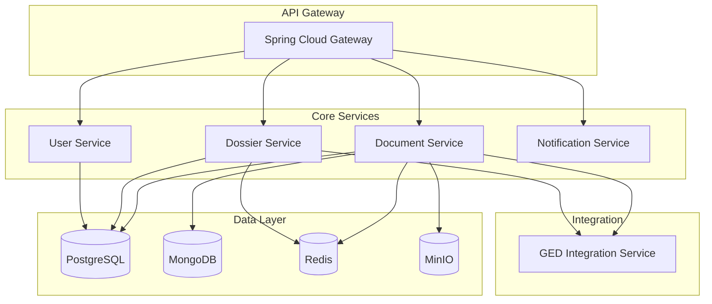

# Architecture DPJ - Dossier de Pièces Justificatives

## 📋 Vue d'Ensemble

Ce repository contient l'architecture complète du système **DPJ (Dossier de Pièces Justificatives)**, conçu pour moderniser l'ancien système DNC (Digital Client File) dans le secteur bancaire.

Le système DPJ est une plateforme omnicanale moderne permettant la centralisation et la gestion des documents justificatifs nécessaires aux processus bancaires, avec des interfaces dédiées pour les clients et les collaborateurs.

## 🎯 Objectifs du Projet

- **Modernisation** : Remplacer le système DNC obsolète par une architecture microservices moderne
- **Omnicanalité** : Interfaces web et mobile pour clients et collaborateurs
- **Centralisation** : Point unique pour tous les documents justificatifs
- **Réutilisation** : Éviter la re-soumission de documents déjà fournis
- **Performance** : Support de 500+ utilisateurs simultanés avec haute disponibilité
- **Sécurité** : Chiffrement bout-en-bout et audit complet

## 📚 Documentation d'Architecture

### 1. Analyse et Conception

| Document | Description | Statut |
|----------|-------------|--------|
| [`01-analyse-exigences-fonctionnelles.md`](01-analyse-exigences-fonctionnelles.md) | Analyse complète des 18 exigences fonctionnelles, cas d'usage et règles métier | ✅ Complet |
| [`02-architecture-technique-globale.md`](02-architecture-technique-globale.md) | Architecture microservices avec stack technologique détaillée | ✅ Complet |
| [`03-architecture-donnees-modeles.md`](03-architecture-donnees-modeles.md) | Modèles de données PostgreSQL, MongoDB et Redis avec schémas | ✅ Complet |

### 2. Services et APIs

| Document | Description | Statut |
|----------|-------------|--------|
| [`04-api-rest-contrats-service.md`](04-api-rest-contrats-service.md) | Spécifications OpenAPI complètes pour tous les microservices | ✅ Complet |
| [`05-architecture-securite-authentification.md`](05-architecture-securite-authentification.md) | Sécurité JWT, RBAC, chiffrement AES-256 et stratégies d'audit | ✅ Complet |
| [`06-architecture-stockage-documents.md`](06-architecture-stockage-documents.md) | Stockage MinIO avec cache multi-niveaux et sauvegarde | ✅ Complet |

### 3. Intégration et Interfaces

| Document | Description | Statut |
|----------|-------------|--------|
| [`07-integration-ged-existante.md`](07-integration-ged-existante.md) | Intégration GED avec patterns adapter et traitement asynchrone | ✅ Complet |
| [`08-architecture-interfaces-utilisateur.md`](08-architecture-interfaces-utilisateur.md) | Interfaces React responsive pour clients et collaborateurs | ✅ Complet |

### 4. Déploiement et Opérations

| Document | Description | Statut |
|----------|-------------|--------|
| [`09-strategie-deploiement-infrastructure.md`](09-strategie-deploiement-infrastructure.md) | Déploiement Kubernetes sur AWS avec CI/CD et disaster recovery | ✅ Complet |
| [`10-diagrammes-architecture.md`](10-diagrammes-architecture.md) | Diagrammes Mermaid complets (système, microservices, données, infrastructure) | ✅ Complet |

### 5. Qualité et Bonnes Pratiques

| Document | Description | Statut |
|----------|-------------|--------|
| [`11-patterns-bonnes-pratiques.md`](11-patterns-bonnes-pratiques.md) | Patterns DDD, CQRS, Circuit Breaker et bonnes pratiques de développement | ✅ Complet |
| [`12-strategie-tests-monitoring.md`](12-strategie-tests-monitoring.md) | Stratégie complète de tests et monitoring avec Prometheus/Grafana | ✅ Complet |

## 🏛️ Architecture Decision Records (ADR)

Toutes les décisions architecturales importantes sont documentées sous forme d'ADR au format MADR :

| ADR | Décision | Domaine | Statut |
|-----|----------|---------|--------|
| [ADR-0001](adr/0001-architecture-microservices.md) | Architecture Microservices | Architecture | ✅ Accepté |
| [ADR-0002](adr/0002-stack-technologique-java-spring.md) | Stack Java/Spring Boot | Technologie | ✅ Accepté |
| [ADR-0003](adr/0003-architecture-donnees-polyglotte.md) | Architecture Données Polyglotte | Données | ✅ Accepté |
| [ADR-0004](adr/0004-authentification-jwt-rbac.md) | Authentification JWT + RBAC | Sécurité | ✅ Accepté |
| [ADR-0005](adr/0005-stockage-documents-minio.md) | Stockage Documents MinIO | Stockage | ✅ Accepté |
| [ADR-0006](adr/0006-frontend-react-typescript.md) | Frontend React + TypeScript | Frontend | ✅ Accepté |
| [ADR-0007](adr/0007-infrastructure-kubernetes-aws.md) | Infrastructure Kubernetes/AWS | Infrastructure | ✅ Accepté |
| [ADR-0008](adr/0008-integration-ged-pattern-adapter.md) | Intégration GED Pattern Adapter | Intégration | ✅ Accepté |
| [ADR-0009](adr/0009-messaging-apache-kafka.md) | Messaging Apache Kafka | Messaging | ✅ Accepté |
| [ADR-0010](adr/0010-monitoring-prometheus-grafana.md) | Monitoring Prometheus/Grafana | Observabilité | ✅ Accepté |
| [ADR-0011](adr/0011-patterns-ddd-cqrs.md) | Patterns DDD + CQRS | Architecture | ✅ Accepté |
| [ADR-0012](adr/0012-strategie-tests-pyramide.md) | Stratégie Tests Pyramide | Qualité | ✅ Accepté |

📖 **[Voir tous les ADR](adr/README.md)** - Documentation complète des décisions architecturales

## 🏗️ Architecture Technique

### Stack Technologique

**Backend**
- Java 17 + Spring Boot 3.x
- Spring Security + JWT
- PostgreSQL (données transactionnelles)
- MongoDB (documents et métadonnées)
- Redis (cache distribué)
- Apache Kafka (messaging asynchrone)

**Frontend**
- React 18 + TypeScript
- Material-UI (composants)
- Redux Toolkit (état global)
- React Query (gestion des données)

**Infrastructure**
- Kubernetes sur AWS
- Docker + Helm Charts
- MinIO (stockage S3-compatible)
- Prometheus + Grafana (monitoring)
- Jaeger (distributed tracing)

### Microservices



## 🚀 Capacités et Performance

- **Utilisateurs simultanés** : 500+ avec auto-scaling horizontal
- **Taille des documents** : Jusqu'à 50MB par fichier
- **Temps de réponse** : <2s pour 95% des requêtes
- **Disponibilité** : 99.9% avec RTO <15min, RPO <1h
- **Sécurité** : Chiffrement AES-256, audit complet, conformité RGPD

## 🔧 Fonctionnalités Principales

### Interface Client
- ✅ Upload de documents par glisser-déposer
- ✅ Visualisation contextuelle des pièces requises
- ✅ Suivi en temps réel du statut des dossiers
- ✅ Réutilisation automatique de documents existants
- ✅ Notifications multi-canal (email, SMS, push)

### Interface Collaborateur
- ✅ Validation et traitement des documents
- ✅ Tableau de bord avec métriques temps réel
- ✅ Gestion des workflows d'approbation
- ✅ Outils de recherche et filtrage avancés
- ✅ Intégration transparente avec la GED existante

## 📊 Monitoring et Observabilité

- **Métriques** : Prometheus avec dashboards Grafana personnalisés
- **Logging** : Structured logging avec agrégation centralisée
- **Tracing** : Distributed tracing avec Jaeger pour le debugging
- **Alerting** : Règles intelligentes avec escalade automatique
- **Health Checks** : Probes Kubernetes avec indicateurs métier

## 🧪 Stratégie de Tests

- **Tests Unitaires** : >80% de couverture avec JUnit 5 et Mockito
- **Tests d'Intégration** : TestContainers pour les bases de données
- **Tests E2E** : Cypress pour les parcours utilisateur complets
- **Tests de Performance** : JMeter et K6 pour la charge et le stress
- **Tests de Sécurité** : OWASP ZAP et analyse statique

## 🔒 Sécurité

- **Authentification** : JWT avec refresh tokens
- **Autorisation** : RBAC granulaire par ressource
- **Chiffrement** : AES-256 pour les données sensibles, TLS 1.3 en transit
- **Audit** : Traçabilité complète des actions utilisateur
- **Conformité** : RGPD, PCI-DSS, ISO 27001

## 🚀 Déploiement

### Prérequis
- Cluster Kubernetes 1.25+
- Helm 3.x
- AWS CLI configuré
- Docker Registry accessible

### Installation
```bash
# Cloner le repository
git clone <repository-url>
cd dpj-architecture

# Déployer l'infrastructure
helm install dpj-infra ./helm/infrastructure

# Déployer les services
helm install dpj-services ./helm/services

# Vérifier le déploiement
kubectl get pods -n dpj
```

## 📈 Roadmap

### Phase 1 - MVP (3 mois)
- [ ] Services core (Document, Dossier, User)
- [ ] Interface client basique
- [ ] Intégration GED minimale

### Phase 2 - Enrichissement (2 mois)
- [ ] Interface collaborateur complète
- [ ] Notifications multi-canal
- [ ] Workflows d'approbation

### Phase 3 - Optimisation (2 mois)
- [ ] Performance et scalabilité
- [ ] Monitoring avancé
- [ ] Fonctionnalités IA/ML

## 📁 Structure du Repository

```
dpj-architecture/
├── README.md                                    # Ce fichier
├── INDEX.md                                     # Index de navigation
├── git-commands.md                              # Guide Git
├── adr/                                         # Architecture Decision Records
│   ├── README.md                               # Index des ADR
│   ├── 0001-architecture-microservices.md     # ADR Architecture
│   ├── 0002-stack-technologique-java-spring.md # ADR Stack technique
│   └── ...                                    # Autres ADR
├── 01-analyse-exigences-fonctionnelles.md      # Exigences et cas d'usage
├── 02-architecture-technique-globale.md        # Architecture microservices
├── 03-architecture-donnees-modeles.md          # Modèles de données
├── 04-api-rest-contrats-service.md             # APIs REST OpenAPI
├── 05-architecture-securite-authentification.md # Sécurité JWT/RBAC
├── 06-architecture-stockage-documents.md       # Stockage MinIO
├── 07-integration-ged-existante.md             # Intégration GED
├── 08-architecture-interfaces-utilisateur.md   # Interfaces React
├── 09-strategie-deploiement-infrastructure.md  # Kubernetes/AWS
├── 10-diagrammes-architecture.md               # Diagrammes Mermaid
├── 11-patterns-bonnes-pratiques.md             # Patterns DDD/CQRS
└── 12-strategie-tests-monitoring.md            # Tests et monitoring
```

## 👥 Équipe et Contacts

- **Architecte Technique** : Responsable de la conception globale
- **Tech Lead Backend** : Développement des microservices
- **Tech Lead Frontend** : Interfaces utilisateur React
- **DevOps Engineer** : Infrastructure et déploiement
- **QA Engineer** : Tests et qualité

## 📄 Licence

Ce projet est la propriété de [Nom de la Banque] et est confidentiel.

---

**Dernière mise à jour** : 28 janvier 2025  
**Version de l'architecture** : 1.0  
**Statut** : Architecture complète avec ADR - Prêt pour implémentation